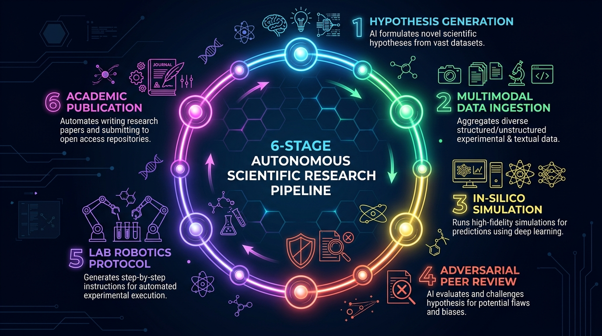
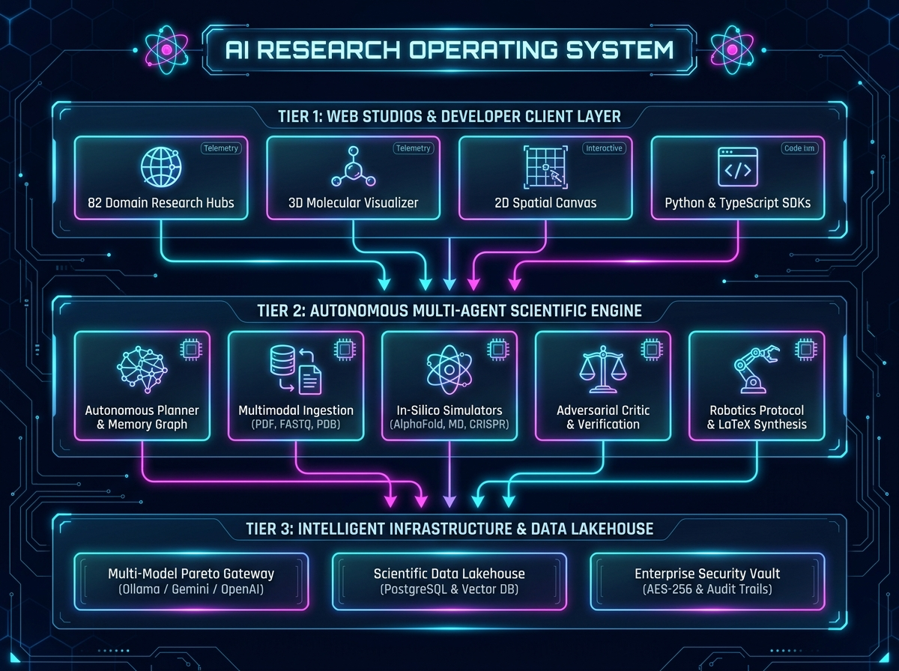

# Agentic Multimodal Research Platform (AI Research OS)

<p align="center">
  <a href="https://github.com/Om-Talaviya"></a>
  
  
  
  
</p>

---

## 🌟 Overview

The **Agentic Multimodal Research Platform (AI Research OS v1.1)** is a local-first, enterprise-grade operating system designed for autonomous scientific research and computational discovery.

Rather than acting as a standard text chatbot, the platform serves as an **Autonomous AI Scientist**. It coordinates multi-agent workflows to explore scientific literature, run physical and molecular simulations, verify empirical findings, and translate discoveries into robotic laboratory protocols and academic publications.

---

## 🔄 Autonomous Research Lifecycle

The platform transforms high-level scientific inquiries into verified discoveries through an automated 6-stage closed loop:

<p align="center">
  
</p>

* **1. Hypothesis Generation**: Analyzes cross-domain knowledge graphs and literature to formulate testable hypotheses.
* **2. Multimodal Ingestion**: Parses diverse data sources including academic papers, clinical tables, audio/video, and 3D molecular structures.
* **3. In-Silico Simulation**: Runs deterministic biophysical, kinetic, and computational models (AlphaFold3, Molecular Dynamics, QSAR).
* **4. Adversarial Peer Review**: Deploys dialectical review agents (`Proposer` vs `Opposer`) to stress-test claims and eliminate hallucinations.
* **5. Lab Robotics Protocol**: Translates verified discoveries into executable automation scripts for liquid handlers (Opentrons v2, PyLabRobot).
* **6. Academic Publication**: Synthesizes publication-ready LaTeX preprints, PRISMA meta-analyses, and grant proposals.

---

## 🏗️ System Architecture

Built on a modular, multi-tier microservices architecture designed for high scalability and local privacy:

<p align="center">
  
</p>

### Key Architectural Layers:
1. **Web Research Studio & Visual Hubs**: React 18 frontend featuring 82 specialized consoles, interactive canvas workspaces, and real-time DAG execution tracking.
2. **FastAPI REST Gateway & WebSockets**: High-throughput ASGI backend exposing 82 domain routers with real-time bidirectional streaming.
3. **Autonomous Multi-Agent Scientific Core**: LangGraph-driven orchestration engine coordinating planning, data extraction, computational simulation, and critique.
4. **Model Gateway & Data Lakehouse**: Pareto-optimal model router (Ollama, Gemini, OpenAI, Anthropic) paired with PostgreSQL 16, ChromaDB vector search, and Parquet/Iceberg storage.

---

## ⚡ Core Capabilities by Domain

| Domain | Key Capabilities |
|---|---|
| 🧠 **Cognition & Meta-Science** | Recursive Deep Research, Multi-Agent Debates, PRISMA Meta-Analysis, Computational Reproducibility, and Peer Review. |
| 🧬 **Genomics & Synthetic Biology** | CRISPR Guide RNA Design, Single-Cell scRNA-seq, Long-Read NGS Telomere Calling, DNA Methylation Clocks (Horvath/Hannum), Synthetic Gene Circuits (Hill Kinetics & Logic Gates), ATAC-seq, and ACMG Variant Scoring. |
| 🧪 **Structural Biology & Chemistry** | Quantum Chemistry VQE Solvers, Diffusion 3D Complex Docking, Preclinical Toxicogenomics & ADMET-Safety Ranker, Velocity Verlet MD, Generative Drug Design, and QSAR Toxicity. |
| 🏥 **Translational & Clinical AI** | Clinical Genomics Digital Twins, Pharmacogenomics CPIC Guidelines, Radiogenomics 3D Features, High-Content Phenotypic Cell Painting Screening, and Pharmacovigilance Sentinels. |
| 🔬 **Robotics & Laboratory Tools** | Opentrons/Hamilton Workcell Compilers, 21 CFR Part 11 Electronic Lab Notebooks, Flow Cytometry Gating, Whole-Cell Metabolic Flux, and Cryo-ET. |
| 🏢 **Enterprise Infrastructure** | AES-256 KMS Envelope Encryption, Merkle Audit Trails, Distributed Task Queue, Multi-Tenant RBAC, and Async SDKs. |

---

## 📊 Complete 93-Phase Engineering Matrix

<details>
<summary><b>Click to expand full 93-Phase Status Tracker (590+ Tests Passing, 100% CI)</b></summary>

```
Phase 1: Foundation                  [████████████████████] 100%
Phase 2: Research MVP                [████████████████████] 100%
Phase 3: Multimodal Ingestion        [████████████████████] 100%
Phase 4: Agentic System              [████████████████████] 100%
Phase 5: RAG / Knowledge Core        [████████████████████] 100%
Phase 6: Production / Security       [████████████████████] 100%
Phase 7: Application Maturity        [████████████████████] 100%
Phase 8A: Intelligent Model Routing  [████████████████████] 100%
Phase 8B: Usage Tracking & Quotas    [████████████████████] 100%
Phase 9: Intelligent Knowledge Auto  [████████████████████] 100%
Phase 10: Evidence & Citation Intel  [████████████████████] 100%
Phase 11: Advanced Research Planning [████████████████████] 100%
Phase 12: Advanced Multimodal Intel  [████████████████████] 100%
Phase 13: Dataset & Data Analysis    [████████████████████] 100%
Phase 14: Document & Paper Intel     [████████████████████] 100%
Phase 15: Deep Research Engine       [████████████████████] 100%
Phase 16: Research Memory            [████████████████████] 100%
Phase 17: Long-Term Knowledge Graph  [████████████████████] 100%
Phase 18: Projects & Workspaces      [████████████████████] 100%
Phase 19: Team Collaboration         [████████████████████] 100%
Phase 20: Intelligent Model Ecosys   [████████████████████] 100%
Phase 21: Model Evaluation System    [████████████████████] 100%
Phase 22: Agent Evaluation           [████████████████████] 100%
Phase 23: Enterprise Security        [████████████████████] 100%
Phase 24: Production Infrastructure  [████████████████████] 100%
Phase 25: Public API & Dev Platform  [████████████████████] 100%
Phase 26: Research Automation        [████████████████████] 100%
Phase 27: Multi-Agent Debate Engine  [████████████████████] 100%
Phase 28: Systematic Literature Rev  [████████████████████] 100%
Phase 29: In-Silico Reproducibility  [████████████████████] 100%
Phase 30: Multimodal Presentation    [████████████████████] 100%
Phase 31: Peer Review & Publishing   [████████████████████] 100%
Phase 32: Research Canvas Studio     [████████████████████] 100%
Phase 33: Synthetic Dataset Gen      [████████████████████] 100%
Phase 34: Patent Landscape & FTO     [████████████████████] 100%
Phase 35: Scientific Grant Studio    [████████████████████] 100%
Phase 36: Clinical Trials & Repurp   [████████████████████] 100%
Phase 37: Robotic Lab Automation     [████████████████████] 100%
Phase 38: Bio-Molecular 3D Structure [████████████████████] 100%
Phase 39: MD Trajectory & Quantum    [████████████████████] 100%
Phase 40: CRISPR & Synthetic Biology [████████████████████] 100%
Phase 41: Single-Cell Transcriptomics[████████████████████] 100%
Phase 42: Spatial Microenvironment   [████████████████████] 100%
Phase 43: Generative Chemistry VAE   [████████████████████] 100%
Phase 44: Knowledge Super-Graph      [████████████████████] 100%
Phase 45: Drug Synergy Simulator     [████████████████████] 100%
Phase 46: Clinical Trial Optimizer   [████████████████████] 100%
Phase 47: Cryo-EM Density Modeler    [████████████████████] 100%
Phase 48: Multi-Omics Perturbation   [████████████████████] 100%
Phase 49: Pharmacovigilance Signals  [████████████████████] 100%
Phase 50: AI Scientist Self-Evolving [████████████████████] 100%
Phase 51: RAGAS & Red-Teaming Gate   [████████████████████] 100%
Phase 52: Multi-Modal Data Lakehouse [████████████████████] 100%
Phase 53: Electronic Lab Notebook ELN[████████████████████] 100%
Phase 54: Virtual Screening vHTS     [████████████████████] 100%
Phase 55: Computational Immunology   [████████████████████] 100%
Phase 56: Epigenomics ATAC-seq Peak  [████████████████████] 100%
Phase 57: Protein-Protein PPI Network[████████████████████] 100%
Phase 58: Spatial Metabolomics IMS   [████████████████████] 100%
Phase 59: Antibody-Drug Conjugate ADC[████████████████████] 100%
Phase 60: PBPK Nanomedicine Transport[████████████████████] 100%
Phase 61: Rare Disease Phenotype HPO [████████████████████] 100%
Phase 62: Bioprocess Digital Twin    [████████████████████] 100%
Phase 63: Clinical Supply Chain GxP  [████████████████████] 100%
Phase 64: Referee Panel & Rebuttals  [████████████████████] 100%
Phase 65: Synthetic DNA Logic Gates  [████████████████████] 100%
Phase 66: Cell Therapy CAR-T Studio  [████████████████████] 100%
Phase 67: Neoepitope Cancer Vaccines [████████████████████] 100%
Phase 68: HTS Flow Cytometry Gating  [████████████████████] 100%
Phase 69: Biotherapeutic Stability   [████████████████████] 100%
Phase 70: CRISPR Synthetic Lethality [████████████████████] 100%
Phase 71: In-Silico Toxicity QSAR    [████████████████████] 100%
Phase 72: Gene Circuit Burden IFFL   [████████████████████] 100%
Phase 73: Clinical Site Feasibility  [████████████████████] 100%
Phase 74: Genomic Variant ACMG Class [████████████████████] 100%
Phase 75: Liquid Biopsy ctDNA MRD    [████████████████████] 100%
Phase 76: Real-World Safety Sentinel [████████████████████] 100%
Phase 77: Cryo-ET Subtomogram Average[████████████████████] 100%
Phase 78: Chemogenomics Polypharm    [████████████████████] 100%
Phase 79: smFRET Conformational HMM  [████████████████████] 100%
Phase 80: Multi-Omics Biomarkers     [████████████████████] 100%
Phase 81: Membrane LNP Simulator     [████████████████████] 100%
Phase 82: Metagenomic AMR Resistome  [████████████████████] 100%
Phase 83: Quantum Chemistry VQE      [████████████████████] 100%
Phase 84: NGS Long-Read Telomeres    [████████████████████] 100%
Phase 85: Diffusion 3D Docking       [████████████████████] 100%
Phase 86: Whole-Cell Metabolic Flux  [████████████████████] 100%
Phase 87: Clinical Genomics Twin     [████████████████████] 100%
Phase 88: Radiogenomics 3D Features  [████████████████████] 100%
Phase 89: Robotic Workcell Compiler  [████████████████████] 100%
Phase 90: Epigenetic Methylation Clock[████████████████████] 100%
Phase 91: Phenotypic Image Screening [████████████████████] 100%
Phase 92: Synthetic Bio Gene Circuit [████████████████████] 100%
Phase 93: Preclinical Toxicogenomics [████████████████████] 100%
─────────────────────────────────────────────────────────────────────────────────
ALL 93 PHASES (GENERATIONS 1 - 19) COMPLETED & FULLY ACTIVE (590+ TESTS PASSING)
```
</details>

---

## 💻 Quick Start

### 1. Setup Environment
```bash
git clone https://github.com/Om-Talaviya/agentic-multimodal-research-platform.git
cd agentic-multimodal-research-platform
cp .env.example .env
```

### 2. Start Services with Docker
```bash
docker compose up -d
```
*Launches PostgreSQL 16, ChromaDB Vector Store, Redis, and Ollama.*

### 3. Launch Backend Server
```bash
cd apps/api
pip install -e ".[dev]"
alembic upgrade head
uvicorn src.main:app --reload --port 8000
```
* API Documentation: `http://localhost:8000/docs`
* Health Check: `http://localhost:8000/api/v1/health`

### 4. Launch Frontend Web App
```bash
cd apps/web
npm install
npm run dev
```
* Web Dashboard: `http://localhost:5173`

---

## 📦 Developer SDKs

### Python SDK
```python
import asyncio
from ai_research_os import ResearchClient

async def main():
    async with ResearchClient(base_url="http://localhost:8000", api_key="sk_live_demo") as client:
        # Run in-silico CAR-T simulation
        result = await client.cart.simulate(
            target_antigen="CD19",
            scfv_clone="FMC63",
            costimulatory_domain="4-1BB"
        )
        print(f"Predicted Lysis: {result.cytotoxicity_lysis_pct}% | CRS Risk: {result.crs_risk_tier}")

asyncio.run(main())
```

### TypeScript SDK
```typescript
import { ResearchClient } from './sdk/client';

const client = new ResearchClient({ baseUrl: 'http://localhost:8000', apiKey: 'sk_live_demo' });

async function run() {
  const variant = await client.variants.classifyACMG({
    gene_symbol: 'BRCA1',
    hgvs_c: 'c.5266dupC',
    alphamissense_score: 0.95
  });
  console.log(`Classification: ${variant.acmg_class} (${variant.pathogenicity_score})`);
}
```

---

## 🔒 Enterprise Security & Privacy

* **100% Air-Gapped / Local-First**: Run entirely on-premise with local Ollama models and private vector stores.
* **SSRF Guardrails**: Strict DNS inspection blocking loopback, private subnets, and cloud metadata endpoints.
* **GxP & 21 CFR Part 11**: Cryptographic SHA-256 audit chaining and verified witness electronic signatures.
* **Deterministic Solvers**: Scientific computations execute in sandboxed Python kernels rather than probabilistic text outputs.

---

## 📜 License & Citation

Distributed under the **Apache 2.0 License**.

```bibtex
@software{talaviya2026researchos,
  author = {Om Talaviya},
  title = {Agentic Multimodal Research Platform: An Autonomous Multi-Disciplinary AI Research Operating System},
  year = {2026},
  url = {https://github.com/Om-Talaviya/agentic-multimodal-research-platform},
  version = {1.1}
}
```