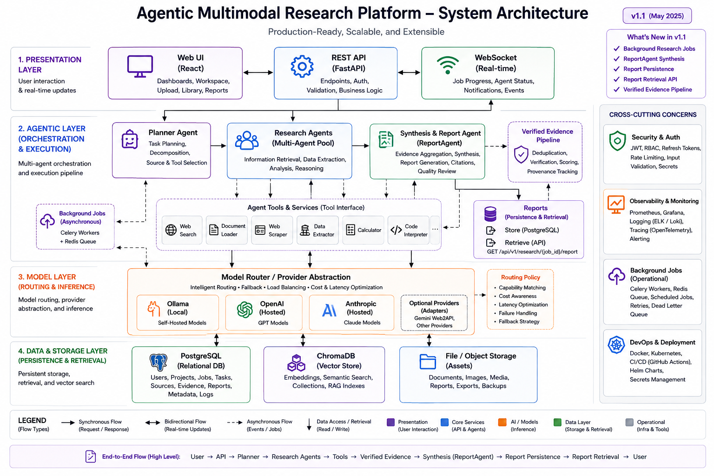

# Agentic Multimodal Research Platform

<p align="left">
  <a href="https://github.com/Om-Talaviya"></a>
  
  
  
</p>

A production-grade research platform that uses agentic AI to conduct comprehensive, evidence-based research across multiple modalities (text, PDF, images, web).

## Architecture Overview




## Features

- **Agentic Research Pipeline**: Planner → Research Agents → Verification → Synthesis → Report
- **Multimodal Ingestion**: Text, Markdown, PDF, DOCX, Images (with vision models)
- **Local-First Models**: Runs entirely locally with Ollama (llama3.1, llava, nomic-embed-text)
- **Cloud Provider Support**: OpenAI, Anthropic compatible APIs
- **Full Provenance**: Every claim traceable to source evidence with citations
- **Real-time Updates**: WebSocket streaming for research progress
- **Observability**: Structured logging, agent traces, model call metrics

## Quick Start

### Prerequisites

- Docker & Docker Compose
- Python 3.11+
- Node.js 20+
- Ollama (for local models)

### 1. Clone and Configure

```bash
git clone <repository>
cd agentic-multimodal-research-platform

# Copy environment template
cp .env.example .env

# Edit .env with your settings (optional for local development)
```

### 2. Start Infrastructure

```bash
docker-compose up -d
```

This starts:
- PostgreSQL (port 5432)
- ChromaDB (port 8000)
- Redis (port 6379)
- Ollama (port 11434)

### 3. Pull Required Models

```bash
# Pull models into Ollama
docker exec -it ollama ollama pull llama3.1
docker exec -it ollama ollama pull llava
docker exec -it ollama ollama pull nomic-embed-text
```

### 4. Backend

```bash
cd apps/api

# Install dependencies
pip install -e ".[dev]"

# Run database migrations (when implemented)
# alembic upgrade head

# Start development server
uvicorn src.main:app --reload
```

API will be available at `http://localhost:8000`
- API docs: `http://localhost:8000/docs`
- Health check: `http://localhost:8000/api/v1/health`

### 5. Frontend

```bash
cd apps/web

# Install dependencies
npm install

# Start development server
npm run dev
```

Frontend will be available at `http://localhost:5173`

## Project Structure

```
project-root/
│
├── apps/
│   ├── api/                 # FastAPI backend
│   │   ├── src/
│   │   │   ├── main.py      # Application entry point
│   │   │   ├── api/         # API routes
│   │   │   ├── dependencies.py  # Provider initialization
│   │   │   └── ...
│   │   ├── tests/
│   │   └── pyproject.toml
│   │
│   └── web/                 # React frontend
│       ├── src/
│       │   ├── components/
│       │   ├── pages/
│       │   ├── services/
│       │   └── types/
│       ├── package.json
│       └── ...
│
├── packages/                # Shared internal packages
│   ├── ai/                  # Model provider abstractions
│   ├── agents/              # Agent framework
│   ├── research/            # Research pipeline
│   ├── ingestion/           # Multimodal ingestion (planned)
│   ├── retrieval/           # Vector search & RAG (planned)
│   ├── database/            # Database layer
│   ├── tools/               # Tool system
│   └── shared/              # Common utilities
│
├── tests/                   # Integration & E2E tests
├── docs/                    # Architecture documentation
├── scripts/                 # Utility scripts
├── infrastructure/          # Docker, Kubernetes configs
├── docker-compose.yml
├── .env.example
└── README.md
```

## Development

### Running Tests

```bash
# Backend unit tests
cd apps/api && pytest tests/unit -v

# Backend integration tests (requires Docker services)
cd apps/api && pytest tests/integration -v

# Frontend tests
cd apps/web && npm run test:unit

# All tests
pytest tests/ -v
```

### Code Quality

```bash
# Backend linting
cd apps/api && ruff check .

# Frontend linting
cd apps/web && npm run lint

# Type checking
cd apps/api && mypy src/
```

### Adding a New Model Provider

1. Implement the provider protocols in `packages/ai/src/ai/providers/`
2. Add provider initialization in `apps/api/src/api/dependencies.py`
3. Register with the ModelRouter

### Adding a New Agent

1. Create agent class in `packages/agents/src/agents/` extending `Agent`
2. Register in `apps/api/src/api/dependencies.py`
3. Add to planner's available agents list

## API Endpoints

| Endpoint | Method | Description |
|----------|--------|-------------|
| `/api/v1/health` | GET | Health check |
| `/api/v1/research` | POST | Create research job |
| `/api/v1/research/{id}` | GET | Get job status |
| `/api/v1/research/{id}/plan` | GET | Get research plan |
| `/api/v1/research/{id}/tasks` | GET | List tasks |
| `/api/v1/research/{id}/sources` | GET | List sources |
| `/api/v1/research/{id}/evidence` | GET | List evidence |
| `/api/v1/research/{id}/report` | GET | Get final report |
| `/api/v1/documents` | POST | Upload document |
| `/api/v1/models` | GET | List available models |

## Configuration

All configuration via environment variables (see `.env.example`):

- **Model Providers**: `OLLAMA_BASE_URL`, `OPENAI_API_KEY`, `ANTHROPIC_API_KEY`
- **Database**: `DATABASE_URL`
- **Vector Store**: `CHROMA_HOST`, `CHROMA_PORT`
- **File Upload**: `UPLOAD_DIR`, `MAX_UPLOAD_SIZE`
- **Logging**: `LOG_LEVEL`, `LOG_FORMAT`

## Project Implementation Status

### Phase 1 — Foundation
🟢 **COMPLETE**
- ✅ Repository structure & architectural specifications
- ✅ Backend foundation (FastAPI, Pydantic settings, structlog, SQLAlchemy async)
- ✅ Database models & repositories (PostgreSQL & SQLite parity)
- ✅ Frontend foundation shell (React + TypeScript + Vite)
- ✅ Model provider abstractions (Ollama, Official Google Gemini API, OpenAI-compatible)
- ✅ Testing infrastructure & Docker Compose environment

### Phase 2 — Research MVP
🟢 **COMPLETE**
- ✅ Planner Agent with LLM-based structured decomposition
- ✅ Dynamic, persistent DAG task execution & dependency resolution
- ✅ Web Research Agent (search & fetch) & Document Analysis Agent
- ✅ Agent Orchestrator with retries, context isolation & lifecycle hooks
- ✅ Critic Agent for evidence quality verification & confidence scoring
- ✅ Report Agent for structured report synthesis & citation preservation
- ✅ Complete REST API for jobs, plans, tasks, sources, evidence & reports
- ✅ Real-time WebSocket streaming updates (`/api/v1/research/{job_id}/ws`)

### Phase 3 — Multimodal Ingestion
🟢 **COMPLETE**
- ✅ Plain text & Markdown parsing
- ✅ PDF document extraction (`pdfplumber`) with table extraction
- ✅ Word document extraction (`python-docx`) with paragraph structure
- ✅ Image vision analysis via Model Gateway (Ollama / Gemini)
- ✅ Semantic & fixed-size chunking pipelines
- ✅ Multipart document upload API (`/api/v1/documents`)

### Phase 4 — Agentic System
🟢 **COMPLETE**
- ✅ Extensible Tool Framework & Registry with permission controls
- ✅ Web Fetch Tool hardened against SSRF (full IPv4/IPv6 private/multicast rejection)
- ✅ Web Search Tool & Document Read Tool
- ✅ Knowledge Search Tool wired to RAG retriever
- ✅ Agent short/long-term memory & execution tracing (`agent_runs` & `model_calls`)

### Phase 5 — RAG / Knowledge Layer
🟢 **COMPLETE**
- ✅ Provider-agnostic Embedder abstraction
- ✅ ChromaDB vector store adapter & In-Memory vector store
- ✅ BM25 sparse keyword index
- ✅ Hybrid Retriever with Reciprocal Rank Fusion (RRF)
- ✅ Cross-job Knowledge Indexer & evidence citation grounding

### Phase 6 — Production & Security
🟢 **COMPLETE** (Core Roadmap Capabilities)
- ✅ JWT authentication (access & refresh token lifecycle)
- ✅ Role-Based Access Control (RBAC with Admin, Researcher, Viewer roles)
- ✅ Security filters (prompt injection detection, safe filename validation)
- ✅ Prometheus metrics exposition (`/metrics` endpoint)
- ✅ Kubernetes manifests (`infrastructure/k8s/`) & monitoring configs

---

### Test Suite Status
- **Passing**: 100% (All unit & integration tests pass with 0 skips and 0 failures)