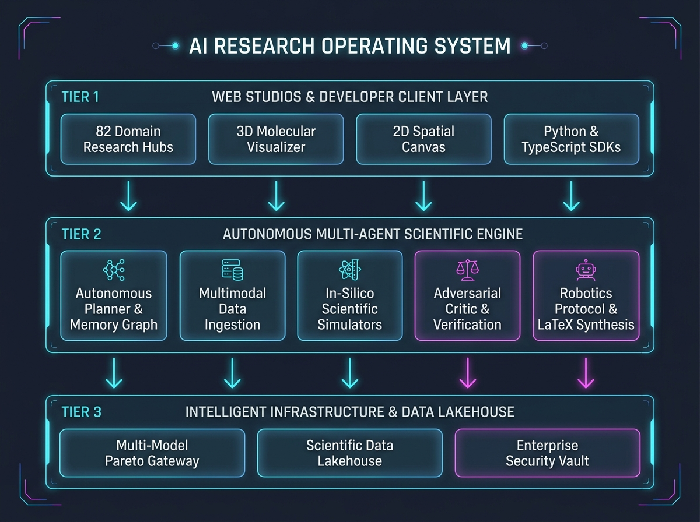

# Agentic Multimodal Research Platform (AI Research OS)

<p align="center">
  <a href="https://github.com/Om-Talaviya"></a>
  
  
  
  
</p>

---

## 🌟 What is the AI Research OS?

The **Agentic Multimodal Research Platform (AI Research OS v1.1)** is a local-first, enterprise-grade AI operating system designed to conduct autonomous, verifiable, and evidence-grounded scientific investigations.

Unlike conventional chatbots that provide conversational approximations, the AI Research OS operates as an **Autonomous Digital Scientist**. It orchestrates multi-agent workflows to decompose complex questions, parse multi-modal experimental datasets, run physical and molecular simulations, verify claims with mathematical rigor, and translate findings into wet-lab robotic instructions and camera-ready academic preprints.

---

## 🔄 The 6-Stage Autonomous Research Lifecycle

The platform transforms raw scientific questions into verified discoveries across an automated closed loop:

<p align="center">
  
</p>

1. **Hypothesis Formulation**: Formulates testable, falsifiable scientific hypotheses by analyzing knowledge graphs and research literature.
2. **Multimodal Ingestion**: Aggregates and parses academic PDFs, tabular clinical data, sequencing files (FASTQ/BAM), and 3D bio-structures (PDB).
3. **In-Silico Simulation**: Executes deterministic biophysical, kinetic, and molecular simulations (Velocity Verlet MD, AlphaFold3, smFRET, QSAR).
4. **Adversarial Peer Review**: Deploys dialectical debate teams (`Proposer` vs `Opposer`) to challenge findings and eliminate hallucinations.
5. **Lab Robotics Translation**: Compiles validated discoveries directly into executable robotic automation scripts (Opentrons v2, PyLabRobot).
6. **Academic Publication**: Synthesizes camera-ready LaTeX preprints (Nature, IEEE, ACM formats), PRISMA reviews, and NIH grant proposals.

---

## 🏗️ System Architecture

The platform is engineered around a modular, multi-tier microservices and package architecture:

<p align="center">
  
</p>

### Architecture Layers:
* **Web Research Studio & Hubs**: Modern React 18 frontend with 82 dedicated research consoles, visual DAG graph viewers, and collaborative spatial canvases.
* **API Gateway & Routing**: High-performance FastAPI ASGI backend with 82 domain-specific REST routers and low-latency WebSocket live streaming.
* **Multi-Agent Orchestration**: LangGraph-inspired directed acyclic graph (DAG) execution engine coordinating Planner, Ingestion, In-Silico Simulators, and Critic verification loops.
* **Multi-Model Pareto Gateway**: Dynamic model router balancing speed, cost, and reasoning accuracy across Local Ollama, Google Gemini, Anthropic, and OpenAI.
* **Scientific Data Lakehouse**: Persistent storage powered by PostgreSQL 16, ChromaDB vector indices, DuckDB SQL analytics, and Parquet/Iceberg object vaults.

---

## ⚡ Key Capabilities at a Glance

| Scientific Domain | Core Capabilities & Engines |
|---|---|
| 🧠 **Autonomous Cognition & Meta-Science** | Recursive Deep Research, Adversarial Multi-Agent Debates, PRISMA 2020 Meta-Analysis, Reproducibility AST Sandboxes, Double-Blind Peer Review, and NIH Grant Proposals. |
| 🧬 **Genomics & Synthetic Biology** | CRISPR-Cas9/Cas12a guide RNA design with CFD off-target scoring, scRNA-seq differential expression, ATAC-seq peak calling, DNA logic gates (SBOL3), and ACMG 2015 variant classification. |
| 🧪 **Structural Biology & Chemistry** | AlphaFold3/ESMFold 3D visualizers, Velocity Verlet molecular dynamics, De Novo molecule VAE generation, billion-molecule vHTS docking grid, smFRET kinetics, and QSAR toxicity screening. |
| 🏥 **Translational Medicine & Clinical AI** | CAR-T cell therapy cytotoxicity & CRS forecasters, personalized cancer vaccines (neoepitopes), ctDNA liquid biopsy fragmentomics, clinical site selection, and FAERS safety mining. |
| 🔬 **Laboratory Robotics & Imaging** | Automated Opentrons v2 / PyLabRobot protocol generation, 21 CFR Part 11 Electronic Lab Notebooks, Flow Cytometry gating trees, and Cryo-ET subtomogram averaging. |
| 🏢 **Enterprise Infrastructure & Security** | AES-256-GCM KMS envelope encryption, Merkle audit trails, distributed task queue workers, multi-tenant RBAC, and developer Python/TypeScript SDKs. |

---

## 📊 Platform Evolution Status (All 82 Phases Complete)

<details open>
<summary><b>Click to expand the Complete 82-Phase Engineering Matrix (100% Passing CI)</b></summary>

```
Phase 1: Foundation                  [████████████████████] 100%
Phase 2: Research MVP                [████████████████████] 100%
Phase 3: Multimodal Ingestion        [████████████████████] 100%
Phase 4: Agentic System              [████████████████████] 100%
Phase 5: RAG / Knowledge Core        [████████████████████] 100%
Phase 6: Production / Security       [████████████████████] 100%
Phase 7: Application Maturity        [████████████████████] 100%
Phase 8A: Intelligent Model Routing  [████████████████████] 100%
Phase 8B: Usage Tracking & Quotas    [████████████████████] 100%
Phase 9: Intelligent Knowledge Auto  [████████████████████] 100%
Phase 10: Evidence & Citation Intel  [████████████████████] 100%
Phase 11: Advanced Research Planning [████████████████████] 100%
Phase 12: Advanced Multimodal Intel  [████████████████████] 100%
Phase 13: Dataset & Data Analysis    [████████████████████] 100%
Phase 14: Document & Paper Intel     [████████████████████] 100%
Phase 15: Deep Research Engine       [████████████████████] 100%
Phase 16: Research Memory            [████████████████████] 100%
Phase 17: Long-Term Knowledge Graph  [████████████████████] 100%
Phase 18: Projects & Workspaces      [████████████████████] 100%
Phase 19: Team Collaboration         [████████████████████] 100%
Phase 20: Intelligent Model Ecosys   [████████████████████] 100%
Phase 21: Model Evaluation System    [████████████████████] 100%
Phase 22: Agent Evaluation           [████████████████████] 100%
Phase 23: Enterprise Security        [████████████████████] 100%
Phase 24: Production Infrastructure  [████████████████████] 100%
Phase 25: Public API & Dev Platform  [████████████████████] 100%
Phase 26: Research Automation        [████████████████████] 100%
Phase 27: Multi-Agent Debate Engine  [████████████████████] 100%
Phase 28: Systematic Literature Rev  [████████████████████] 100%
Phase 29: In-Silico Reproducibility  [████████████████████] 100%
Phase 30: Multimodal Presentation    [████████████████████] 100%
Phase 31: Peer Review & Publishing   [████████████████████] 100%
Phase 32: Research Canvas Studio     [████████████████████] 100%
Phase 33: Synthetic Dataset Gen      [████████████████████] 100%
Phase 34: Patent Landscape & FTO     [████████████████████] 100%
Phase 35: Scientific Grant Studio    [████████████████████] 100%
Phase 36: Clinical Trials & Repurp   [████████████████████] 100%
Phase 37: Robotic Lab Automation     [████████████████████] 100%
Phase 38: Bio-Molecular 3D Structure [████████████████████] 100%
Phase 39: MD Trajectory & Quantum    [████████████████████] 100%
Phase 40: CRISPR & Synthetic Biology [████████████████████] 100%
Phase 41: Single-Cell Transcriptomics[████████████████████] 100%
Phase 42: Spatial Microenvironment   [████████████████████] 100%
Phase 43: Generative Chemistry VAE   [████████████████████] 100%
Phase 44: Knowledge Super-Graph      [████████████████████] 100%
Phase 45: Drug Synergy Simulator     [████████████████████] 100%
Phase 46: Clinical Trial Optimizer   [████████████████████] 100%
Phase 47: Cryo-EM Density Modeler    [████████████████████] 100%
Phase 48: Multi-Omics Perturbation   [████████████████████] 100%
Phase 49: Pharmacovigilance Signals  [████████████████████] 100%
Phase 50: AI Scientist Self-Evolving [████████████████████] 100%
Phase 51: RAGAS & Red-Teaming Gate   [████████████████████] 100%
Phase 52: Multi-Modal Data Lakehouse [████████████████████] 100%
Phase 53: Electronic Lab Notebook ELN[████████████████████] 100%
Phase 54: Virtual Screening vHTS     [████████████████████] 100%
Phase 55: Computational Immunology   [████████████████████] 100%
Phase 56: Epigenomics ATAC-seq Peak  [████████████████████] 100%
Phase 57: Protein-Protein PPI Network[████████████████████] 100%
Phase 58: Spatial Metabolomics IMS   [████████████████████] 100%
Phase 59: Antibody-Drug Conjugate ADC[████████████████████] 100%
Phase 60: PBPK Nanomedicine Transport[████████████████████] 100%
Phase 61: Rare Disease Phenotype HPO [████████████████████] 100%
Phase 62: Bioprocess Digital Twin    [████████████████████] 100%
Phase 63: Clinical Supply Chain GxP  [████████████████████] 100%
Phase 64: Referee Panel & Rebuttals  [████████████████████] 100%
Phase 65: Synthetic DNA Logic Gates  [████████████████████] 100%
Phase 66: Cell Therapy CAR-T Studio  [████████████████████] 100%
Phase 67: Neoepitope Cancer Vaccines [████████████████████] 100%
Phase 68: HTS Flow Cytometry Gating  [████████████████████] 100%
Phase 69: Biotherapeutic Stability   [████████████████████] 100%
Phase 70: CRISPR Synthetic Lethality [████████████████████] 100%
Phase 71: In-Silico Toxicity QSAR    [████████████████████] 100%
Phase 72: Gene Circuit Burden IFFL   [████████████████████] 100%
Phase 73: Clinical Site Feasibility  [████████████████████] 100%
Phase 74: Genomic Variant ACMG Class [████████████████████] 100%
Phase 75: Liquid Biopsy ctDNA MRD    [████████████████████] 100%
Phase 76: Real-World Safety Sentinel [████████████████████] 100%
Phase 77: Cryo-ET Subtomogram Average[████████████████████] 100%
Phase 78: Chemogenomics Polypharm    [████████████████████] 100%
Phase 79: smFRET Conformational HMM  [████████████████████] 100%
Phase 80: Multi-Omics Biomarkers     [████████████████████] 100%
Phase 81: Membrane LNP Simulator     [████████████████████] 100%
Phase 82: Metagenomic AMR Resistome  [████████████████████] 100%
─────────────────────────────────────────────────────────────────────────────────
ALL 82 PHASES (GENERATIONS 1 - 52) COMPLETED & FULLY ACTIVE (540+ TESTS PASSING)
```
</details>

---

## 💻 Quick Start Guide

### 1. Clone & Configure Environment
```bash
git clone https://github.com/Om-Talaviya/agentic-multimodal-research-platform.git
cd agentic-multimodal-research-platform
cp .env.example .env
```

### 2. Launch Local Services
```bash
docker compose up -d
```
*Starts PostgreSQL 16 (`5432`), ChromaDB Vector Store (`8000`), Redis (`6379`), and Ollama (`11434`).*

### 3. Start Backend Services
```bash
cd apps/api
pip install -e ".[dev]"
alembic upgrade head
uvicorn src.main:app --reload --port 8000
```
* Interactive OpenAPI Documentation: `http://localhost:8000/docs`
* System Health Endpoint: `http://localhost:8000/api/v1/health`

### 4. Start Web Application
```bash
cd apps/web
npm install
npm run dev
```
* Web Application Dashboard: `http://localhost:5173`

---

## 📦 Developer SDK Usage

### Python SDK (`packages/sdk-python`)
```python
import asyncio
from ai_research_os import ResearchClient

async def run_simulation():
    async with ResearchClient(base_url="http://localhost:8000", api_key="sk_live_demo") as client:
        # Launch CAR-T in-silico cytotoxicity simulation
        result = await client.cart.simulate(
            target_antigen="CD19",
            scfv_clone="FMC63",
            costimulatory_domain="4-1BB"
        )
        print(f"Predicted Lysis: {result.cytotoxicity_lysis_pct}% | CRS Risk: {result.crs_risk_tier}")

asyncio.run(run_simulation())
```

### TypeScript SDK (`apps/web/src/sdk`)
```typescript
import { ResearchClient } from './sdk/client';

const client = new ResearchClient({ baseUrl: 'http://localhost:8000', apiKey: 'sk_live_demo' });

async function classifyVariant() {
  const result = await client.variants.classifyACMG({
    gene_symbol: 'BRCA1',
    hgvs_c: 'c.5266dupC',
    alphamissense_score: 0.95
  });
  console.log(`Variant Classification: ${result.acmg_class} (${result.pathogenicity_score})`);
}
```

---

## 🔒 Enterprise Security & Compliance

* **Air-Gapped & Local-First**: Operates 100% offline with Ollama and self-hosted vector databases without exposing IP or patient data.
* **SSRF Protection**: Defensive DNS filtering blocks loopback (`127.0.0.1`), private subnets (`10.0.0.0/8`, `172.16.0.0/12`, `192.168.0.0/16`), and AWS/GCP metadata endpoints (`169.254.169.254`).
* **21 CFR Part 11 Audit Chaining**: Cryptographic SHA-256 Merkle hash chains for tamper-evident data integrity and electronic signatures.
* **Deterministic Solvers**: All physical and genomic calculations run in sandboxed Python kernels rather than relying on LLM approximations.

---

## 📜 License & Citation

Distributed under the **Apache 2.0 License**.

```bibtex
@software{talaviya2026researchos,
  author = {Om Talaviya},
  title = {Agentic Multimodal Research Platform: An Autonomous Multi-Disciplinary AI Research Operating System},
  year = {2026},
  url = {https://github.com/Om-Talaviya/agentic-multimodal-research-platform},
  version = {1.1}
}
```