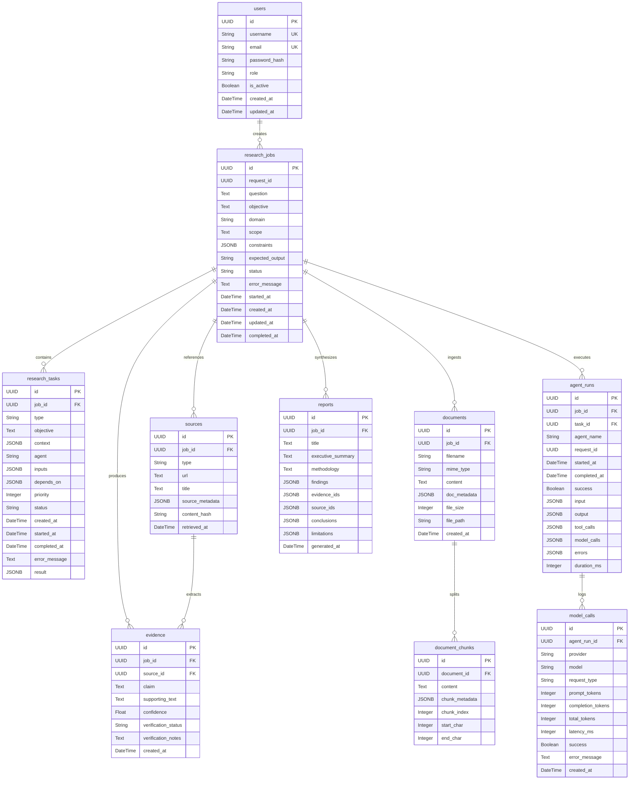

# Database Schema & API Contracts: backend-schema.md

This document defines the physical relational database schema, SQLAlchemy models, Alembic migrations, indexes, constraints, and API data contracts for the **Agentic Multimodal Research Platform**.

---

## 1. Entity Relationship Diagram (ERD)

---

## 2. Table Specifications

### 2.1 Table: `users`
**Model**: `database.models.user.User`  
**Migration**: `001_create_users_table.py`

| Column | Type | Nullable | Default | Description |
|---|---|---|---|---|
| `id` | UUID (PK) | No | `uuid.uuid4` | Unique user identifier |
| `username` | VARCHAR(100) | No | - | Unique username (Index) |
| `email` | VARCHAR(255) | No | - | Unique user email (Index) |
| `password_hash` | VARCHAR(255) | No | - | PBKDF2-HMAC-SHA256 hashed password string (`salt$hash`) |
| `role` | VARCHAR(50) | No | `'researcher'` | RBAC role (`admin`, `researcher`, `viewer`) |
| `is_active` | BOOLEAN | No | `True` | Account active flag |
| `created_at` | TIMESTAMPTZ | No | `utc_now` | Timestamp of account registration |
| `updated_at` | TIMESTAMPTZ | No | `utc_now` | Timestamp of profile update |

**Indexes**:
- `ix_users_username` on `username` (Unique)
- `ix_users_email` on `email` (Unique)
- `ix_users_username_lower` on `username`
- `ix_users_email_lower` on `email`

---

### 2.2 Table: `research_jobs`
**Model**: `database.models.research_job.ResearchJob`

| Column | Type | Nullable | Default | Description |
|---|---|---|---|---|
| `id` | UUID (PK) | No | `uuid.uuid4` | Unique research job identifier |
| `request_id` | UUID | No | - | Request correlation ID |
| `question` | TEXT | No | - | Primary user research question |
| `objective` | TEXT | No | - | Decomposed high-level objective |
| `domain` | VARCHAR(255) | Yes | `None` | Optional research domain |
| `scope` | TEXT | Yes | `None` | Optional research scope boundary |
| `constraints` | JSONB / JSON | Yes | `[]` | List of user constraints |
| `expected_output` | VARCHAR(100) | Yes | `'report'` | Deliverable type |
| `status` | VARCHAR(50) | No | `'pending'` | State (`pending`, `running`, `completed`, `failed`) |
| `error_message` | TEXT | Yes | `None` | Error details on failure |
| `started_at` | TIMESTAMPTZ | Yes | `None` | Timestamp when execution started |
| `created_at` | TIMESTAMPTZ | No | `utc_now` | Creation timestamp |
| `updated_at` | TIMESTAMPTZ | No | `utc_now` | Update timestamp |
| `completed_at` | TIMESTAMPTZ | Yes | `None` | Completion/termination timestamp |

**Indexes**:
- `ix_research_jobs_created_at` on `created_at`
- `ix_research_jobs_status_created` on `(status, created_at)`

---

### 2.3 Table: `research_tasks`
**Model**: `database.models.research_job.ResearchTask`

| Column | Type | Nullable | Default | Description |
|---|---|---|---|---|
| `id` | UUID (PK) | No | `uuid.uuid4` | Unique task identifier |
| `job_id` | UUID (FK) | No | - | FK → `research_jobs.id` (ON DELETE CASCADE) |
| `type` | VARCHAR(100) | No | - | Task type (`web_search`, `document_analysis`, etc.) |
| `objective` | TEXT | No | - | Specific task goal |
| `context` | JSONB / JSON | Yes | `{}` | Context metadata passed from dependencies |
| `agent` | VARCHAR(100) | No | - | Assigned agent worker identifier |
| `inputs` | JSONB / JSON | Yes | `{}` | Input arguments |
| `depends_on` | JSONB / JSON | Yes | `[]` | List of predecessor task UUIDs |
| `priority` | INTEGER | Yes | `1` | Scheduling priority |
| `status` | VARCHAR(50) | No | `'pending'` | Task state (`pending`, `running`, `completed`, `failed`) |
| `created_at` | TIMESTAMPTZ | No | `utc_now` | Task creation timestamp |
| `started_at` | TIMESTAMPTZ | Yes | `None` | Execution start timestamp |
| `completed_at` | TIMESTAMPTZ | Yes | `None` | Execution completion timestamp |
| `error_message` | TEXT | Yes | `None` | Failure message |
| `result` | JSONB / JSON | Yes | `None` | Task output payload |

**Indexes**:
- `ix_research_tasks_job_status` on `(job_id, status)`

---

### 2.4 Table: `sources`
**Model**: `database.models.source.Source`

| Column | Type | Nullable | Default | Description |
|---|---|---|---|---|
| `id` | UUID (PK) | No | `uuid.uuid4` | Unique source identifier |
| `job_id` | UUID (FK) | No | - | FK → `research_jobs.id` (ON DELETE CASCADE) |
| `type` | VARCHAR(50) | No | - | Source type (`web`, `document`, `paper`) |
| `url` | TEXT | Yes | `None` | URL for web resources |
| `title` | TEXT | No | - | Title or document header |
| `source_metadata`| JSONB / JSON | Yes | `{}` | Arbitrary source metadata |
| `content_hash` | VARCHAR(64) | Yes | `None` | SHA-256 hash of content (Index) |
| `retrieved_at` | TIMESTAMPTZ | No | `utc_now` | Extraction timestamp |

---

### 2.5 Table: `evidence`
**Model**: `database.models.source.Evidence`

| Column | Type | Nullable | Default | Description |
|---|---|---|---|---|
| `id` | UUID (PK) | No | `uuid.uuid4` | Unique evidence identifier |
| `job_id` | UUID (FK) | No | - | FK → `research_jobs.id` (ON DELETE CASCADE) |
| `source_id` | UUID (FK) | No | - | FK → `sources.id` (ON DELETE CASCADE) |
| `claim` | TEXT | No | - | Extracted atomic factual statement |
| `supporting_text`| TEXT | No | - | Verbatim quote span from source |
| `confidence` | FLOAT | No | `0.5` | Critic confidence score (0.0 - 1.0) |
| `verification_status`| VARCHAR(50)| Yes | `'unverified'` | Status (`verified`, `refuted`, `unverified`) |
| `verification_notes`| TEXT | Yes | `None` | Justification or contradiction notes |
| `created_at` | TIMESTAMPTZ | No | `utc_now` | Extraction timestamp |

**Indexes**:
- `ix_evidence_job_verification` on `(job_id, verification_status)`

---

### 2.6 Table: `documents` & `document_chunks`
**Model**: `database.models.document.Document` & `DocumentChunk`

- `documents`: Stores file metadata (`filename`, `mime_type`, `file_size`, `file_path`, `content`, `doc_metadata`).
- `document_chunks`: Stores parsed text partitions (`document_id`, `content`, `chunk_index`, `start_char`, `end_char`, `chunk_metadata`).

---

### 2.7 Table: `reports`
**Model**: `database.models.report.Report`

| Column | Type | Nullable | Default | Description |
|---|---|---|---|---|
| `id` | UUID (PK) | No | `uuid.uuid4` | Unique report identifier |
| `job_id` | UUID (FK) | No | - | FK → `research_jobs.id` (ON DELETE CASCADE) |
| `title` | TEXT | No | - | Report title |
| `executive_summary`| TEXT | Yes | `None` | Executive overview summary |
| `methodology` | TEXT | Yes | `None` | Investigation methodology description |
| `findings` | JSONB / JSON | Yes | `[]` | List of topic findings with confidence & uncertainty |
| `evidence_ids` | JSONB / JSON | Yes | `[]` | Array of cited Evidence UUIDs |
| `source_ids` | JSONB / JSON | Yes | `[]` | Array of referenced Source UUIDs |
| `conclusions` | JSONB / JSON | Yes | `[]` | Key conclusions |
| `limitations` | JSONB / JSON | Yes | `[]` | Limitations & areas of uncertainty |
| `generated_at`| TIMESTAMPTZ | No | `utc_now` | Report creation timestamp |

---

### 2.8 Observability Tables: `agent_runs` & `model_calls`
**Model**: `database.models.agent_run.AgentRun` & `ModelCall`

- `agent_runs`: Captures agent execution traces (`job_id`, `task_id`, `agent_name`, `request_id`, `duration_ms`, `tool_calls`, `model_calls`, `errors`).
- `model_calls`: Captures granular model provider API telemetry (`provider`, `model`, `request_type`, `prompt_tokens`, `completion_tokens`, `total_tokens`, `latency_ms`, `success`, `error_message`).

---

## 3. Planned Schema Extensions (Phase 8B)

The following entities are specified for the upcoming Phase 8B quota and usage tracking tier (currently in local validation branch):

### 3.1 `UsageRecord` (Planned)
- `id`: UUID (PK)
- `user_id`: UUID (FK → `users.id`)
- `job_id`: UUID (FK → `research_jobs.id`)
- `provider`: String
- `model`: String
- `prompt_tokens`: Integer
- `completion_tokens`: Integer
- `cost_estimated_usd`: Numeric
- `timestamp`: TIMESTAMPTZ

### 3.2 `UserQuota` (Planned)
- `id`: UUID (PK)
- `user_id`: UUID (FK → `users.id`, Unique)
- `daily_token_limit`: Integer
- `tokens_used_today`: Integer
- `max_concurrent_jobs`: Integer
- `last_reset_at`: TIMESTAMPTZ
