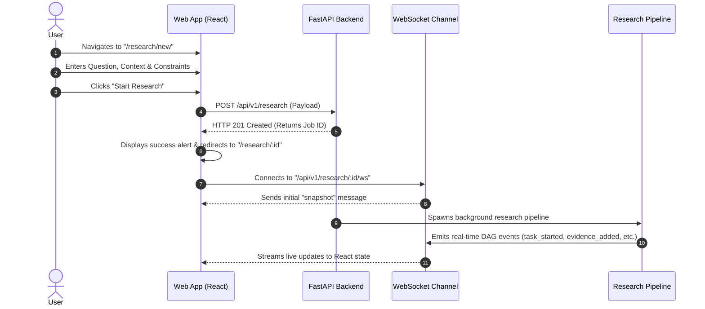
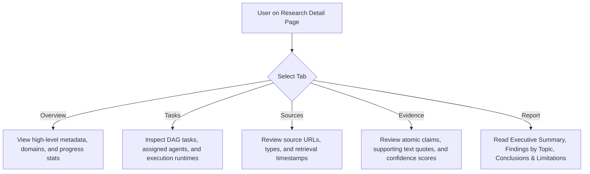

# User Interaction & Navigation Flows: design/user-flows.md

This document outlines the step-by-step user journeys and state transitions across the **Agentic Multimodal Research Platform** web interface.

---

## 1. Flow: Launching a New Research Inquiry

---

## 2. Flow: Monitoring Real-Time Research Execution

1. **Connection Initialization**:
   - Web application mounts `ResearchDetail` component.
   - Triggers `fetchData()` via REST API as fallback baseline.
   - Initiates WebSocket handshake to `/api/v1/research/{id}/ws`.
2. **Snapshot Hydration**:
   - Server authenticates connection and delivers a complete initial state snapshot (`snapshot` type).
   - Client updates `job`, `tasks`, `sources`, `evidence`, and `report` states simultaneously.
3. **Live Event Stream Processing**:
   - `job_started` / `job_completed`: Updates overall header badge and timestamps.
   - `task_started` / `task_completed` / `task_failed`: Updates specific task row in the **Tasks** table with live status spinners.
   - `sources_added`: Appends new sources to the **Sources** tab.
   - `evidence_added` / `verification_completed`: Appends verified claims to the **Evidence** tab.
   - `report_generated`: Activates the **Report** tab and loads synthesized findings.
4. **Disconnection & Reconnection**:
   - If connection drops, an exponential backoff retry loop (1s, 2s, 4s, up to 10s) reconnects automatically.
   - Periodic 30-second server heartbeats prevent proxy timeouts.

---

## 3. Flow: Exploring Evidence & Final Report

---

## 4. Flow: Configuring System Settings

1. User navigates to `/settings`.
2. Modifies Ollama provider URL, default LLM model (`llama3.1`, `mistral`, `codellama`), Vision model (`llava`, `bakllava`), or Embedding model (`nomic-embed-text`, `all-minilm`).
3. Sets general logging levels (`DEBUG`, `INFO`, `WARNING`, `ERROR`) and maximum upload limits.
4. Clicks **Save Settings** to persist local client preferences with confirmation banners.
