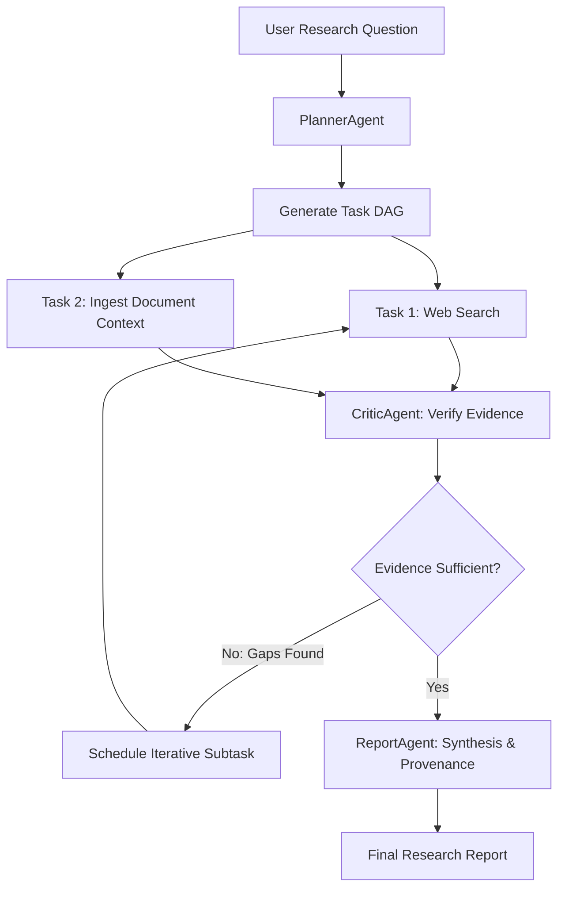
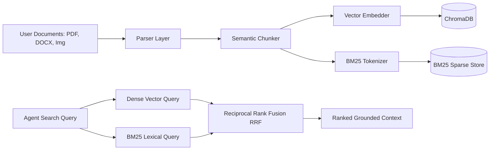

# System Architecture Documentation: ARCHITECTURE.md

## High-Level System Architecture

The **Agentic Multimodal Research Platform** is engineered as a modular, local-first **AI Research Operating System**. It moves beyond standard single-turn chatbots by employing a coordinated, Directed Acyclic Graph (DAG) based agentic workflow that plans, investigates, retrieves, reasons, critiques, synthesizes, and reports on complex multi-domain questions.

```
                                 ┌──────────────┐
                                 │     USER     │
                                 └───────┬──────┘
                                         │
                                         ▼
                        ┌─────────────────────────────────┐
                        │      React Web Platform         │
                        │ (Dashboard / Research / Studio) │
                        └────────────────┬────────────────┘
                                         │ HTTPS / WSS
                                         ▼
                        ┌─────────────────────────────────┐
                        │          FastAPI API            │
                        └────────┬───────────────┬────────┘
                                 │               │
                 ┌───────────────┘               └───────────────┐
                 ▼                                               ▼
      ┌─────────────────────┐                         ┌─────────────────────┐
      │   Research Engine   │                         │   Knowledge Layer   │
      │ (Agent Orchestrator)│                         │  (Hybrid RAG Store) │
      └──────────┬──────────┘                         └──────────┬──────────┘
                 │                                               │
        ┌────────┴───────────────────┐                           │
        ▼              ▼             ▼                           │
   ┌─────────┐   ┌───────────┐ ┌──────────┐                      │
   │ Planner │   │ Web Agent │ │Doc Agent │                      │
   └────┬────┘   └─────┬─────┘ └────┬─────┘                      │
        │              │            │                            │
        └──────────────┼────────────┴────────────────────────────┤
                       ▼                                         │
                 ┌───────────┐                                   │
                 │  Critic   │◄──────────────────────────────────┘
                 └─────┬─────┘
                       ▼
                 ┌───────────┐
                 │ Synthesis │
                 └─────┬─────┘
                       ▼
                 ┌───────────┐
                 │  Report   │
                 └───────────┘

═════════════════════════════════════════════════════════════════════════════════
                              PLATFORM INFRASTRUCTURE
─────────────────────────────────────────────────────────────────────────────────
  [Authentication]       [AI Infrastructure]              [Platform Persistence]
  • Users & RBAC         • ModelRegistry (Capabilities)   • PostgreSQL / SQLite
  • PBKDF2 Password Hash • ModelRouter (Task Matching)    • ChromaDB / In-Memory
  • JWT Access/Refresh   • ModelGateway (Failover)        • Usage Records & Quotas
  • User Context Flow    • Ollama / Gemini / OpenAI       • Row-Locking Concurrency
═════════════════════════════════════════════════════════════════════════════════
```

---

## 1. Core Architectural Pillars

### 1.1 Dependency Inversion & Provider Agnosticism
High-level agent logic depends strictly on abstract protocols (`packages/ai`):
- `LLMProvider` $\rightarrow$ `OllamaProvider`, `GeminiProvider`, `OpenAICompatibleProvider`.
- `VisionProvider` $\rightarrow$ Multimodal model endpoints.
- `EmbeddingProvider` $\rightarrow$ Vector embedders (`nomic-embed-text`, etc.).
- `VectorStore` $\rightarrow$ `ChromaStore`, `InMemoryStore`.

### 1.2 Multi-Tier AI Routing & Gateway Hierarchy (Phase 8A & 8B)
```
  Agent Request (AgentContext + TaskType)
                     │
                     ▼
             ┌──────────────┐
             │ ModelGateway │
             └───────┬──────┘
                     │
                     ▼
             ┌──────────────┐
             │ ModelRouter  │
             └───────┬──────┘
                     │
         ┌───────────┴───────────┐
         ▼                       ▼
┌─────────────────┐     ┌──────────────────┐
│  ModelRegistry  │     │ ProviderRegistry │
│ (Capabilities)  │     │ (Health & Auth)  │
└─────────────────┘     └──────────────────┘
         │                       │
         └───────────┬───────────┘
                     ▼
        ┌─────────────────────────┐
        │ Quota Verification Lock │
        │ (SELECT ... FOR UPDATE) │
        └────────────┬────────────┘
                     │
                     ▼
        ┌─────────────────────────┐
        │ Concrete Provider Call  │
        │ (Ollama, Gemini, OpenAI)│
        └────────────┬────────────┘
                     │
                     ▼
        ┌─────────────────────────┐
        │  Usage Telemetry Log    │
        │  (UsageRecord in DB)    │
        └─────────────────────────┘
```

1. **`ModelRegistry`**: Catalog of registered models, capabilities (`STREAMING_RESPONSE`, `VISION_ANALYSIS`, `FACTUAL_EXTRACTION`, `SYNTHESIS`), context sizes, and priority scores.
2. **`ProviderRegistry`**: Manages live provider instances, connection pooling, and health status.
3. **`ModelRouter`**: Dynamically maps task requirements and constraints to candidate models.
4. **`ModelGateway`**: High-level execution entry point that handles model selection, fallback execution on rate limits/errors, quota verification, and telemetry logging.
5. **Usage & Quotas**: Persistent `UsageRecord` and `UserQuota` models with transactional row locking to eliminate race conditions under concurrent worker executions.

---

## 2. Research Engine & Agentic Orchestration

### 2.1 Dynamic DAG Task Execution
The research process is modeled as an executable Directed Acyclic Graph:


### 2.2 Agent Roles & Specialization
- **`PlannerAgent`**: Deconstructs broad questions into structured subtasks with explicit dependencies (`depends_on`).
- **`WebResearchAgent`**: Executes web search queries and retrieves sanitized web pages using `SSRF-safe` network adapters.
- **`DocumentAnalysisAgent`**: Retrieves and extracts relevant passages from local uploaded PDFs, DOCX, and images.
- **`CriticAgent`**: Audits factual claims, calculates confidence metrics, detects source contradictions, and flags unverified assertions.
- **`ReportAgent`**: Compiles verified evidence into an executive summary, findings, methodology, conclusions, and citation map.

---

## 3. Multimodal Ingestion & Hybrid RAG Architecture



---

## 4. User Context Flow & Persistence

Authenticated requests flow through the entire system with complete user attribution:
```
  FastAPI JWT Authentication (/api/v1/auth)
                     │
                     ▼ (Extract authenticated user_id)
        Endpoint: POST /api/v1/research
                     │
                     ▼ (Pass user_id into pipeline)
             ResearchPipeline
                     │
                     ▼ (Initialize orchestrator with context)
             AgentOrchestrator
                     │
                     ▼ (Propagate into AgentContext)
               AgentContext
                     │
                     ▼ (Invoke LLM with user context)
               ModelGateway
                     │
                     ▼ (Record tokens & cost)
             UsageRepository
                     │
                     ▼
          Database (UsageRecord.user_id)
```

---

## 5. The 6-Generation Long-Term Architecture (Phases 9 – 26)

### Generation 1: Intelligent Research Core (Phases 9 – 11)
- **Phase 9 (Knowledge Automation - COMPLETE)**: Automated document ingestion daemon and planner-integrated retrieval.
- **Phase 10 (Evidence & Citation Intelligence - COMPLETE)**: Fine-grained claim-to-source anchoring with page/paragraph coordinates and pairwise contradiction detection.
- **Phase 11 (Advanced Research Planning - COMPLETE)**: Hierarchical planning engine with `QueryTreeNode` recursive subquestion decomposition and closed-loop replanning.

### Generation 2: Multimodal Intelligence (Phases 12 – 14) (COMPLETE)
- **Phase 12 (Advanced Multimodal Research - COMPLETE)**: Unified multi-modal context assembler for 50+ page PDFs, images, charts (`ChartRef`), and audio/video timestamp transcripts (`[MM:SS - MM:SS]`).
- **Phase 13 (Dataset & Data Analysis Intelligence - COMPLETE)**: Tabular data analysis (CSV, TSV, Excel, JSON) using deterministic Python calculation tools (`DataAnalysisTool`, `DeterministicMathTool`, `TabularParser`).
- **Phase 14 (Document & Paper Intelligence - COMPLETE)**: Academic research paper parser (`AcademicPaperParser`), section tree hierarchies (`PaperSection`), BibTeX citation matching, and cross-paper comparative matrices (`PaperAnalysisTool`, `MethodologyComparisonTool`).

### Generation 3: Autonomous Research (Phases 15 – 17) (COMPLETE)
- **Phase 15 (Deep Research Engine - COMPLETE)**: Autonomous recursive multi-round research loops (`DeepResearchEngine`), recursive gap & hypothesis formulation with `CriticAgent`, adaptive DAG expansion with `PlannerAgent.replan()`, strict convergence guardrails ($\tau \ge 0.85$, max iterations, $\Delta \tau < 0.02$), WebSocket iteration telemetry, and `DeepResearchTracker.tsx` timeline studio.
- **Phase 16 (Research Memory - COMPLETE)**: Cross-session persistent research memory (`DBResearchMemory`, `MemoryRepository`, `ResearchMemoryManager`), semantic conceptual indexing, agent memory tools (`RecallMemoryTool`, `StoreMemoryTool`), REST API (`/api/v1/memory`), and interactive `ResearchMemoryViewer` UI.
- **Phase 17 (Long-Term Knowledge Graph - COMPLETE)**: Relational entity-relationship adjacency persistence (`DBKnowledgeEntity`, `DBKnowledgeRelation`, `KnowledgeGraphRepository`), `KnowledgeGraphEngine` (triplet extraction from findings/reports, Graph-Augmented RAG `GraphRAG`), agent tools (`QueryKnowledgeGraphTool`, `ExtractGraphTripletsTool`, `FindRelationPathTool`), REST API (`/api/v1/graph`), and interactive React network visualization studio (`KnowledgeGraphViewer.tsx` & `KnowledgeGraphPage.tsx`).

### Generation 4: Collaboration Platform (Phases 18 – 19) (COMPLETE)
- **Phase 18 (Projects & Workspaces - COMPLETE)**: Hierarchical tenant isolation (`User $\rightarrow$ Workspace $\rightarrow$ Projects $\rightarrow$ Knowledge & Research`), `DBWorkspace`, `DBWorkspaceMember`, `DBProject`, `WorkspaceRepository`, `ProjectRepository`, REST APIs (`/workspaces`, `/projects`), `WorkspaceSelector` and `ProjectsPage` UI.
- **Phase 19 (Team Collaboration - COMPLETE)**: Granular workspace RBAC (`owner`, `admin`, `researcher`, `analyst`, `reviewer`, `viewer`), cryptographic email invitation lifecycle (`DBWorkspaceInvite`, `WorkspaceInviteRepository`), threaded report annotations with quotes and 1-click resolution (`DBReportAnnotation`, `ReportAnnotationsDrawer.tsx`), and collaborative audit activity logs (`DBWorkspaceActivity`).

### Generation 5: AI Platform Intelligence (Phases 20 – 22) (COMPLETE)
- **Phase 20 (Intelligent Model Ecosystem - COMPLETE)**: Multi-parameter utility routing optimization engine (`ModelEcosystemOptimizer`), Pareto-frontier non-dominated sorting across Quality, Speed, Cost, and Locality, preset optimization profiles (Balanced, Cost, Speed, Quality), and `/models/profiles` + `/models/optimize` REST endpoints (**ADR 020**).
- **Phase 21 (Model Evaluation System - COMPLETE)**: Ground-truth benchmark harness (`BenchmarkDataset`, `DEFAULT_RESEARCH_BENCHMARK`), automated multi-dimensional scoring (`EvaluationMetricsEngine` - factuality, reasoning, faithfulness, citations, latency, cost), persistence (`DBModelEvaluation`, `ModelEvaluationRepository`), REST APIs (`/models/evaluate`, `/models/evaluations`, `/models/leaderboard`), and competitive Leaderboard studio (`ModelEvaluationPage.tsx`) (**ADR 021**).
- **Phase 22 (Agent Evaluation - COMPLETE)**: Autonomous multi-metric agent evaluation engine (`AgentEvaluator`, `AgentEvaluationScorecard`, `AgentStepTelemetry`), plan precision scoring, tool invocation accuracy, evidence grounding coverage, sentence-level hallucination rate detection, database persistence (`DBAgentEvaluation`, `DBAgentStepMetric`, `AgentEvaluationRepository`), REST APIs (`/api/v1/agents/evaluate`, `/api/v1/agents/evaluations`, `/api/v1/agents/metrics/summary`), and interactive Agent Observability Studio (`AgentEvaluationPage.tsx`) (**ADR 022**).

### Generation 6: Production Product (Phases 23 – 26) (COMPLETE — ALL 6 GENERATIONS 100% COMPLETE)
- **Phase 23 (Enterprise Security - COMPLETE)**: KMS two-tier envelope encryption (AES-256-GCM DEK/KEK with PBKDF2 salt derivation), tamper-evident SHA-256 cryptographic audit hash chaining (`AuditHashChainer`), workspace security & data retention policies (`DBSecurityPolicy`), automated GDPR Article 17 cascade purge (`execute_gdpr_data_purge`), SOC 2 compliance scorecard APIs, and `EnterpriseSecurityPage.tsx` React studio (**ADR 023**).
- **Phase 24 (Production Scale Infrastructure - COMPLETE)**: In-memory and distributed asynchronous task queues (`AsyncTaskQueue` priority heap with `CRITICAL`, `HIGH`, `DEFAULT`, `LOW` scheduling), worker node cluster tracking (`WorkerNode`, `DBWorkerNode`), S3/MinIO/Local unified blob storage vault (`ObjectStorageClient`, `DBStorageObject`), `InfrastructureRepository`, REST APIs (`/api/v1/system`), and `ProductionInfrastructurePage.tsx` React cluster topology studio (**ADR 024**).
- **Phase 25 (Public API & Developer Platform - COMPLETE)**: Public OpenAPI 3.1 gateway (`/api/v1/developer/*`), developer API key provisioning with SHA-256 secret hashing (`DBApiKey`, `ApiKeyRepository`), granular permission scopes (`research:read`, `research:write`, `documents:read`, `documents:write`, `memory:read`, `graph:read`), sliding window tier rate limiting (Free: 60 rpm, Pro: 300 rpm, Enterprise: 1,200 rpm), interactive API Playground with live cURL / Python / TypeScript SDK snippets, and `DeveloperPlatformPage.tsx` UI (**ADR 025**).
- **Phase 26 (Research Automation - COMPLETE)**: Cron and interval-based recurring research sweeps (`compute_next_run`), automated web/academic change detection, semantic claim diffing and novelty scoring (`ResearchAutomationEngine`), webhook and in-app multi-channel alerting (`DBScheduledResearch`, `DBResearchSweepResult`, `DBAutomationAlert`, `AutomationRepository`), REST APIs (`/api/v1/automation/*`), and `ResearchAutomationPage.tsx` studio (**ADR 026**).

### Generation 7: Scientific & Meta-Intelligence (Phases 27 – 30) (COMPLETE)
- **Phase 27 (Adversarial Multi-Agent Debate & Consensus Engine - COMPLETE)**: Dialectical multi-agent scientific debate architecture featuring `ProposerAgent` (affirmative thesis defense with empirical citation grounding) and `OpposerAgent` (counter-theses, edge case stress testing, fallacy identification) evaluated by `ConsensusArbiter`. Dynamic Elo rating shifts computed per round ($\Delta R = K \times (S - E)$ with $K=32.0$). Automated synthesis of dialectical consensus (accepted claims, refuted claims, mutual concessions, residual uncertainties, and factual confidence ratings). Database persistence (`DBAgentDebate`, `DBDebateRound`, `DBDebateConsensus`), `DebateRepository`, REST APIs (`/api/v1/debates/*`), and `DebateArenaPage.tsx` React studio (**ADR 027**).
- **Phase 28 (Systematic Literature Review & Meta-Analysis Engine - COMPLETE)**: PRISMA 2020 four-stage study flow tracking, Cochrane Risk of Bias 2.0 (RoB 2) multi-domain quality scoring, quantitative meta-analysis statistical pooling (`EffectSizeCalculator`, `HeterogeneityEngine`, `PooledEffectEstimator`) supporting Cohen's $d$, Hedges' $g$, inverse-variance weighting, Cochran's $Q$, and Higgins $I^2$ heterogeneity index, database models (`DBLiteratureReview`, `DBSLRCriterion`, `DBSLRStudyCandidate`, `DBMetaAnalysisReport`, `DBRiskOfBiasAssessment`), `LiteratureRepository`, `/api/v1/literature/*` REST API, and `LiteratureReviewPage.tsx` React studio (**ADR 028**).
- **Phase 29 (In-Silico Experimentation & Reproducibility - COMPLETE)**: AST-sandboxed computational code execution engine with timeout controls and forbidden module validation, empirical claim verification traces with mathematical and numerical delta scoring ($\Delta \le \epsilon$), deterministic replication pass/fail status determination, database models (`DBExperimentProtocol`, `DBReproducibilityRun`, `DBClaimVerificationTrace`), `ReproducibilityRepository`, `ReproducibilityEngine`, `/api/v1/reproducibility/*` REST API, and `ReproducibilityPage.tsx` React studio (**ADR 029**).
- **Phase 30 (Multimodal Presentation & Executive Podcast - COMPLETE)**: Autonomous structured presentation slide deck generator (16:9 widescreen slides, Markdown speaker notes, visual card grids, key takeaways), multi-speaker executive podcast audio script synthesizer (Host & Analyst roles, conversational dialogue banter, tone markers), database models (`DBSynthesisPresentation`, `DBPresentationSlide`, `DBPodcastBriefing`), `PresentationRepository`, `PresentationGenerator`, `PodcastBriefingSynthesizer`, `/api/v1/presentations/*` REST API, and `PresentationStudioPage.tsx` React studio (**ADR 030**).

### Generation 8: Autonomous Meta-Science & Publishing Ecosystem (Phases 31 – 34) (100% COMPLETE)
- **Phase 31 (Autonomous Peer Review & Academic Publishing - COMPLETE)**: Multi-agent double-blind academic peer review simulator (Methodology, Statistical, and Domain Specialist reviewer personas), weighted scorecards, author rebuttals with point-by-point response tracking, camera-ready academic publishing generator (Nature, IEEE, ACM, arXiv LaTeX source, BibTeX entries, and DOI minting), database models (`DBPeerReviewManuscript`, `DBPeerReviewReport`, `DBManuscriptRevision`), `PeerReviewRepository`, `PeerReviewEngine`, `PublicationFormatter`, `AuthorRebuttalGenerator`, `/api/v1/publishing/*` REST API, and `PeerReviewPage.tsx` React studio (**ADR 031**).
- **Phase 32 (Real-Time Collaborative Research Canvas - COMPLETE)**: Infinite 2D spatial canvas, node-link visual DAG representations (`DBCanvasBoard`, `DBCanvasNode`, `DBCanvasEdge`), automated DAG layout from research dossiers, real-time agentic brainstorming nodes, clustering by entity type, `CanvasRepository`, `CanvasIdeationEngine`, `/api/v1/canvas/*` REST API, and `ResearchCanvasPage.tsx` React studio (**ADR 032**).
- **Phase 33 (Synthetic Instruction Dataset Generation & Active Learning - COMPLETE)**: Evolutionary prompt mutator (`InstructionDatasetSynthesizer` with `in_depth_expansion`, `in_breadth_variation`, `constraint_hardening`, `adversarial_redteaming`, `cot_decomposition`), format adapters (Alpaca SFT, ShareGPT Multi-Turn, DPO Preference Pairs, Chain-of-Thought), deterministic quality/toxicity/hallucination/dedup scoring, active learning human-in-the-loop curation studio, database models (`DBSyntheticDataset`, `DBInstructionSample`, `DBAlignmentExport`), `DatasetSynthesisRepository`, `/api/v1/datasets/*` REST API, and `DatasetSynthesisPage.tsx` React studio (**ADR 033**).
### Generation 9: Autonomous Scientific Grant & Research Funding Studio (Phase 35) (100% COMPLETE)
- **Phase 35 (Autonomous Scientific Grant & Research Funding Proposal Synthesizer - COMPLETE)**: Multi-year Specific Aims, narrative modules (Significance, Innovation, Approach, Preliminary Data), institutional multi-year budget calculator (`InstitutionalBudgetCalculator` with MTDC, fringe benefits, and 52% F&A indirect cost recovery), mock NIH study section peer review panel simulator with 1.0-9.0 criterion ratings, compilable LaTeX grant proposal generator, database models (`DBGrantProposal`, `DBGrantSpecificAim`, `DBGrantBudgetItem`, `DBGrantReviewScorecard`), `GrantProposalRepository`, `GrantProposalSynthesizer`, `/api/v1/grants/*` REST API, and `GrantProposalStudioPage.tsx` React studio (**ADR 035**).

### Generation 10: Clinical Intelligence & Developer Platform Ecosystem (Phase 36) (100% COMPLETE)
- **Phase 36 (Autonomous Clinical Trial Protocol & Drug Repurposing Engine - COMPLETE)**: Autonomous PICO cohort eligibility criteria synthesizer with LOINC mapping, molecular target-affinity repurposing screen ($K_d$ nanomolar affinities, bioavailability %, and toxicity risk scores), adverse risk quantification, and eCTD FDA IND / EMA CTD electronic regulatory compliance dossier generator, database models (`DBClinicalProtocol`, `DBCohortCriterion`, `DBDrugCandidate`, `DBRegulatoryPackage`), `ClinicalRepository`, `ClinicalTrialEngine`, `/api/v1/clinical/*` REST API, and `ClinicalTrialsPage.tsx` React studio (**ADR 036**).
- **Official Developer Platform SDKs**: Async Python developer SDK (`ai_research_os` in `packages/sdk-python/ai_research_os`) and isomorphic TypeScript Client SDK (`apps/web/src/sdk/client.ts`) with typed models, polling helpers, rate limit handlers, and connection pooling.
- **Production Demo Data Seeder**: Comprehensive multi-modal sample dataset seeder (`scripts/seed_demo_data.py`) spanning all 37 platform studios with the flagship project *"Targeted CRISPR-Cas9 Epigenetic Editing via Lipid Nanoparticle Delivery for Monogenic Hepatopathies"*.

### Generation 11: Laboratory Automation & Cloud Biofoundry Integration (Phase 37) (100% COMPLETE)
- **Phase 37 (Autonomous Laboratory Automation & Robotic Protocol Generator - COMPLETE)**: Opentrons Protocol API v2 Python code generator (`requirements = {"robotType": "OT-2", "apiLevel": "2.15"}`), PyLabRobot Universal scripts, Autoprotocol JSON v1.0 specifications, 12-slot deck spatial modeling, microfluidic liquid class speed and droplet calibration (`viscous_glycerol`, `volatile_ethanol`, `aqueous`), 3D gantry collision check for tall labware, tip consumption optimization, database models (`DBRoboticProtocol`, `DBLabwareSlot`, `DBLiquidTransferStep`, `DBRoboticExecutionTrace`), `LabAutomationRepository`, `RoboticProtocolCompiler`, `/api/v1/lab/*` REST API, and `LabAutomationPage.tsx` React studio (**ADR 037**).


---

## 6. Architectural Anti-Patterns ("What We Should NOT Do")

To prevent engineering decay and maintain structural velocity:
1. **No Premature Complexity**: We will not introduce distributed message queues (Kafka), microservices, OAuth federations, or additional vector databases before the core agentic research loops are tightly integrated and proven.
2. **No Generative Arithmetic**: LLMs must never perform arithmetic or statistical computations directly; all calculations are executed via deterministic tools.
3. **Core Philosophy**: **Make the research engine excellent first $\rightarrow$ make knowledge deeply integrated $\rightarrow$ make evidence trustworthy $\rightarrow$ make multimodal analysis powerful $\rightarrow$ make it collaborative $\rightarrow$ make it production-grade.**