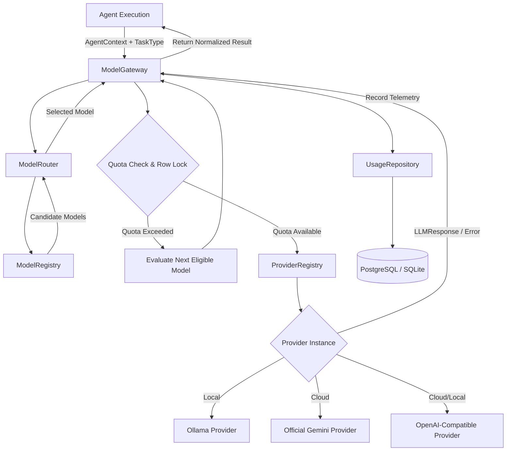

# Technical Requirements Document (TRD)

## Project: Agentic Multimodal Research Platform (AI Research OS)
**Status**: Active / Production v1.1 (Phase 17 Complete, Preparing Phase 18)  
**Architecture Version**: 1.1 (Phase 17 Complete, Preparing Phase 18)  
**Last Updated**: September 2026  
**Stable Branch**: `develop/v1.1`

---

## 1. System Architecture & Boundaries

The platform implements a modular, asynchronous, decoupled monorepo architecture:

```
┌──────────────────────────────────────────────────────────────────────────────────┐
│                           Client Tier (React 18 / Vite)                          │
│     - Responsive Dashboard, Live Research Studio, Document Hub, Memory Studio    │
│     - Bi-directional WebSockets with Exponential Backoff Auto-Reconnect         │
└────────────────────────────────────────┬─────────────────────────────────────────┘
                                         │ HTTPS / WSS
┌────────────────────────────────────────▼─────────────────────────────────────────┐
│                     FastAPI Application Gateway (apps/api)                       │
│  - JWT Authentication Middleware (PBKDF2-HMAC-SHA256, Access & Refresh)          │
│  - User Context Extraction (Injects user_id into downstream async context)       │
│  - REST Endpoints (/api/v1/auth, /research, /documents, /memory, /models, /health)│
│  - Real-Time WebSocket Connection Manager with Initial Snapshot Hydration       │
└────────────────────────────────────────┬─────────────────────────────────────────┘
                                         │
        ┌────────────────────────────────┼────────────────────────────────┐
        ▼                                ▼                                ▼
┌──────────────────┐           ┌──────────────────┐             ┌──────────────────┐
│ Database Layer   │           │ Research Engine  │             │ AI Engine Layer  │
│ (packages/       │           │ (packages/       │             │ (packages/ai)    │
│  database)       │           │  research)       │             │                  │
│ • AsyncSession   │           │ • Task DAG Engine│             │ • ModelGateway   │
│ • PostgreSQL 16  │           │ • Orchestrator   │             │ • ModelRouter    │
│ • SQLite Parity  │           │ • Memory Manager │             │ • ModelRegistry  │
│ • ResearchMemory │           │ • EventBus       │             │ • ProviderReg.   │
│ • UserQuota      │           │ • Synthesis      │             │ • Quota & Usage  │
│ • Row Locking    │           └────────┬─────────┘             └────────┬─────────┘
└──────────────────┘                    │                                │
                                        ▼                                │
                               ┌──────────────────┐                      │
                               │ Agent Framework  │                      │
                               │ (packages/agents)│◄─────────────────────┘
                               │ • PlannerAgent   │
                               │ • WebAgent       │
                               │ • DocAgent       │
                               │ • CriticAgent    │
                               │ • ReportAgent    │
                               └────────┬─────────┘
                                        │
                         ┌──────────────┴──────────────┐
                         ▼                             ▼
                ┌──────────────────┐          ┌──────────────────┐
                │ Tools Registry   │          │ Retrieval / RAG  │
                │ (packages/tools) │          │ (packages/       │
                │ • WebSearch      │          │  retrieval)      │
                │ • SSRF-Safe Fetch│          │ • ChromaDB       │
                │ • DocReader      │          │ • In-Memory Store│
                │ • Math & Memory  │          │ • BM25 + RRF     │
                └──────────────────┘          └──────────────────┘
```

---

## 2. Technical Stack Specifications

| Component | Technology | Version | Purpose |
|---|---|---|---|
| **Runtime & Language** | Python | 3.11+ | High-performance asynchronous backend services |
| **API Framework** | FastAPI | 0.110+ | Asynchronous REST and WebSocket routing |
| **ASGI Server** | Uvicorn | 0.29+ | Production ASGI server with uvloop support |
| **Database ORM** | SQLAlchemy | 2.0+ (Async) | Unified async SQL interface across DB engines |
| **Migration Tool** | Alembic | 1.13+ | Automated, version-controlled relational schema migrations |
| **Primary Relational DB** | PostgreSQL | 16+ | Persistent users, quotas, memories, usage logs, research jobs, DAG tasks |
| **Testing Relational DB** | SQLite (Async) | 3.40+ | In-memory zero-latency dialect-compatible test execution |
| **Vector Database** | ChromaDB | 0.4+ | Semantic document chunk vector index |
| **Sparse Lexical Search** | `rank-bm25` | 0.2+ | Exact keyword / BM25 search for Hybrid RAG |
| **Document Parsers** | `pdfplumber`, `python-docx`, `Pillow` | Latest | Multimodal text, table, and image extraction |
| **AI Inference SDKs** | `google-genai` (official SDK), `httpx` (Ollama & OpenAI) | Latest | Unified multi-provider AI model completions and streaming |
| **Frontend Framework** | React / TypeScript | 18+ / 5.4+ | Interactive single-page research studio |
| **Build & Bundling** | Vite | 5.2+ | Ultra-fast HMR and optimized production bundling |

---

## 3. Subsystem Technical Requirements

### 3.1 AI Engine: Model Gateway, Routing & Quota Architecture



#### Key Technical Rules:
1. **Model Capability Matching**: Tasks define capability constraints (`STREAMING_RESPONSE`, `VISION_ANALYSIS`, `FACTUAL_EXTRACTION`, `SYNTHESIS`). `ModelRouter` scores eligible candidates by suitability score and priority.
2. **Quota Enforcement with Transactional Row Locking**:
   - Quota queries must utilize `SELECT ... FOR UPDATE` (or SQLite serialized transactions) on the `user_quotas` table.
   - Prevents race conditions during concurrent parallel agent runs. Verification confirmed: 10 concurrent workers @ 20 tokens each against a 50-token quota yield exactly 2 successes, 8 rejections, and 0 oversubscription.
3. **Quota-Aware Fallback**: If a selected model exceeds user cost/token quota, the gateway automatically evaluates the next candidate model or falls back to local zero-cost Ollama instances.
4. **User Pipeline Propagation**: Authenticated user ID is passed from FastAPI `get_current_user()` $\rightarrow$ `ResearchPipeline` $\rightarrow$ `AgentOrchestrator` $\rightarrow$ `AgentContext` $\rightarrow$ `ModelGateway` $\rightarrow$ `UsageRepository`.

---

### 3.2 Research Engine: DAG Task Orchestrator & State Flow

1. **DAG Representation**: Research plans are compiled into topological dependency graphs (`depends_on: [task_id_1, task_id_2]`).
2. **Concurrency Execution**: Tasks with no pending dependencies execute concurrently via `asyncio.gather()` / coroutine pools.
3. **EventBus Dispatch**: Every task lifecycle transition (`PENDING` $\rightarrow$ `RUNNING` $\rightarrow$ `COMPLETED` / `FAILED`) emits structured events onto `ResearchEventBus`.
4. **Critic Verification Loop & Deep Research**: `CriticAgent` audits evidence coverage, generates gap analyses, and triggers recursive hypothesis refinement loops until convergence criteria ($\tau \ge 0.85$) are met.
5. **Research Memory Consolidation**: Synthesized report key findings, methodologies, and verified hypotheses are automatically persisted into `DBResearchMemory` across sessions.

---

### 3.3 Multimodal Ingestion & Hybrid RAG

1. **Ingestion Pipeline**:
   - PDF: Page-by-page text extraction + tabular grid detection via `pdfplumber`.
   - DOCX: Document hierarchy preservation (headings, body, lists) via `python-docx`.
   - Images: Visual feature description and OCR via vision LLM endpoints.
2. **Chunking**: Semantic boundary chunking with overlap (500 tokens / 50 token stride) preserving document metadata (`source_id`, `page_number`, `chunk_index`).
3. **Hybrid Retrieval**:
   $$\text{RRF Score}(d) = \sum_{m \in \{\text{dense}, \text{sparse}\}} \frac{1}{k + \text{rank}_m(d)} \quad (k=60)$$

---

## 4. Security & Hardening Requirements

1. **SSRF Safe Fetching (`WebFetchTool`)**:
   - Resolves DNS before making HTTP requests.
   - Blocks private IP ranges: `127.0.0.0/8`, `10.0.0.0/8`, `172.16.0.0/12`, `192.168.0.0/16`, `169.254.0.0/16`, `fc00::/7`, `fe80::/10`.
   - Rejects redirects to internal endpoints.
2. **Authentication & Password Security**:
   - Passwords hashed with PBKDF2-HMAC-SHA256 (100,000 iterations).
   - JWT tokens signed with `HS256`, 24-hour expiration for access tokens, 7-day expiration for refresh tokens.
3. **Deterministic Calculation Requirement**:
   - All mathematical, statistical, and numerical computations are executed via sandboxed Python calculation tools rather than generative LLM guessing.

---

## 5. Roadmap Technical Requirements (Phases 9 – 26)

### Generation 1: Intelligent Research Core (COMPLETE)
- **Phase 9 (Knowledge Automation - COMPLETE)**: Automated asynchronous ingestion worker connecting upload to vector/BM25 indexing; Planner integration to query existing knowledge before dispatching web tasks.
- **Phase 10 (Citation Intelligence - COMPLETE)**: Data contract for `Citation` model anchoring claims to exact character/line offsets, paragraph indices, and page coordinates in source documents, with pairwise contradiction detection.
- **Phase 11 (Advanced Planning - COMPLETE)**: Hierarchical planning engine with `QueryTreeNode` recursive decomposition, ambiguity scoring, and closed-loop dynamic replanning.

### Generation 2: Multimodal Intelligence (COMPLETE)
- **Phase 12 (Advanced Multimodal - COMPLETE)**: Multi-modal context assembler handling interleaved text, charts (`ChartRef`), and audio/video timestamp segments (`[MM:SS - MM:SS]`).
- **Phase 13 (Data Intelligence - COMPLETE)**: Deterministic execution engine (`DataAnalysisTool`, `DeterministicMathTool`, `TabularParser`) for statistical profiling, aggregations, correlation, linear regression, and AST math over CSV/TSV/Excel/JSON datasets.
- **Phase 14 (Paper Intelligence - COMPLETE)**: Academic research paper parser (`AcademicPaperParser`), section tree hierarchies (`PaperSection`), BibTeX citation matching, and cross-paper comparative matrices (`PaperAnalysisTool`, `MethodologyComparisonTool`).

### Generation 3: Autonomous Research (COMPLETE)
- **Phase 15 (Deep Research - COMPLETE)**: Dynamic recursive hypothesis formulation, Critic gap audits, DAG task rescheduling with convergence guardrails $\tau \ge 0.85$.
- **Phase 16 (Research Memory - COMPLETE)**: Cross-session conceptual memory persistence (`DBResearchMemory`, `MemoryRepository`, `ResearchMemoryManager`), agent memory tools (`RecallMemoryTool`, `StoreMemoryTool`), REST API (`/api/v1/memory`), and interactive `ResearchMemoryViewer` UI.
- **Phase 17 (Knowledge Graph - COMPLETE)**: Relational entity-relationship adjacency persistence (`DBKnowledgeEntity`, `DBKnowledgeRelation`, `KnowledgeGraphRepository`), `KnowledgeGraphEngine` (triplet extraction from findings/reports, Graph-Augmented RAG `GraphRAG`), agent tools (`QueryKnowledgeGraphTool`, `ExtractGraphTripletsTool`, `FindRelationPathTool`), REST API (`/api/v1/graph`), and interactive React network visualization studio (`KnowledgeGraphViewer.tsx` & `KnowledgeGraphPage.tsx`).

### Generation 4: Collaboration Platform (COMPLETE)
- **Phase 18 (Workspaces - COMPLETE)**: Multi-tenant workspace and project isolation (`DBWorkspace`, `DBWorkspaceMember`, `DBProject`), scoped repositories, `/workspaces` and `/projects` REST APIs, and `WorkspaceSelector` / `ProjectsPage` UI.
- **Phase 19 (Collaboration - COMPLETE)**: Granular workspace RBAC (`owner`, `admin`, `researcher`, `analyst`, `reviewer`, `viewer`), cryptographic email invitation lifecycle (`DBWorkspaceInvite`, `WorkspaceInviteRepository`), threaded report annotations with quotes and 1-click resolution (`DBReportAnnotation`, `ReportAnnotationsDrawer.tsx`), and collaborative audit activity logs (`DBWorkspaceActivity`).

### Generation 5: AI Platform Intelligence (COMPLETE)
- **Phase 20 (Model Ecosystem - COMPLETE)**: Cost/latency/quality Pareto frontier multi-parameter utility optimization engine (`ModelEcosystemOptimizer`), preset profiles (Balanced, Cost, Speed, Quality), `/models/profiles` and `/models/optimize` REST APIs, and live frontend preview simulation.
- **Phase 21 (Model Evaluation - COMPLETE)**: Automated offline eval harness comparing model responses against golden research benchmarks (`BenchmarkDataset`, `DEFAULT_RESEARCH_BENCHMARK`), multi-metric scoring (`EvaluationMetricsEngine`), persistence (`DBModelEvaluation`, `ModelEvaluationRepository`), REST endpoints (`/models/evaluate`, `/models/evaluations`, `/models/leaderboard`), and competitive Leaderboard studio (`ModelEvaluationPage.tsx`).
- **Phase 22 (Agent Evaluation - COMPLETE)**: Autonomous multi-metric agent evaluation engine (`AgentEvaluator`, `AgentEvaluationScorecard`, `AgentStepTelemetry`), plan precision scoring, tool invocation accuracy, evidence grounding coverage, sentence-level hallucination rate detection, database persistence (`DBAgentEvaluation`, `DBAgentStepMetric`, `AgentEvaluationRepository`), REST APIs (`/api/v1/agents/evaluate`, `/api/v1/agents/evaluations`, `/api/v1/agents/metrics/summary`), and interactive Agent Observability Studio (`AgentEvaluationPage.tsx`).

### Generation 6: Production Product (ACTIVE GENERATION - Phase 26 Next)
- **Phase 23 (Enterprise Security - COMPLETE)**: KMS two-tier envelope encryption (AES-256-GCM DEK/KEK with PBKDF2 salt derivation), tamper-evident SHA-256 cryptographic audit hash chaining (`AuditHashChainer`), workspace security & data retention policies (`DBSecurityPolicy`), automated GDPR Article 17 cascade purge (`execute_gdpr_data_purge`), SOC 2 compliance scorecard APIs, and `EnterpriseSecurityPage.tsx` React studio.
- **Phase 24 (Production Infrastructure - COMPLETE)**: In-memory and distributed asynchronous task queues (`AsyncTaskQueue` with `CRITICAL`, `HIGH`, `DEFAULT`, `LOW` heap scheduling), worker node cluster tracking (`WorkerNode`, `DBWorkerNode`), S3/MinIO/Local unified blob storage vault (`ObjectStorageClient`, `DBStorageObject`), `InfrastructureRepository`, REST APIs (`/api/v1/system`), and `ProductionInfrastructurePage.tsx` React cluster topology studio.
- **Phase 25 (Developer Platform - COMPLETE)**: Public OpenAPI 3.1 gateway (`/api/v1/developer/*`), developer API key provisioning with SHA-256 secret hashing (`DBApiKey`, `ApiKeyRepository`), granular permission scopes (`research:read`, `research:write`, `documents:read`, `documents:write`, `memory:read`, `graph:read`), sliding window tier rate limiting (Free, Pro, Enterprise), interactive API Playground with live cURL / Python / TypeScript SDK snippets, and `DeveloperPlatformPage.tsx` UI.
- **Phase 26 (Research Automation - 🟡 IMMEDIATE NEXT MILESTONE)**: Cron-based research workers with web/paper change detection, diff comparison engine, and webhook/email alert triggers.
