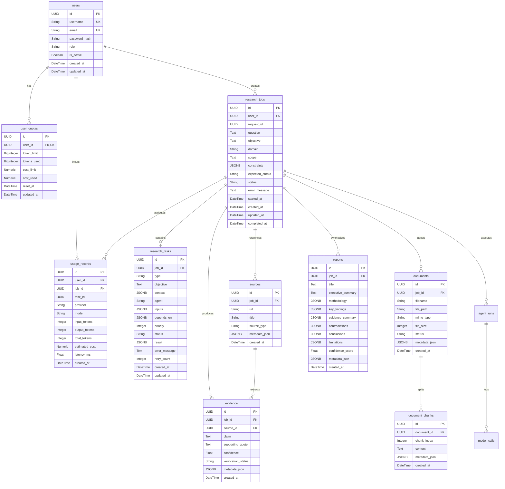

# Database Schema & API Contracts: backend-schema.md

This document defines the physical relational database schema, SQLAlchemy models, Alembic migrations, indexes, constraints, and API data contracts for the **Agentic Multimodal Research Platform**.

---

## 1. Entity Relationship Diagram (ERD)



---

## 2. Relational Table Specifications

### 2.1 Table: `users`
- Managed via Alembic migration `001_create_users_table.py`.
- Primary storage for authenticated user credentials and RBAC roles.

| Column | Type | Constraints | Description |
|---|---|---|---|
| `id` | `UUID` | `PRIMARY KEY` | Unique user identifier |
| `username` | `VARCHAR(50)` | `UNIQUE, NOT NULL` | Unique user handle |
| `email` | `VARCHAR(255)` | `UNIQUE, NOT NULL` | Verified email address |
| `password_hash` | `VARCHAR(255)` | `NOT NULL` | PBKDF2-HMAC-SHA256 hashed password |
| `role` | `VARCHAR(20)` | `NOT NULL, DEFAULT 'Researcher'` | Role (`Admin`, `Researcher`, `Viewer`) |
| `is_active` | `BOOLEAN` | `NOT NULL, DEFAULT TRUE` | Account active state |
| `created_at` | `TIMESTAMP WITH TZ` | `NOT NULL, DEFAULT NOW()` | Creation timestamp |
| `updated_at` | `TIMESTAMP WITH TZ` | `NOT NULL, DEFAULT NOW()` | Last update timestamp |

---

### 2.2 Table: `user_quotas` (Phase 8B)
- Manages lifetime or recurring token and cost quotas. `NULL` limits represent unlimited quotas.

| Column | Type | Constraints | Description |
|---|---|---|---|
| `id` | `UUID` | `PRIMARY KEY` | Unique quota record ID |
| `user_id` | `UUID` | `FOREIGN KEY (users.id), UNIQUE, NOT NULL` | Owner user reference |
| `token_limit` | `BIGINT` | `NULLABLE` | Maximum allowed tokens (`NULL` = unlimited) |
| `tokens_used` | `BIGINT` | `NOT NULL, DEFAULT 0` | Cumulative tokens consumed |
| `cost_limit` | `NUMERIC(10, 4)` | `NULLABLE` | Maximum spend limit USD (`NULL` = unlimited) |
| `cost_used` | `NUMERIC(10, 4)` | `NOT NULL, DEFAULT 0.0000` | Cumulative cost consumed USD |
| `reset_at` | `TIMESTAMP WITH TZ` | `NULLABLE` | Scheduled quota reset date |
| `updated_at` | `TIMESTAMP WITH TZ` | `NOT NULL, DEFAULT NOW()` | Last modification timestamp |

---

### 2.3 Table: `usage_records` (Phase 8B)
- Granular per-inference telemetry log linking AI operations back to users and research jobs.

| Column | Type | Constraints | Description |
|---|---|---|---|
| `id` | `UUID` | `PRIMARY KEY` | Telemetry record ID |
| `user_id` | `UUID` | `FOREIGN KEY (users.id), NULLABLE` | Authenticated user ID |
| `job_id` | `UUID` | `FOREIGN KEY (research_jobs.id), NULLABLE`| Associated research job |
| `task_id` | `UUID` | `NULLABLE` | Associated DAG task ID |
| `provider` | `VARCHAR(50)` | `NOT NULL` | Provider name (`ollama`, `gemini`, `openai`) |
| `model` | `VARCHAR(100)` | `NOT NULL` | Exact model name |
| `input_tokens` | `INTEGER` | `NOT NULL, DEFAULT 0` | Prompt token count |
| `output_tokens` | `INTEGER` | `NOT NULL, DEFAULT 0` | Completion token count |
| `total_tokens` | `INTEGER` | `NOT NULL, DEFAULT 0` | Summed token count |
| `estimated_cost`| `NUMERIC(10, 6)` | `NOT NULL, DEFAULT 0.000000` | Computed USD cost |
| `latency_ms` | `FLOAT` | `NOT NULL, DEFAULT 0.0` | Execution latency in milliseconds |
| `created_at` | `TIMESTAMP WITH TZ` | `NOT NULL, DEFAULT NOW()` | Timestamp of inference |

---

### 2.4 Table: `research_jobs`
- Represents top-level research inquiries.

| Column | Type | Constraints | Description |
|---|---|---|---|
| `id` | `UUID` | `PRIMARY KEY` | Research job ID |
| `user_id` | `UUID` | `FOREIGN KEY (users.id), NULLABLE` | Submitting user ID |
| `request_id` | `UUID` | `NOT NULL` | Correlation tracking ID |
| `question` | `TEXT` | `NOT NULL` | User research prompt |
| `objective` | `TEXT` | `NULLABLE` | Planner-decomposed objective |
| `domain` | `VARCHAR(100)` | `NULLABLE` | Detected inquiry domain |
| `scope` | `TEXT` | `NULLABLE` | Research boundary definitions |
| `constraints` | `JSONB / JSON` | `NULLABLE` | Query constraints |
| `expected_output`| `VARCHAR(100)` | `NULLABLE` | Target output format |
| `status` | `VARCHAR(30)` | `NOT NULL, DEFAULT 'pending'` | Job status (`pending`, `running`, `completed`, `failed`) |
| `error_message` | `TEXT` | `NULLABLE` | Failure diagnostic message |
| `started_at` | `TIMESTAMP WITH TZ` | `NULLABLE` | Start execution time |
| `completed_at` | `TIMESTAMP WITH TZ` | `NULLABLE` | Finish execution time |

---

## 3. Database Cross-Compatibility Strategy

To ensure seamless production deployment on PostgreSQL 16 while supporting fast, zero-dependency in-memory testing with SQLite, all model definitions use SQLAlchemy dialect-agnostic variants:

```python
from sqlalchemy import JSON, String
from sqlalchemy.dialects.postgresql import JSONB, UUID as PG_UUID
from sqlalchemy.types import TypeDecorator, CHAR
import uuid

# Dialect-safe UUID Type
class GUID(TypeDecorator):
    impl = CHAR
    cache_ok = True

    def load_dialect_impl(self, dialect):
        if dialect.name == "postgresql":
            return dialect.type_descriptor(PG_UUID())
        return dialect.type_descriptor(CHAR(36))

# Dialect-safe JSON Type
JSONType = JSON().with_variant(JSONB, "postgresql")
```

---

## 4. Planned Schema Extensions (Generations 4 – 6)

### Generation 4 (Phases 18 – 19): Workspaces & Collaboration
```sql
CREATE TABLE workspaces (
    id UUID PRIMARY KEY,
    name VARCHAR(100) NOT NULL,
    owner_id UUID REFERENCES users(id) ON DELETE CASCADE,
    created_at TIMESTAMP WITH TIME ZONE DEFAULT NOW()
);

CREATE TABLE workspace_members (
    id UUID PRIMARY KEY,
    workspace_id UUID REFERENCES workspaces(id) ON DELETE CASCADE,
    user_id UUID REFERENCES users(id) ON DELETE CASCADE,
    role VARCHAR(30) NOT NULL DEFAULT 'Researcher', -- Owner, Researcher, Analyst, Reviewer, Viewer
    created_at TIMESTAMP WITH TIME ZONE DEFAULT NOW(),
    UNIQUE(workspace_id, user_id)
);

CREATE TABLE projects (
    id UUID PRIMARY KEY,
    workspace_id UUID REFERENCES workspaces(id) ON DELETE CASCADE,
    name VARCHAR(150) NOT NULL,
    description TEXT,
    created_at TIMESTAMP WITH TIME ZONE DEFAULT NOW()
);
```
