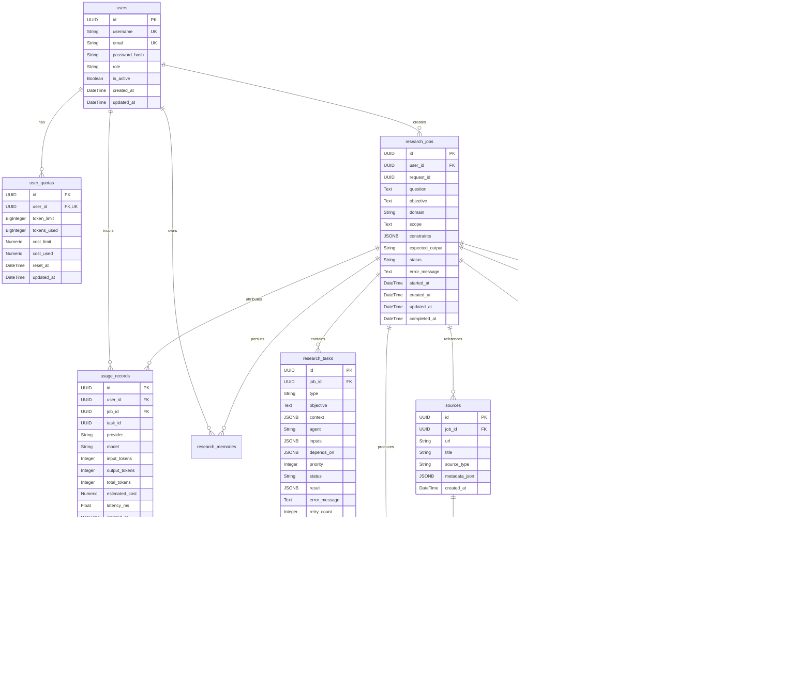

# Database Schema & API Contracts: backend-schema.md

This document defines the physical relational database schema, SQLAlchemy models, Alembic migrations, indexes, constraints, and API data contracts for the **Agentic Multimodal Research Platform**.

---

## 1. Entity Relationship Diagram (ERD)



---

## 2. Relational Table Specifications

### 2.1 Table: `users`
- Managed via Alembic migration `001_create_users_table.py`.
- Primary storage for authenticated user credentials and RBAC roles.

| Column | Type | Constraints | Description |
|---|---|---|---|
| `id` | `UUID` | `PRIMARY KEY` | Unique user identifier |
| `username` | `VARCHAR(50)` | `UNIQUE, NOT NULL` | Unique user handle |
| `email` | `VARCHAR(255)` | `UNIQUE, NOT NULL` | Verified email address |
| `password_hash` | `VARCHAR(255)` | `NOT NULL` | PBKDF2-HMAC-SHA256 hashed password |
| `role` | `VARCHAR(20)` | `NOT NULL, DEFAULT 'Researcher'` | Role (`Admin`, `Researcher`, `Viewer`) |
| `is_active` | `BOOLEAN` | `NOT NULL, DEFAULT TRUE` | Account active state |
| `created_at` | `TIMESTAMP WITH TZ` | `NOT NULL, DEFAULT NOW()` | Creation timestamp |
| `updated_at` | `TIMESTAMP WITH TZ` | `NOT NULL, DEFAULT NOW()` | Last update timestamp |

---

### 2.2 Table: `user_quotas` (Phase 8B)
- Manages lifetime or recurring token and cost quotas. `NULL` limits represent unlimited quotas.

| Column | Type | Constraints | Description |
|---|---|---|---|
| `id` | `UUID` | `PRIMARY KEY` | Unique quota record ID |
| `user_id` | `UUID` | `FOREIGN KEY (users.id), UNIQUE, NOT NULL` | Owner user reference |
| `token_limit` | `BIGINT` | `NULLABLE` | Maximum allowed tokens (`NULL` = unlimited) |
| `tokens_used` | `BIGINT` | `NOT NULL, DEFAULT 0` | Cumulative tokens consumed |
| `cost_limit` | `NUMERIC(10, 4)` | `NULLABLE` | Maximum spend limit USD (`NULL` = unlimited) |
| `cost_used` | `NUMERIC(10, 4)` | `NOT NULL, DEFAULT 0.0000` | Cumulative cost consumed USD |
| `reset_at` | `TIMESTAMP WITH TZ` | `NULLABLE` | Scheduled quota reset date |
| `updated_at` | `TIMESTAMP WITH TZ` | `NOT NULL, DEFAULT NOW()` | Last modification timestamp |

---

### 2.3 Table: `usage_records` (Phase 8B)
- Granular per-inference telemetry log linking AI operations back to users and research jobs.

| Column | Type | Constraints | Description |
|---|---|---|---|
| `id` | `UUID` | `PRIMARY KEY` | Telemetry record ID |
| `user_id` | `UUID` | `FOREIGN KEY (users.id), NULLABLE` | Authenticated user ID |
| `job_id` | `UUID` | `FOREIGN KEY (research_jobs.id), NULLABLE`| Associated research job |
| `task_id` | `UUID` | `NULLABLE` | Associated DAG task ID |
| `provider` | `VARCHAR(50)` | `NOT NULL` | Provider name (`ollama`, `gemini`, `openai`) |
| `model` | `VARCHAR(100)` | `NOT NULL` | Exact model name |
| `input_tokens` | `INTEGER` | `NOT NULL, DEFAULT 0` | Prompt token count |
| `output_tokens` | `INTEGER` | `NOT NULL, DEFAULT 0` | Completion token count |
| `total_tokens` | `INTEGER` | `NOT NULL, DEFAULT 0` | Summed token count |
| `estimated_cost`| `NUMERIC(10, 6)` | `NOT NULL, DEFAULT 0.000000` | Computed USD cost |
| `latency_ms` | `FLOAT` | `NOT NULL, DEFAULT 0.0` | Execution latency in milliseconds |
| `created_at` | `TIMESTAMP WITH TZ` | `NOT NULL, DEFAULT NOW()` | Timestamp of inference |

---

### 2.4 Table: `research_jobs`
- Represents top-level research inquiries.

| Column | Type | Constraints | Description |
|---|---|---|---|
| `id` | `UUID` | `PRIMARY KEY` | Research job ID |
| `user_id` | `UUID` | `FOREIGN KEY (users.id), NULLABLE` | Submitting user ID |
| `request_id` | `UUID` | `NOT NULL` | Correlation tracking ID |
| `question` | `TEXT` | `NOT NULL` | User research prompt |
| `objective` | `TEXT` | `NULLABLE` | Planner-decomposed objective |
| `domain` | `VARCHAR(100)` | `NULLABLE` | Detected inquiry domain |
| `scope` | `TEXT` | `NULLABLE` | Research boundary definitions |
| `constraints` | `JSONB / JSON` | `NULLABLE` | Query constraints |
| `expected_output`| `VARCHAR(100)` | `NULLABLE` | Target output format |
| `status` | `VARCHAR(30)` | `NOT NULL, DEFAULT 'pending'` | Job status (`pending`, `running`, `completed`, `failed`) |
| `error_message` | `TEXT` | `NULLABLE` | Failure diagnostic message |
| `started_at` | `TIMESTAMP WITH TZ` | `NULLABLE` | Start execution time |
| `completed_at` | `TIMESTAMP WITH TZ` | `NULLABLE` | Finish execution time |

---

### 2.5 Structured JSON Contracts: Deep Research Engine (Phase 15)

#### `DeepResearchConfig` (Stored within `research_jobs.constraints` or pipeline request)
```json
{
  "max_iterations": 3,
  "confidence_threshold": 0.85,
  "diminishing_returns_threshold": 0.02,
  "max_subtasks_per_iteration": 4,
  "enable_recursive_hypotheses": true
}
```

#### `ResearchIteration` (Stored within `reports.metadata_json.iterations`)
```json
{
  "iteration_index": 1,
  "hypotheses": ["Higher batch sizes reduce communication overhead in federated learning."],
  "scheduled_task_ids": ["uuid-1", "uuid-2"],
  "completed_task_ids": ["uuid-1", "uuid-2"],
  "evidence_count": 14,
  "confidence_score": 0.88,
  "unresolved_gaps": [],
  "gap_queries": [],
  "status": "converged",
  "created_at": "2026-09-12T13:30:00Z"
}
```

---

### 2.6 Table: `research_memories` (Phase 16)
- Represents persistent, cross-session distilled research findings, methodologies, and concepts.

| Column | Type | Constraints | Description |
|---|---|---|---|
| `id` | `UUID` | `PRIMARY KEY` | Unique memory item ID |
| `user_id` | `UUID` | `FOREIGN KEY (users.id), NOT NULL` | Owning authenticated user ID |
| `project_id` | `UUID` | `NULLABLE` | Associated project workspace ID |
| `job_id` | `UUID` | `FOREIGN KEY (research_jobs.id), NULLABLE` | Originating research job ID |
| `memory_type` | `VARCHAR(50)` | `NOT NULL, DEFAULT 'concept'` | Type: `concept`, `finding`, `hypothesis`, `methodology`, `fact` |
| `title` | `VARCHAR(255)` | `NOT NULL` | Short title / conceptual headline |
| `content` | `TEXT` | `NOT NULL` | Markdown-formatted distilled knowledge body |
| `tags` | `JSONB / JSON` | `NOT NULL, DEFAULT '[]'` | Categorization tags for keyword filtering |
| `confidence_score` | `FLOAT` | `NOT NULL, DEFAULT 1.0` | Confidence level [0.0, 1.0] |
| `provenance_json` | `JSONB / JSON` | `NOT NULL, DEFAULT '{}'` | Provenance metadata (`source`, `source_id`, `url`, `chunk_id`) |
| `access_count` | `INTEGER` | `NOT NULL, DEFAULT 0` | Historical recall frequency count |
| `last_accessed_at` | `TIMESTAMP WITH TZ` | `NULLABLE` | Timestamp of most recent recall |
| `created_at` | `TIMESTAMP WITH TZ` | `NOT NULL, DEFAULT NOW()` | Creation timestamp |
| `updated_at` | `TIMESTAMP WITH TZ` | `NOT NULL, DEFAULT NOW()` | Last modification timestamp |

#### Indexes:
- `ix_research_memories_user_id` (`user_id`)
- `ix_research_memories_project_id` (`project_id`)
- `ix_research_memories_memory_type` (`memory_type`)
- `ix_research_memories_title` (`title`)

#### Memory Item Schema (`MemoryItem` / API Contract):
```json
{
  "id": "3fa85f64-5717-4562-b3fc-2c963f66afa6",
  "user_id": "3fa85f64-5717-4562-b3fc-2c963f66afa6",
  "project_id": null,
  "job_id": "9b1deb4d-3b7d-4bad-9bdd-2b0d7b3dcb6d",
  "memory_type": "finding",
  "title": "Degradation Rate of PLA in Marine Environments",
  "content": "Polylactic acid (PLA) degrades at less than 1.5% per year in ambient seawater (15-20°C).",
  "tags": ["materials", "marine-biodegradation", "pla"],
  "confidence": 0.94,
  "provenance": {
    "source": "paper",
    "source_id": "doi:10.1016/j.polymdegradstab.2025.109876",
    "url": "https://doi.org/10.1016/j.polymdegradstab.2025.109876"
  },
  "access_count": 3,
  "last_accessed_at": "2026-09-12T14:15:00Z",
  "created_at": "2026-09-12T13:45:00Z",
  "updated_at": "2026-09-12T14:15:00Z"
}
```

---

### 2.7 Table: `knowledge_entities` (Phase 17)
- Represents conceptual nodes, technologies, materials, metrics, datasets, papers, and persons in the persistent Research Knowledge Graph.

| Column | Type | Constraints | Description |
|---|---|---|---|
| `id` | `UUID` | `PRIMARY KEY` | Unique entity node UUID |
| `user_id` | `UUID` | `FOREIGN KEY (users.id), NULLABLE` | Optional owning user ID |
| `project_id` | `UUID` | `NULLABLE` | Optional associated project UUID |
| `name` | `VARCHAR(255)` | `NOT NULL` | Entity name / label |
| `canonical_name` | `VARCHAR(255)` | `NOT NULL` | Normalized lowercase canonical entity key |
| `entity_type` | `VARCHAR(50)` | `NOT NULL, DEFAULT 'CONCEPT'` | Type: `CONCEPT`, `TECHNOLOGY`, `MATERIAL`, `PERSON`, `ORGANIZATION`, `METRIC`, `DATASET`, `PAPER`, `LOCATION`, `OTHER` |
| `description` | `TEXT` | `NULLABLE` | Contextual conceptual description |
| `aliases` | `JSONB / JSON` | `NOT NULL, DEFAULT '[]'` | Synonyms and alias names |
| `properties_json` | `JSONB / JSON` | `NOT NULL, DEFAULT '{}'` | Arbitrary metadata key-values |
| `confidence` | `FLOAT` | `NOT NULL, DEFAULT 1.0` | Confidence rating [0.0, 1.0] |
| `created_at` | `TIMESTAMP WITH TZ` | `NOT NULL, DEFAULT NOW()` | Creation timestamp |
| `updated_at` | `TIMESTAMP WITH TZ` | `NOT NULL, DEFAULT NOW()` | Last update timestamp |

#### Indexes:
- `ix_knowledge_entities_canonical_name` (`canonical_name`)
- `ix_knowledge_entities_entity_type` (`entity_type`)
- `ix_knowledge_entities_user_id` (`user_id`)
- `ix_knowledge_entities_project_id` (`project_id`)

---

### 2.8 Table: `knowledge_relations` (Phase 17)
- Represents directed relational edges connecting knowledge entities in the Graph.

| Column | Type | Constraints | Description |
|---|---|---|---|
| `id` | `UUID` | `PRIMARY KEY` | Unique relation edge UUID |
| `source_id` | `UUID` | `FOREIGN KEY (knowledge_entities.id), NOT NULL` | Source entity node ID |
| `target_id` | `UUID` | `FOREIGN KEY (knowledge_entities.id), NOT NULL` | Target entity node ID |
| `relation_type` | `VARCHAR(100)` | `NOT NULL, DEFAULT 'RELATES_TO'` | Predicate: `AUTHORED_BY`, `USES_MATERIAL`, `CONTRADICTS`, `EVALUATED_ON`, `DEVELOPED_BY`, `CORRELATES_WITH`, `DERIVED_FROM`, `APPLIES_METHODOLOGY`, `EXPOSED_TO`, `HOSTS`, `SECRETES`, `ENHANCES`, `SYNTHESIZED_VIA`, `RELATES_TO` |
| `user_id` | `UUID` | `FOREIGN KEY (users.id), NULLABLE` | Optional owning user ID |
| `project_id` | `UUID` | `NULLABLE` | Optional associated project UUID |
| `job_id` | `UUID` | `FOREIGN KEY (research_jobs.id), NULLABLE` | Associated research job ID |
| `description` | `TEXT` | `NULLABLE` | Relational context / explanation |
| `weight` | `FLOAT` | `NOT NULL, DEFAULT 1.0` | Connection weight / strength |
| `confidence` | `FLOAT` | `NOT NULL, DEFAULT 1.0` | Confidence score [0.0, 1.0] |
| `evidence_id` | `UUID` | `FOREIGN KEY (evidence.id), NULLABLE` | Linked research evidence UUID |
| `properties_json` | `JSONB / JSON` | `NOT NULL, DEFAULT '{}'` | Arbitrary edge metadata |
| `created_at` | `TIMESTAMP WITH TZ` | `NOT NULL, DEFAULT NOW()` | Creation timestamp |

#### Indexes:
- `ix_knowledge_relations_source_id` (`source_id`)
- `ix_knowledge_relations_target_id` (`target_id`)
- `ix_knowledge_relations_relation_type` (`relation_type`)
- `ix_knowledge_relations_job_id` (`job_id`)
- `ix_knowledge_relations_user_id` (`user_id`)
- `ix_knowledge_relations_src_tgt_type` (`source_id`, `target_id`, `relation_type`)

---

## 3. Database Cross-Compatibility Strategy

To ensure seamless production deployment on PostgreSQL 16 while supporting fast, zero-dependency in-memory testing with SQLite, all model definitions use SQLAlchemy dialect-agnostic variants:

```python
from sqlalchemy import JSON, String
from sqlalchemy.dialects.postgresql import JSONB, UUID as PG_UUID
from sqlalchemy.types import TypeDecorator, CHAR
import uuid

# Dialect-safe UUID Type
class GUID(TypeDecorator):
    impl = CHAR
    cache_ok = True

    def load_dialect_impl(self, dialect):
        if dialect.name == "postgresql":
            return dialect.type_descriptor(PG_UUID())
        return dialect.type_descriptor(CHAR(36))

# Dialect-safe JSON Type
JSONType = JSON().with_variant(JSONB, "postgresql")
```

---

## 4. Planned Schema Extensions (Generations 4 – 6)

### Generation 4 (Phases 18 – 19): Workspaces & Collaboration
```sql
CREATE TABLE workspaces (
    id UUID PRIMARY KEY,
    name VARCHAR(100) NOT NULL,
    owner_id UUID REFERENCES users(id) ON DELETE CASCADE,
    created_at TIMESTAMP WITH TIME ZONE DEFAULT NOW()
);

CREATE TABLE workspace_members (
    id UUID PRIMARY KEY,
    workspace_id UUID REFERENCES workspaces(id) ON DELETE CASCADE,
    user_id UUID REFERENCES users(id) ON DELETE CASCADE,
    role VARCHAR(30) NOT NULL DEFAULT 'Researcher', -- Owner, Researcher, Analyst, Reviewer, Viewer
    created_at TIMESTAMP WITH TIME ZONE DEFAULT NOW(),
    UNIQUE(workspace_id, user_id)
);

CREATE TABLE projects (
    id UUID PRIMARY KEY,
    workspace_id UUID REFERENCES workspaces(id) ON DELETE CASCADE,
    name VARCHAR(150) NOT NULL,
    description TEXT,
    created_at TIMESTAMP WITH TIME ZONE DEFAULT NOW()
);
```
