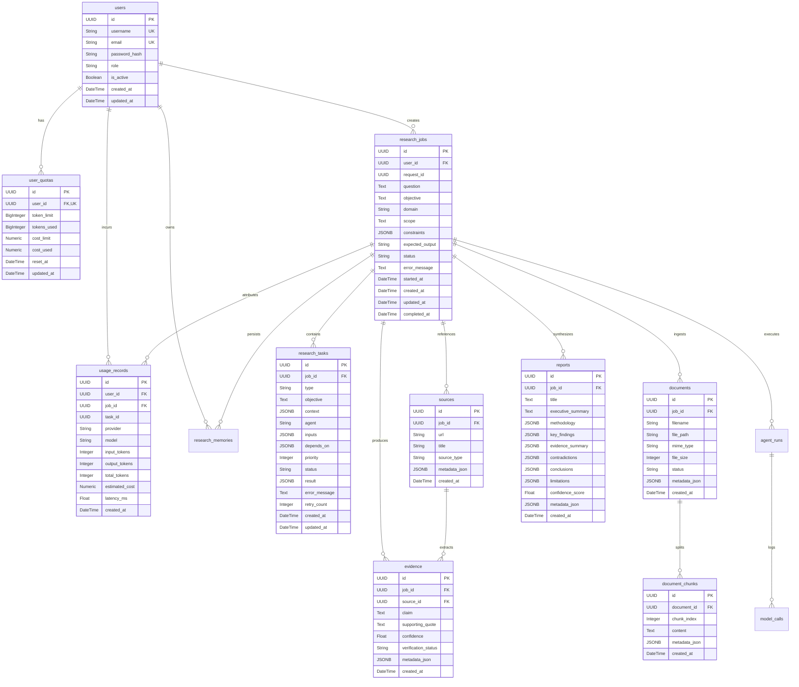

# Database Schema & API Contracts: backend-schema.md

This document defines the physical relational database schema, SQLAlchemy models, Alembic migrations, indexes, constraints, and API data contracts for the **Agentic Multimodal Research Platform**.

---

## 1. Entity Relationship Diagram (ERD)



---

## 2. Relational Table Specifications

### 2.1 Table: `users`
- Managed via Alembic migration `001_create_users_table.py`.
- Primary storage for authenticated user credentials and RBAC roles.

| Column | Type | Constraints | Description |
|---|---|---|---|
| `id` | `UUID` | `PRIMARY KEY` | Unique user identifier |
| `username` | `VARCHAR(50)` | `UNIQUE, NOT NULL` | Unique user handle |
| `email` | `VARCHAR(255)` | `UNIQUE, NOT NULL` | Verified email address |
| `password_hash` | `VARCHAR(255)` | `NOT NULL` | PBKDF2-HMAC-SHA256 hashed password |
| `role` | `VARCHAR(20)` | `NOT NULL, DEFAULT 'Researcher'` | Role (`Admin`, `Researcher`, `Viewer`) |
| `is_active` | `BOOLEAN` | `NOT NULL, DEFAULT TRUE` | Account active state |
| `created_at` | `TIMESTAMP WITH TZ` | `NOT NULL, DEFAULT NOW()` | Creation timestamp |
| `updated_at` | `TIMESTAMP WITH TZ` | `NOT NULL, DEFAULT NOW()` | Last update timestamp |

---

### 2.2 Table: `user_quotas` (Phase 8B)
- Manages lifetime or recurring token and cost quotas. `NULL` limits represent unlimited quotas.

| Column | Type | Constraints | Description |
|---|---|---|---|
| `id` | `UUID` | `PRIMARY KEY` | Unique quota record ID |
| `user_id` | `UUID` | `FOREIGN KEY (users.id), UNIQUE, NOT NULL` | Owner user reference |
| `token_limit` | `BIGINT` | `NULLABLE` | Maximum allowed tokens (`NULL` = unlimited) |
| `tokens_used` | `BIGINT` | `NOT NULL, DEFAULT 0` | Cumulative tokens consumed |
| `cost_limit` | `NUMERIC(10, 4)` | `NULLABLE` | Maximum spend limit USD (`NULL` = unlimited) |
| `cost_used` | `NUMERIC(10, 4)` | `NOT NULL, DEFAULT 0.0000` | Cumulative cost consumed USD |
| `reset_at` | `TIMESTAMP WITH TZ` | `NULLABLE` | Scheduled quota reset date |
| `updated_at` | `TIMESTAMP WITH TZ` | `NOT NULL, DEFAULT NOW()` | Last modification timestamp |

---

### 2.3 Table: `usage_records` (Phase 8B)
- Granular per-inference telemetry log linking AI operations back to users and research jobs.

| Column | Type | Constraints | Description |
|---|---|---|---|
| `id` | `UUID` | `PRIMARY KEY` | Telemetry record ID |
| `user_id` | `UUID` | `FOREIGN KEY (users.id), NULLABLE` | Authenticated user ID |
| `job_id` | `UUID` | `FOREIGN KEY (research_jobs.id), NULLABLE`| Associated research job |
| `task_id` | `UUID` | `NULLABLE` | Associated DAG task ID |
| `provider` | `VARCHAR(50)` | `NOT NULL` | Provider name (`ollama`, `gemini`, `openai`) |
| `model` | `VARCHAR(100)` | `NOT NULL` | Exact model name |
| `input_tokens` | `INTEGER` | `NOT NULL, DEFAULT 0` | Prompt token count |
| `output_tokens` | `INTEGER` | `NOT NULL, DEFAULT 0` | Completion token count |
| `total_tokens` | `INTEGER` | `NOT NULL, DEFAULT 0` | Summed token count |
| `estimated_cost`| `NUMERIC(10, 6)` | `NOT NULL, DEFAULT 0.000000` | Computed USD cost |
| `latency_ms` | `FLOAT` | `NOT NULL, DEFAULT 0.0` | Execution latency in milliseconds |
| `created_at` | `TIMESTAMP WITH TZ` | `NOT NULL, DEFAULT NOW()` | Timestamp of inference |

---

### 2.4 Table: `research_jobs`
- Represents top-level research inquiries.

| Column | Type | Constraints | Description |
|---|---|---|---|
| `id` | `UUID` | `PRIMARY KEY` | Research job ID |
| `user_id` | `UUID` | `FOREIGN KEY (users.id), NULLABLE` | Submitting user ID |
| `request_id` | `UUID` | `NOT NULL` | Correlation tracking ID |
| `question` | `TEXT` | `NOT NULL` | User research prompt |
| `objective` | `TEXT` | `NULLABLE` | Planner-decomposed objective |
| `domain` | `VARCHAR(100)` | `NULLABLE` | Detected inquiry domain |
| `scope` | `TEXT` | `NULLABLE` | Research boundary definitions |
| `constraints` | `JSONB / JSON` | `NULLABLE` | Query constraints |
| `expected_output`| `VARCHAR(100)` | `NULLABLE` | Target output format |
| `status` | `VARCHAR(30)` | `NOT NULL, DEFAULT 'pending'` | Job status (`pending`, `running`, `completed`, `failed`) |
| `error_message` | `TEXT` | `NULLABLE` | Failure diagnostic message |
| `started_at` | `TIMESTAMP WITH TZ` | `NULLABLE` | Start execution time |
| `completed_at` | `TIMESTAMP WITH TZ` | `NULLABLE` | Finish execution time |

---

### 2.5 Structured JSON Contracts: Deep Research Engine (Phase 15)

#### `DeepResearchConfig` (Stored within `research_jobs.constraints` or pipeline request)
```json
{
  "max_iterations": 3,
  "confidence_threshold": 0.85,
  "diminishing_returns_threshold": 0.02,
  "max_subtasks_per_iteration": 4,
  "enable_recursive_hypotheses": true
}
```

#### `ResearchIteration` (Stored within `reports.metadata_json.iterations`)
```json
{
  "iteration_index": 1,
  "hypotheses": ["Higher batch sizes reduce communication overhead in federated learning."],
  "scheduled_task_ids": ["uuid-1", "uuid-2"],
  "completed_task_ids": ["uuid-1", "uuid-2"],
  "evidence_count": 14,
  "confidence_score": 0.88,
  "unresolved_gaps": [],
  "gap_queries": [],
  "status": "converged",
  "created_at": "2026-09-12T13:30:00Z"
}
```

---

### 2.6 Table: `research_memories` (Phase 16)
- Represents persistent, cross-session distilled research findings, methodologies, and concepts.

| Column | Type | Constraints | Description |
|---|---|---|---|
| `id` | `UUID` | `PRIMARY KEY` | Unique memory item ID |
| `user_id` | `UUID` | `FOREIGN KEY (users.id), NOT NULL` | Owning authenticated user ID |
| `project_id` | `UUID` | `NULLABLE` | Associated project workspace ID |
| `job_id` | `UUID` | `FOREIGN KEY (research_jobs.id), NULLABLE` | Originating research job ID |
| `memory_type` | `VARCHAR(50)` | `NOT NULL, DEFAULT 'concept'` | Type: `concept`, `finding`, `hypothesis`, `methodology`, `fact` |
| `title` | `VARCHAR(255)` | `NOT NULL` | Short title / conceptual headline |
| `content` | `TEXT` | `NOT NULL` | Markdown-formatted distilled knowledge body |
| `tags` | `JSONB / JSON` | `NOT NULL, DEFAULT '[]'` | Categorization tags for keyword filtering |
| `confidence_score` | `FLOAT` | `NOT NULL, DEFAULT 1.0` | Confidence level [0.0, 1.0] |
| `provenance_json` | `JSONB / JSON` | `NOT NULL, DEFAULT '{}'` | Provenance metadata (`source`, `source_id`, `url`, `chunk_id`) |
| `access_count` | `INTEGER` | `NOT NULL, DEFAULT 0` | Historical recall frequency count |
| `last_accessed_at` | `TIMESTAMP WITH TZ` | `NULLABLE` | Timestamp of most recent recall |
| `created_at` | `TIMESTAMP WITH TZ` | `NOT NULL, DEFAULT NOW()` | Creation timestamp |
| `updated_at` | `TIMESTAMP WITH TZ` | `NOT NULL, DEFAULT NOW()` | Last modification timestamp |

#### Indexes:
- `ix_research_memories_user_id` (`user_id`)
- `ix_research_memories_project_id` (`project_id`)
- `ix_research_memories_memory_type` (`memory_type`)
- `ix_research_memories_title` (`title`)

#### Memory Item Schema (`MemoryItem` / API Contract):
```json
{
  "id": "3fa85f64-5717-4562-b3fc-2c963f66afa6",
  "user_id": "3fa85f64-5717-4562-b3fc-2c963f66afa6",
  "project_id": null,
  "job_id": "9b1deb4d-3b7d-4bad-9bdd-2b0d7b3dcb6d",
  "memory_type": "finding",
  "title": "Degradation Rate of PLA in Marine Environments",
  "content": "Polylactic acid (PLA) degrades at less than 1.5% per year in ambient seawater (15-20°C).",
  "tags": ["materials", "marine-biodegradation", "pla"],
  "confidence": 0.94,
  "provenance": {
    "source": "paper",
    "source_id": "doi:10.1016/j.polymdegradstab.2025.109876",
    "url": "https://doi.org/10.1016/j.polymdegradstab.2025.109876"
  },
  "access_count": 3,
  "last_accessed_at": "2026-09-12T14:15:00Z",
  "created_at": "2026-09-12T13:45:00Z",
  "updated_at": "2026-09-12T14:15:00Z"
}
```

---

### 2.7 Table: `knowledge_entities` (Phase 17)
- Represents conceptual nodes, technologies, materials, metrics, datasets, papers, and persons in the persistent Research Knowledge Graph.

| Column | Type | Constraints | Description |
|---|---|---|---|
| `id` | `UUID` | `PRIMARY KEY` | Unique entity node UUID |
| `user_id` | `UUID` | `FOREIGN KEY (users.id), NULLABLE` | Optional owning user ID |
| `project_id` | `UUID` | `NULLABLE` | Optional associated project UUID |
| `name` | `VARCHAR(255)` | `NOT NULL` | Entity name / label |
| `canonical_name` | `VARCHAR(255)` | `NOT NULL` | Normalized lowercase canonical entity key |
| `entity_type` | `VARCHAR(50)` | `NOT NULL, DEFAULT 'CONCEPT'` | Type: `CONCEPT`, `TECHNOLOGY`, `MATERIAL`, `PERSON`, `ORGANIZATION`, `METRIC`, `DATASET`, `PAPER`, `LOCATION`, `OTHER` |
| `description` | `TEXT` | `NULLABLE` | Contextual conceptual description |
| `aliases` | `JSONB / JSON` | `NOT NULL, DEFAULT '[]'` | Synonyms and alias names |
| `properties_json` | `JSONB / JSON` | `NOT NULL, DEFAULT '{}'` | Arbitrary metadata key-values |
| `confidence` | `FLOAT` | `NOT NULL, DEFAULT 1.0` | Confidence rating [0.0, 1.0] |
| `created_at` | `TIMESTAMP WITH TZ` | `NOT NULL, DEFAULT NOW()` | Creation timestamp |
| `updated_at` | `TIMESTAMP WITH TZ` | `NOT NULL, DEFAULT NOW()` | Last update timestamp |

#### Indexes:
- `ix_knowledge_entities_canonical_name` (`canonical_name`)
- `ix_knowledge_entities_entity_type` (`entity_type`)
- `ix_knowledge_entities_user_id` (`user_id`)
- `ix_knowledge_entities_project_id` (`project_id`)

---

### 2.8 Table: `knowledge_relations` (Phase 17)
- Represents directed relational edges connecting knowledge entities in the Graph.

| Column | Type | Constraints | Description |
|---|---|---|---|
| `id` | `UUID` | `PRIMARY KEY` | Unique relation edge UUID |
| `source_id` | `UUID` | `FOREIGN KEY (knowledge_entities.id), NOT NULL` | Source entity node ID |
| `target_id` | `UUID` | `FOREIGN KEY (knowledge_entities.id), NOT NULL` | Target entity node ID |
| `relation_type` | `VARCHAR(100)` | `NOT NULL, DEFAULT 'RELATES_TO'` | Predicate: `AUTHORED_BY`, `USES_MATERIAL`, `CONTRADICTS`, `EVALUATED_ON`, `DEVELOPED_BY`, `CORRELATES_WITH`, `DERIVED_FROM`, `APPLIES_METHODOLOGY`, `EXPOSED_TO`, `HOSTS`, `SECRETES`, `ENHANCES`, `SYNTHESIZED_VIA`, `RELATES_TO` |
| `user_id` | `UUID` | `FOREIGN KEY (users.id), NULLABLE` | Optional owning user ID |
| `project_id` | `UUID` | `NULLABLE` | Optional associated project UUID |
| `job_id` | `UUID` | `FOREIGN KEY (research_jobs.id), NULLABLE` | Associated research job ID |
| `description` | `TEXT` | `NULLABLE` | Relational context / explanation |
| `weight` | `FLOAT` | `NOT NULL, DEFAULT 1.0` | Connection weight / strength |
| `confidence` | `FLOAT` | `NOT NULL, DEFAULT 1.0` | Confidence score [0.0, 1.0] |
| `evidence_id` | `UUID` | `FOREIGN KEY (evidence.id), NULLABLE` | Linked research evidence UUID |
| `properties_json` | `JSONB / JSON` | `NOT NULL, DEFAULT '{}'` | Arbitrary edge metadata |
| `created_at` | `TIMESTAMP WITH TZ` | `NOT NULL, DEFAULT NOW()` | Creation timestamp |

#### Indexes:
- `ix_knowledge_relations_source_id` (`source_id`)
- `ix_knowledge_relations_target_id` (`target_id`)
- `ix_knowledge_relations_relation_type` (`relation_type`)
- `ix_knowledge_relations_job_id` (`job_id`)
- `ix_knowledge_relations_user_id` (`user_id`)
- `ix_knowledge_relations_src_tgt_type` (`source_id`, `target_id`, `relation_type`)

---

### 2.9 Table: `workspaces` (Phase 18)
- Multi-tenant workspace grouping users, projects, and research artifacts.

| Column | Type | Constraints | Description |
|---|---|---|---|
| `id` | `UUID` | `PRIMARY KEY` | Unique workspace UUID |
| `name` | `VARCHAR(255)` | `NOT NULL` | Workspace name |
| `slug` | `VARCHAR(255)` | `UNIQUE, NOT NULL` | URL-safe slug |
| `description` | `TEXT` | `NULLABLE` | Workspace description |
| `owner_id` | `UUID` | `FOREIGN KEY (users.id), NOT NULL` | Owning user UUID |
| `is_personal` | `BOOLEAN` | `NOT NULL, DEFAULT FALSE` | Flag for personal workspace |
| `settings_json` | `JSONB / JSON` | `NOT NULL, DEFAULT '{}'` | Custom workspace settings |
| `created_at` | `TIMESTAMP WITH TZ` | `NOT NULL, DEFAULT NOW()` | Creation timestamp |
| `updated_at` | `TIMESTAMP WITH TZ` | `NOT NULL, DEFAULT NOW()` | Last update timestamp |

---

### 2.10 Table: `workspace_members` (Phase 18)
- Join table linking users to workspaces with RBAC roles.

| Column | Type | Constraints | Description |
|---|---|---|---|
| `id` | `UUID` | `PRIMARY KEY` | Unique membership UUID |
| `workspace_id` | `UUID` | `FOREIGN KEY (workspaces.id), NOT NULL` | Associated workspace |
| `user_id` | `UUID` | `FOREIGN KEY (users.id), NOT NULL` | Associated user |
| `role` | `VARCHAR(50)` | `NOT NULL, DEFAULT 'member'` | Role: `owner`, `admin`, `researcher`, `member`, `viewer` |
| `created_at` | `TIMESTAMP WITH TZ` | `NOT NULL, DEFAULT NOW()` | Creation timestamp |
| `updated_at` | `TIMESTAMP WITH TZ` | `NOT NULL, DEFAULT NOW()` | Last update timestamp |

---

### 2.11 Table: `projects` (Phase 18)
- Project workspace container scoping research jobs, documents, memories, and knowledge graphs.

| Column | Type | Constraints | Description |
|---|---|---|---|
| `id` | `UUID` | `PRIMARY KEY` | Unique project UUID |
| `workspace_id` | `UUID` | `FOREIGN KEY (workspaces.id), NOT NULL` | Owning workspace UUID |
| `name` | `VARCHAR(255)` | `NOT NULL` | Project name |
| `slug` | `VARCHAR(255)` | `NOT NULL` | Project slug (unique within workspace) |
| `description` | `TEXT` | `NULLABLE` | Project goals and description |
| `created_by` | `UUID` | `FOREIGN KEY (users.id), NULLABLE` | Creator user UUID |
| `status` | `VARCHAR(50)` | `NOT NULL, DEFAULT 'active'` | Status: `active`, `archived` |
| `settings_json` | `JSONB / JSON` | `NOT NULL, DEFAULT '{}'` | Project configuration |
| `created_at` | `TIMESTAMP WITH TZ` | `NOT NULL, DEFAULT NOW()` | Creation timestamp |
| `updated_at` | `TIMESTAMP WITH TZ` | `NOT NULL, DEFAULT NOW()` | Last update timestamp |

---

### 2.12 Table: `workspace_invites` (Phase 19)
- Managed via `packages/database/src/database/models/collaboration.py`.
- Stores pending and accepted email invitations to workspaces.

| Column | Type | Constraints | Description |
|---|---|---|---|
| `id` | `UUID / CHAR(36)` | `PRIMARY KEY` | Unique invitation ID |
| `workspace_id` | `UUID / CHAR(36)` | `NOT NULL, FK -> workspaces.id CASCADE, INDEX` | Target workspace |
| `email` | `VARCHAR(255)` | `NOT NULL, INDEX` | Recipient email address |
| `role` | `VARCHAR(50)` | `NOT NULL, DEFAULT 'researcher'` | Assigned role (`admin`, `researcher`, `analyst`, `reviewer`, `viewer`) |
| `token` | `VARCHAR(128)` | `UNIQUE, NOT NULL, INDEX` | URL-safe cryptographic redemption token |
| `invited_by` | `UUID / CHAR(36)` | `NULLABLE, FK -> users.id SET NULL` | Inviting user ID |
| `is_accepted` | `BOOLEAN` | `NOT NULL, DEFAULT FALSE, INDEX` | Acceptance flag |
| `expires_at` | `TIMESTAMP WITH TZ` | `NOT NULL` | Expiration timestamp (default +7 days) |
| `created_at` | `TIMESTAMP WITH TZ` | `NOT NULL, DEFAULT NOW()` | Creation timestamp |

---

### 2.13 Table: `report_annotations` (Phase 19)
- Stores collaborative inline review comments on generated research reports.

| Column | Type | Constraints | Description |
|---|---|---|---|
| `id` | `UUID / CHAR(36)` | `PRIMARY KEY` | Unique annotation ID |
| `report_id` | `UUID / CHAR(36)` | `NOT NULL, FK -> reports.id CASCADE, INDEX` | Research report ID |
| `user_id` | `UUID / CHAR(36)` | `NOT NULL, FK -> users.id CASCADE, INDEX` | Author user ID |
| `section_index` | `INTEGER` | `NULLABLE` | Index of findings section or paragraph |
| `selected_text` | `TEXT` | `NULLABLE` | Highlighted/quoted text snippet |
| `comment_text` | `TEXT` | `NOT NULL` | Review note or recommendation |
| `status` | `VARCHAR(50)` | `NOT NULL, DEFAULT 'open', INDEX` | Status: `open`, `resolved` |
| `resolved_by` | `UUID / CHAR(36)` | `NULLABLE, FK -> users.id SET NULL` | User who resolved the comment |
| `resolved_at` | `TIMESTAMP WITH TZ` | `NULLABLE` | Resolution timestamp |
| `created_at` | `TIMESTAMP WITH TZ` | `NOT NULL, DEFAULT NOW()` | Creation timestamp |
| `updated_at` | `TIMESTAMP WITH TZ` | `NOT NULL, DEFAULT NOW()` | Last modification timestamp |

---

### 2.14 Table: `workspace_activities` (Phase 19)
- Immutable chronological audit activity feed for workspaces and projects.

| Column | Type | Constraints | Description |
|---|---|---|---|
| `id` | `UUID / CHAR(36)` | `PRIMARY KEY` | Unique activity event ID |
| `workspace_id` | `UUID / CHAR(36)` | `NOT NULL, FK -> workspaces.id CASCADE, INDEX` | Target workspace ID |
| `project_id` | `UUID / CHAR(36)` | `NULLABLE, FK -> projects.id SET NULL, INDEX` | Associated project ID |
| `user_id` | `UUID / CHAR(36)` | `NULLABLE, FK -> users.id SET NULL, INDEX` | Triggering user ID |
| `action` | `VARCHAR(100)` | `NOT NULL, INDEX` | Action identifier (`member_invited`, `member_joined`, `job_created`, `doc_uploaded`, etc.) |
| `entity_id` | `UUID / CHAR(36)` | `NULLABLE` | Target entity ID |
| `details_json` | `JSONB / JSON` | `NOT NULL, DEFAULT '{}'` | Arbitrary structured event metadata |
| `created_at` | `TIMESTAMP WITH TZ` | `NOT NULL, DEFAULT NOW(), INDEX` | Event timestamp |

---

## 3. Database Cross-Compatibility Strategy

To ensure seamless production deployment on PostgreSQL 16 while supporting fast, zero-dependency in-memory testing with SQLite, all model definitions use SQLAlchemy dialect-agnostic variants:

```python
from sqlalchemy import JSON, String
from sqlalchemy.dialects.postgresql import JSONB, UUID as PG_UUID
from sqlalchemy.types import TypeDecorator, CHAR
import uuid

# Dialect-safe UUID Type
class GUID(TypeDecorator):
    impl = CHAR
    cache_ok = True

    def load_dialect_impl(self, dialect):
        if dialect.name == "postgresql":
            return dialect.type_descriptor(PG_UUID())
        return dialect.type_descriptor(CHAR(36))

# Dialect-safe JSON Type
JSONType = JSON().with_variant(JSONB, "postgresql")
```

---

---

## 4. Model Ecosystem Optimization API Contracts (Phase 20)

### 4.1 GET `/api/v1/models/profiles`
Returns all preset routing optimization profiles and their constituent weight vectors.

**Response (200 OK):**
```json
{
  "balanced": {
    "name": "Balanced Ecosystem",
    "profile_type": "balanced",
    "quality_weight": 0.35,
    "speed_weight": 0.25,
    "cost_weight": 0.30,
    "locality_weight": 0.10,
    "prefer_local": true,
    "description": "Even trade-off between reasoning quality, execution speed, and token cost."
  },
  "cost_minimized": {
    "name": "Cost Minimized",
    "profile_type": "cost_minimized",
    "quality_weight": 0.20,
    "speed_weight": 0.15,
    "cost_weight": 0.55,
    "locality_weight": 0.10,
    "prefer_local": true,
    "description": "Prioritizes free tiers and low-cost models to maximize budget efficiency."
  },
  "speed_maximized": {
    "name": "Speed Maximized",
    "profile_type": "speed_maximized",
    "quality_weight": 0.20,
    "speed_weight": 0.55,
    "cost_weight": 0.10,
    "locality_weight": 0.15,
    "prefer_local": true,
    "description": "Prioritizes fast inference, lightweight models, and local low-latency engines."
  },
  "quality_maximized": {
    "name": "Quality & Reasoning Maximized",
    "profile_type": "quality_maximized",
    "quality_weight": 0.75,
    "speed_weight": 0.10,
    "cost_weight": 0.10,
    "locality_weight": 0.05,
    "prefer_local": false,
    "description": "Selects the highest capability frontier models for deep reasoning and synthesis."
  }
}
```

### 4.2 POST `/api/v1/models/optimize`
Simulates candidate model evaluation, calculates Pareto-optimal frontier, and returns ranked utility scores.

**Request Body:**
```json
{
  "task": "long_form_research",
  "profile": "balanced",
  "required_capabilities": ["reasoning", "summarization"]
}
```

**Response (200 OK):**
```json
{
  "selected_model_id": "gemini-2.5-pro",
  "selected_provider": "gemini",
  "profile_used": {
    "name": "Balanced Ecosystem",
    "profile_type": "balanced",
    "quality_weight": 0.35,
    "speed_weight": 0.25,
    "cost_weight": 0.30,
    "locality_weight": 0.10
  },
  "ranked_candidates": [
    {
      "model_id": "gemini-2.5-pro",
      "provider_name": "gemini",
      "total_score": 0.825,
      "quality_score": 0.95,
      "speed_score": 0.70,
      "cost_score": 0.65,
      "locality_score": 0.30,
      "is_pareto_optimal": true,
      "rank": 1,
      "tier": "paid",
      "is_local": false,
      "estimated_cost_per_1k": 0.003125,
      "rationale": "Pareto-optimal trade-off, Specialized for 'long_form_research', High reasoning score"
    }
  ],
  "pareto_frontier": ["gemini-2.5-pro", "ollama-llama3.3:70b"],
  "tradeoff_analysis": "Selected 'gemini-2.5-pro' via Balanced Ecosystem (Score: 0.825). Model is on the non-dominated Pareto frontier."
}
```

---

## 5. Model Evaluation System Schemas & REST APIs (Phase 21)

### 5.1 Table: `model_evaluations`
Tracks top-level offline benchmark runs evaluating model performance against golden datasets.

| Column | Type | Constraints | Description |
|---|---|---|---|
| `id` | `UUID` | `PRIMARY KEY` | Unique evaluation run ID |
| `model_id` | `VARCHAR(100)` | `NOT NULL, INDEX` | Evaluated model ID |
| `provider_name` | `VARCHAR(50)` | `NOT NULL` | AI Provider name |
| `benchmark_name` | `VARCHAR(100)` | `NOT NULL, DEFAULT 'research_core_eval_v1'` | Benchmark dataset identifier |
| `total_samples` | `INTEGER` | `NOT NULL, DEFAULT 0` | Total test cases in run |
| `passed_samples` | `INTEGER` | `NOT NULL, DEFAULT 0` | Test cases meeting pass threshold |
| `pass_rate` | `FLOAT` | `NOT NULL, DEFAULT 0.0` | Proportion of passed samples [0.0 - 1.0] |
| `overall_score` | `FLOAT` | `NOT NULL, DEFAULT 0.0` | Weighted composite score [0.0 - 1.0] |
| `mean_accuracy` | `FLOAT` | `NOT NULL, DEFAULT 0.0` | Mean factual keyword accuracy |
| `mean_reasoning` | `FLOAT` | `NOT NULL, DEFAULT 0.0` | Mean multi-step reasoning score |
| `mean_faithfulness`| `FLOAT` | `NOT NULL, DEFAULT 0.0` | Mean retrieval context faithfulness |
| `mean_citation_precision` | `FLOAT` | `NOT NULL, DEFAULT 0.0` | Mean citation match precision |
| `mean_latency_ms`| `FLOAT` | `NOT NULL, DEFAULT 0.0` | Average response latency (ms) |
| `total_cost_usd` | `NUMERIC(10, 6)` | `NOT NULL, DEFAULT 0.000000` | Cumulative execution cost in USD |
| `category_scores`| `JSONB / JSON` | `NOT NULL, DEFAULT '{}'` | Category-level aggregated score map |
| `triggered_by` | `UUID` | `FOREIGN KEY (users.id), NULLABLE` | Triggering user identifier |
| `created_at` | `TIMESTAMP WITH TZ` | `NOT NULL, DEFAULT NOW()` | Run execution timestamp |

---

### 5.2 Table: `model_benchmark_results`
Individual sample test case outputs and diagnostic breakdowns for an evaluation run.

| Column | Type | Constraints | Description |
|---|---|---|---|
| `id` | `UUID` | `PRIMARY KEY` | Test case result ID |
| `evaluation_id` | `UUID` | `FOREIGN KEY (model_evaluations.id ON DELETE CASCADE), NOT NULL` | Parent evaluation run |
| `sample_id` | `VARCHAR(100)` | `NOT NULL` | Benchmark sample case ID |
| `category` | `VARCHAR(50)` | `NOT NULL` | Category (reasoning, factual, etc.) |
| `prompt` | `TEXT` | `NOT NULL` | Input prompt presented to model |
| `response_text` | `TEXT` | `NOT NULL` | Generated model completion |
| `passed` | `BOOLEAN` | `NOT NULL, DEFAULT TRUE` | Sample passed indicator |
| `score` | `FLOAT` | `NOT NULL, DEFAULT 0.0` | Sample composite score |
| `metrics` | `JSONB / JSON` | `NOT NULL, DEFAULT '{}'` | Dimensional metrics breakdown |
| `latency_ms` | `INTEGER` | `NOT NULL, DEFAULT 0` | Sample execution latency |
| `prompt_tokens` | `INTEGER` | `NOT NULL, DEFAULT 0` | Prompt token count |
| `completion_tokens` | `INTEGER` | `NOT NULL, DEFAULT 0` | Output token count |
| `cost_usd` | `NUMERIC(10, 6)` | `NOT NULL, DEFAULT 0.000000` | Sample cost in USD |
| `error` | `TEXT` | `NULLABLE` | Error message if failed |
| `created_at` | `TIMESTAMP WITH TZ` | `NOT NULL, DEFAULT NOW()` | Creation timestamp |

---

### 5.3 REST Endpoints (Phase 21)

#### `POST /api/v1/models/evaluate`
Triggers an automated benchmark evaluation run across golden test cases.

**Request:**
```json
{
  "model_id": "gemini-2.0-flash",
  "benchmark_name": "research_core_eval_v1"
}
```

#### `GET /api/v1/models/leaderboard`
Returns an aggregated competitive model leaderboard ranked by overall score with Pareto frontier flags.

**Response:**
```json
[
  {
    "rank": 1,
    "model_id": "gemini-2.0-flash",
    "provider_name": "gemini",
    "overall_score": 0.892,
    "factual_accuracy": 0.940,
    "reasoning_depth": 0.885,
    "retrieval_faithfulness": 0.920,
    "citation_precision": 0.850,
    "mean_latency_ms": 320.0,
    "cost_per_1k_usd": 0.00015,
    "tier": "paid",
    "is_local": false,
    "is_pareto_optimal": true,
    "last_evaluated": "2026-09-13T10:00:00Z"
  }
]
```

---

## 6. Agent Evaluation & Observability Schemas & REST APIs (Phase 22)

### 6.1 Table: `agent_evaluations`
Tracks autonomous multi-agent execution scorecards assessing reasoning precision, tool accuracy, evidence coverage, and hallucination rates.

| Column | Type | Constraints | Description |
|---|---|---|---|
| `id` | `UUID` | `PRIMARY KEY` | Unique evaluation scorecard ID |
| `agent_name` | `VARCHAR(100)` | `NOT NULL, INDEX` | Agent type/name (e.g. `ResearchPipeline`, `WebResearchAgent`) |
| `job_id` | `UUID` | `FOREIGN KEY (research_jobs.id ON DELETE SET NULL), NULLABLE` | Optional associated research job |
| `total_steps` | `INTEGER` | `NOT NULL, DEFAULT 0` | Total sequential steps executed |
| `successful_steps` | `INTEGER` | `NOT NULL, DEFAULT 0` | Steps succeeding without error |
| `failed_steps` | `INTEGER` | `NOT NULL, DEFAULT 0` | Steps encountering errors or crashes |
| `plan_precision` | `FLOAT` | `NOT NULL, DEFAULT 0.0` | Plan DAG relevance and diversity [0.0 - 1.0] |
| `tool_accuracy` | `FLOAT` | `NOT NULL, DEFAULT 0.0` | Proportion of successful tool invocations |
| `evidence_coverage` | `FLOAT` | `NOT NULL, DEFAULT 0.0` | Proportion of claims grounded in evidence |
| `hallucination_rate` | `FLOAT` | `NOT NULL, DEFAULT 0.0` | Ratio of ungrounded sentences [0.0 - 1.0] |
| `synthesis_fidelity` | `FLOAT` | `NOT NULL, DEFAULT 0.0` | Report faithfulness (1 - hallucination_rate) |
| `overall_score` | `FLOAT` | `NOT NULL, DEFAULT 0.0` | Composite weighted agent execution score |
| `execution_time_ms` | `INTEGER` | `NOT NULL, DEFAULT 0` | Total agent execution runtime in ms |
| `total_tokens` | `INTEGER` | `NOT NULL, DEFAULT 0` | Total tokens consumed by agent steps |
| `estimated_cost_usd` | `NUMERIC(10, 6)` | `NOT NULL, DEFAULT 0.000000` | Estimated USD inference cost |
| `findings_audit` | `JSONB / JSON` | `NOT NULL, DEFAULT '{}'` | Breakdown of evaluated claims and sources |
| `evaluated_by` | `UUID` | `FOREIGN KEY (users.id ON DELETE SET NULL), NULLABLE` | Triggering user ID |
| `created_at` | `TIMESTAMP WITH TZ` | `NOT NULL, DEFAULT NOW()` | Scorecard creation timestamp |

---

### 6.2 Table: `agent_step_metrics`
Individual step telemetry records for sequential agent actions.

| Column | Type | Constraints | Description |
|---|---|---|---|
| `id` | `UUID` | `PRIMARY KEY` | Step metric ID |
| `evaluation_id` | `UUID` | `FOREIGN KEY (agent_evaluations.id ON DELETE CASCADE), NOT NULL` | Parent evaluation scorecard |
| `step_index` | `INTEGER` | `NOT NULL` | Sequence order index |
| `agent_type` | `VARCHAR(100)` | `NOT NULL` | Agent identifier for this step |
| `action_type` | `VARCHAR(50)` | `NOT NULL` | Action category (`plan`, `tool_execution`, `synthesis`) |
| `tool_name` | `VARCHAR(100)` | `NULLABLE` | Invoked tool name (if applicable) |
| `tool_args` | `JSONB / JSON` | `NOT NULL, DEFAULT '{}'` | Tool input arguments |
| `tool_output_length` | `INTEGER` | `NOT NULL, DEFAULT 0` | Character length of tool return |
| `success` | `BOOLEAN` | `NOT NULL, DEFAULT TRUE` | Execution success status |
| `error_message` | `TEXT` | `NULLABLE` | Error diagnostic if step failed |
| `latency_ms` | `INTEGER` | `NOT NULL, DEFAULT 0` | Step execution duration in ms |
| `tokens_consumed` | `INTEGER` | `NOT NULL, DEFAULT 0` | Tokens consumed in step |
| `created_at` | `TIMESTAMP WITH TZ` | `NOT NULL, DEFAULT NOW()` | Step record timestamp |

---

### 6.3 REST Endpoints (Phase 22)

#### `POST /api/v1/agents/evaluate`
Calculates and persists an agent evaluation scorecard with step telemetry.

**Request:**
```json
{
  "agent_name": "WebResearchAgent",
  "research_objective": "Transformer scaling laws exploration",
  "plan_tasks": [{"title": "Search transformer papers"}],
  "step_telemetry": [
    {
      "step_index": 1,
      "agent_type": "WebResearchAgent",
      "action_type": "tool_execution",
      "tool_name": "web_search",
      "tool_args": {"query": "transformer scaling laws"},
      "tool_output_length": 150,
      "success": true,
      "latency_ms": 110,
      "tokens_consumed": 50
    }
  ],
  "evidence_items": [{"content": "Transformer models scale with compute."}],
  "report_text": "Transformer models scale with compute.",
  "claims": ["Transformer models scale with compute."],
  "execution_time_ms": 360,
  "total_tokens": 200,
  "cost_usd": 0.00004
}
```

#### `GET /api/v1/agents/evaluations`
Lists historical agent evaluation scorecards with filtering by `agent_name` and `job_id`.

#### `GET /api/v1/agents/evaluations/{id}`
Retrieves detailed scorecard and full sequential step telemetry history.

#### `GET /api/v1/agents/metrics/summary`
Returns system-wide aggregated agent metrics (mean score, plan precision, tool accuracy, evidence coverage, hallucination rate, total tokens, total cost).

---

## 7. Enterprise Security, KMS Secret Vault & Audit Trail Schemas (Phase 23)

### 7.1 Table: `security_audit_logs`
Immutable, tamper-evident audit logs with cryptographic SHA-256 hash chaining forming a verifiable Merkle sequence:
$$\text{CurrentHash} = \text{SHA256}(\text{PreviousHash} \parallel \text{Timestamp} \parallel \text{EventType} \parallel \text{ActorId} \parallel \text{ResourceId} \parallel \text{Details})$$

| Column | Type | Constraints | Description |
|---|---|---|---|
| `id` | `UUID` | `PRIMARY KEY` | Unique audit log ID |
| `event_type` | `VARCHAR(100)` | `NOT NULL, INDEX` | Event category (`user.login`, `secret.access`, `gdpr.purge`) |
| `severity` | `VARCHAR(30)` | `NOT NULL, DEFAULT 'INFO'` | Event severity (`INFO`, `WARNING`, `CRITICAL`) |
| `actor_id` | `UUID` | `FOREIGN KEY (users.id ON DELETE SET NULL), NULLABLE` | Triggering actor ID |
| `workspace_id` | `UUID` | `FOREIGN KEY (workspaces.id ON DELETE SET NULL), NULLABLE` | Associated tenant workspace |
| `resource_type` | `VARCHAR(100)` | `NULLABLE` | Targeted resource entity type |
| `resource_id` | `VARCHAR(255)` | `NULLABLE` | Targeted resource ID |
| `action` | `VARCHAR(100)` | `NOT NULL` | Specific action taken |
| `details` | `JSONB / JSON` | `NOT NULL, DEFAULT '{}'` | Serialized contextual payload |
| `ip_address` | `VARCHAR(45)` | `NULLABLE` | Client IPv4 / IPv6 address |
| `user_agent` | `TEXT` | `NULLABLE` | Client browser / CLI user agent string |
| `previous_hash` | `VARCHAR(64)` | `NOT NULL, INDEX` | SHA-256 hash of previous record (or Genesis) |
| `current_hash` | `VARCHAR(64)` | `NOT NULL, INDEX` | SHA-256 hash chaining record data |
| `created_at` | `TIMESTAMP WITH TZ` | `NOT NULL, DEFAULT NOW(), INDEX` | Immutable timestamp |

---

### 7.2 Table: `encrypted_secrets`
KMS Two-Tier Envelope Encrypted Secrets Vault (AES-256-GCM DEK/KEK architecture).

| Column | Type | Constraints | Description |
|---|---|---|---|
| `id` | `UUID` | `PRIMARY KEY` | Unique secret record ID |
| `name` | `VARCHAR(100)` | `NOT NULL, INDEX` | Human-readable secret label |
| `secret_type` | `VARCHAR(50)` | `NOT NULL` | Secret classification (`api_key`, `oauth_token`, `database_uri`) |
| `provider` | `VARCHAR(50)` | `NOT NULL, INDEX` | Target provider (`gemini`, `openai`, `anthropic`, `custom`) |
| `key_version` | `VARCHAR(50)` | `NOT NULL, DEFAULT 'v1-aes256gcm'` | KMS key version identifier |
| `encrypted_payload`| `TEXT` | `NOT NULL` | Base64-encoded AES-256-GCM ciphertext payload |
| `encrypted_dek` | `TEXT` | `NOT NULL` | Base64-encoded DEK wrapped by KEK |
| `masked_preview` | `VARCHAR(50)` | `NOT NULL` | Masked identifier string for display (e.g. `AIz...8877`) |
| `workspace_id` | `UUID` | `FOREIGN KEY (workspaces.id ON DELETE CASCADE), NULLABLE` | Scoped workspace |
| `created_by` | `UUID` | `FOREIGN KEY (users.id ON DELETE SET NULL), NULLABLE` | Owning user ID |
| `is_revoked` | `BOOLEAN` | `NOT NULL, DEFAULT FALSE` | Vault revocation flag |
| `created_at` | `TIMESTAMP WITH TZ` | `NOT NULL, DEFAULT NOW()` | Creation timestamp |
| `updated_at` | `TIMESTAMP WITH TZ` | `NOT NULL, DEFAULT NOW()` | Last update timestamp |

---

### 7.3 Table: `security_policies`
Workspace security constraints, retention lifecycles, and compliance rules.

| Column | Type | Constraints | Description |
|---|---|---|---|
| `id` | `UUID` | `PRIMARY KEY` | Unique policy ID |
| `workspace_id` | `UUID` | `FOREIGN KEY (workspaces.id ON DELETE CASCADE), UNIQUE` | Scoped workspace ID |
| `retention_days` | `INTEGER` | `NOT NULL, DEFAULT 365` | Data retention lifespan in days |
| `enforce_mfa` | `BOOLEAN` | `NOT NULL, DEFAULT FALSE` | Multi-Factor Authentication requirement |
| `ip_whitelist` | `JSONB / JSON` | `NOT NULL, DEFAULT '{"allowed_cidrs": []}'` | Allowed CIDR IP whitelist |
| `allowed_providers` | `JSONB / JSON` | `NOT NULL, DEFAULT '{"providers": ["gemini", "ollama", "openai"]}'` | Whitelisted LLM providers |
| `gdpr_anonymize_on_delete` | `BOOLEAN` | `NOT NULL, DEFAULT TRUE` | Automated anonymization on deletion |
| `data_classification` | `VARCHAR(50)` | `NOT NULL, DEFAULT 'CONFIDENTIAL'` | Classification (`PUBLIC`, `INTERNAL`, `CONFIDENTIAL`, `RESTRICTED`) |
| `updated_at` | `TIMESTAMP WITH TZ` | `NOT NULL, DEFAULT NOW()` | Last modification timestamp |

---

### 7.4 REST Endpoints (Phase 23)

- `POST /api/v1/security/audit-logs`: Record an immutable, hash-chained security audit log entry.
- `GET /api/v1/security/audit-logs`: Query historical security audit logs with filtering.
- `GET /api/v1/security/audit-logs/verify`: Cryptographically verify SHA-256 hash chain integrity of audit logs.
- `POST /api/v1/security/secrets`: Store encrypted credentials into KMS envelope vault.
- `GET /api/v1/security/secrets`: List vaulted secrets metadata with masked previews.
- `PATCH /api/v1/security/secrets/{id}/revoke`: Revoke credentials in vault.
- `DELETE /api/v1/security/secrets/{id}`: Permanently delete credentials from vault.
- `GET /api/v1/security/policy`: Retrieve workspace security policy and retention rules.
- `PATCH /api/v1/security/policy`: Update workspace security policy, MFA, and CIDR whitelist.
- `POST /api/v1/security/gdpr/purge`: Execute GDPR Right-to-be-Forgotten cascade data purge.
- `GET /api/v1/security/compliance/status`: Retrieve SOC 2 and GDPR compliance scorecard.


