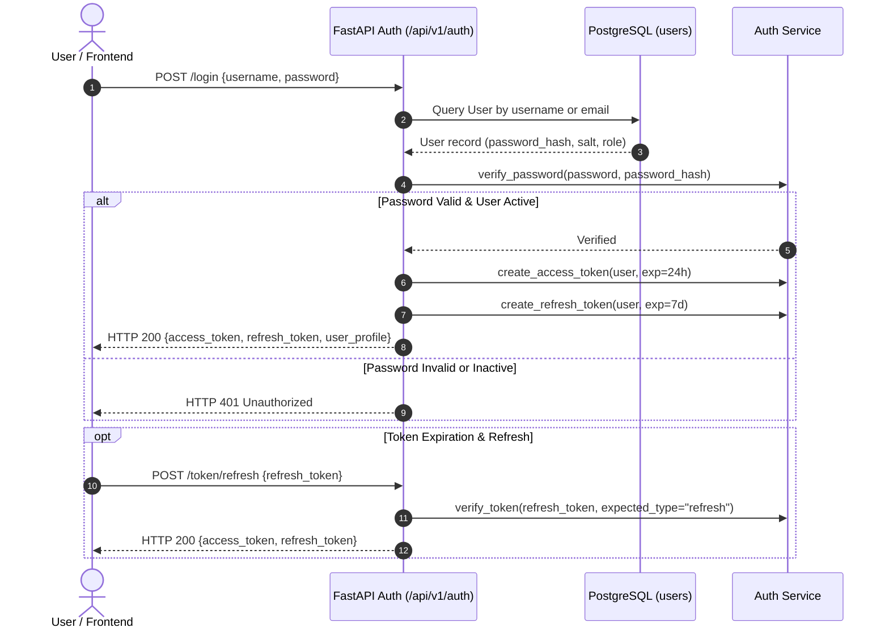
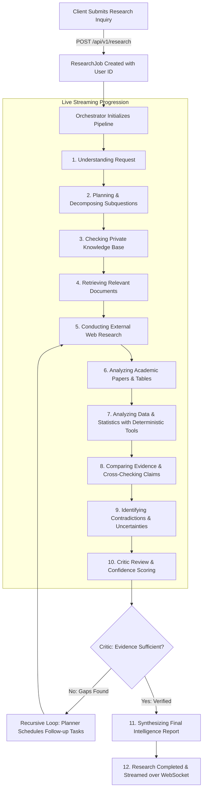
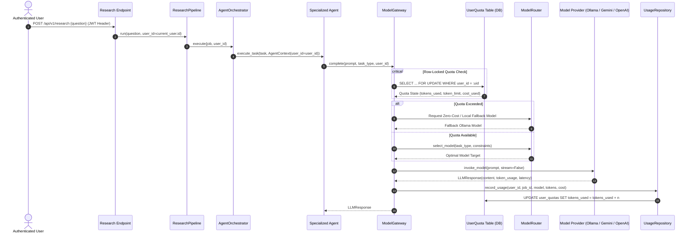
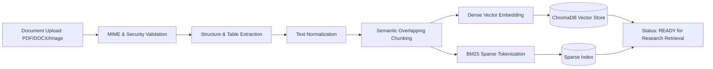
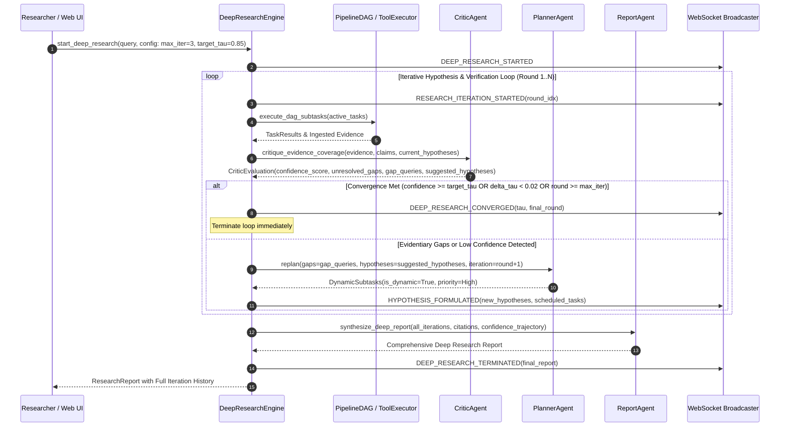
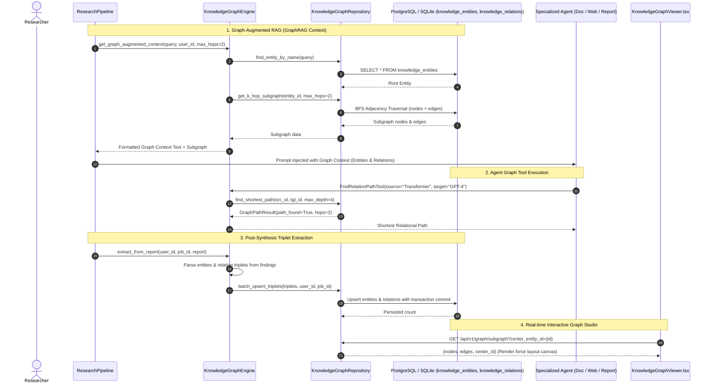

# System & User Workflows: flow.md

This document specifies the end-to-end operational, agentic, data ingestion, model routing, and real-time streaming workflows of the **Agentic Multimodal Research Platform (AI Research OS)**.

---

## 1. Authentication & Session Flow



---

## 2. Research Job Lifecycle & Real-Time Progression Flow

When a research query is submitted, the platform executes an end-to-end streamed pipeline:



---

## 3. User Context & Quota-Locked Model Routing Flow



---

## 4. Phase 9: Automated Knowledge Ingestion Pipeline Flow



---

## 5. Explainability & Provenance Verification Flow

When a user asks: *"Why do you believe this finding?"*, the platform traverses the explicit provenance tree:

```
  Synthesized Report Finding
               │
               ▼
  Extracted Atomic Claim & Verification Confidence
               │
               ▼
  Exact Supporting Quote & Page/Coordinate Coordinates
               │
               ▼
  Source Document (PDF Table / Academic Preprint / Scraped Web URL)
               │
               ▼
  Raw Ingested Multimodal Chunk & Ingestion Timestamp
```

---

## 6. Phase 15: Deep Research Multi-Round Hypothesis Loop Flow



---

## 7. Phase 16: Research Memory Recall & Auto-Consolidation Flow

```mermaid
sequenceDiagram
    autonumber
    actor User as Researcher
    participant Pipe as ResearchPipeline
    participant MemMgr as ResearchMemoryManager
    participant MemRepo as MemoryRepository
    participant Planner as PlannerAgent
    participant Agents as Specialized Agents / Tools
    participant Rep as ReportAgent
    participant WS as WebSocket Broadcaster

    User->>Pipe: run(question, user_id)
    
    rect rgb(20, 30, 45)
        Note over Pipe, MemRepo: 1. Cross-Session Memory Recall
        Pipe->>MemMgr: recall_memories(user_id, query=question, limit=5)
        MemMgr->>MemRepo: search_by_text(user_id, query, limit=5)
        MemRepo-->>MemMgr: List[DBResearchMemory]
        MemMgr->>MemRepo: increment_access(memory_ids)
        MemMgr-->>Pipe: MemoryRecallResult(memories, summary)
        Pipe->>WS: MEMORY_RECALLED(count, titles)
        Pipe->>Planner: plan(question, context, historical_memories=recalled_summary)
    end

    Note over Planner, Agents: 2. Autonomous DAG Execution
    Planner-->>Pipe: ResearchPlan (incorporating prior knowledge)
    Pipe->>Agents: Execute DAG subtasks
    opt In-Flight Agent Memory Tool Calls
        Agents->>MemMgr: RecallMemoryTool / StoreMemoryTool
        MemMgr-->>Agents: Memory contents / Confirmation
    end
    Agents-->>Pipe: Verified Evidence & Findings

    rect rgb(20, 45, 30)
        Note over Pipe, MemRepo: 3. Post-Report Auto-Consolidation
        Pipe->>Rep: generate_report(evidence, query)
        Rep-->>Pipe: Synthesized ResearchReport
        Pipe->>MemMgr: store_memories_from_report(user_id, job_id, report)
        MemMgr->>MemRepo: batch_create(distilled_findings, methodologies, hypotheses)
        MemRepo-->>MemMgr: List[DBResearchMemory] persisted
        Pipe->>WS: MEMORY_STORED(count, keys)
    end

    Pipe-->>User: Final Research Job Complete (Memory Retained for Future Jobs)
```



---

## 7. Knowledge Graph Extraction & GraphRAG Flow (Phase 17)



