# System & User Workflows: flow.md

This document specifies the end-to-end operational, agentic, data ingestion, model routing, and real-time streaming workflows of the **Agentic Multimodal Research Platform (AI Research OS)**.

---

## 1. Authentication & Session Flow

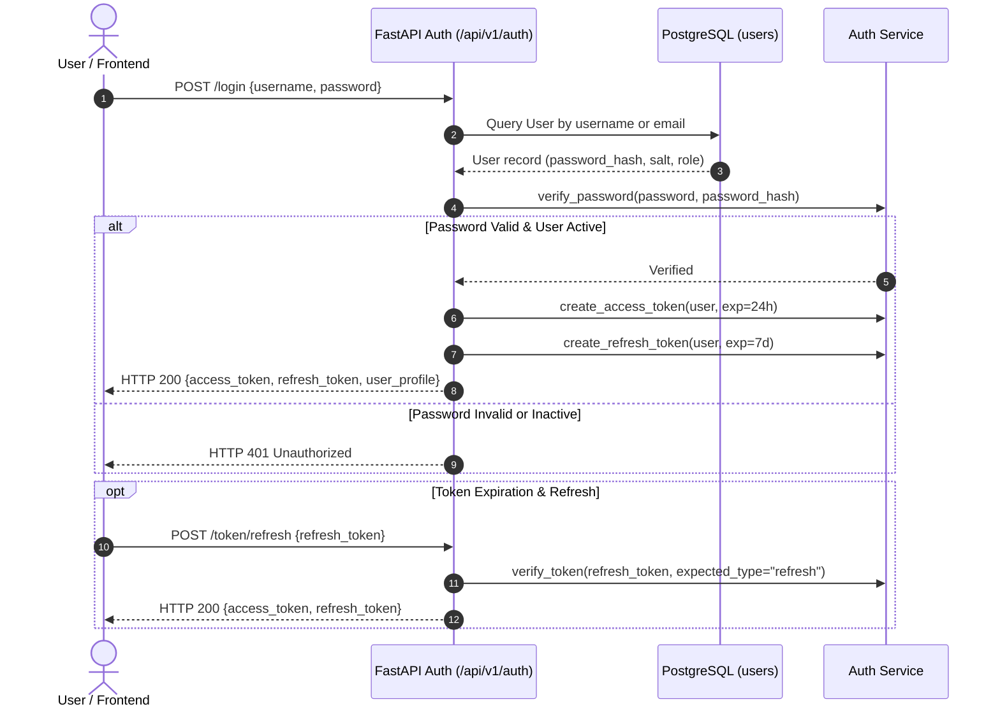

---

## 2. Research Job Lifecycle & Real-Time Progression Flow

When a research query is submitted, the platform executes an end-to-end streamed pipeline:

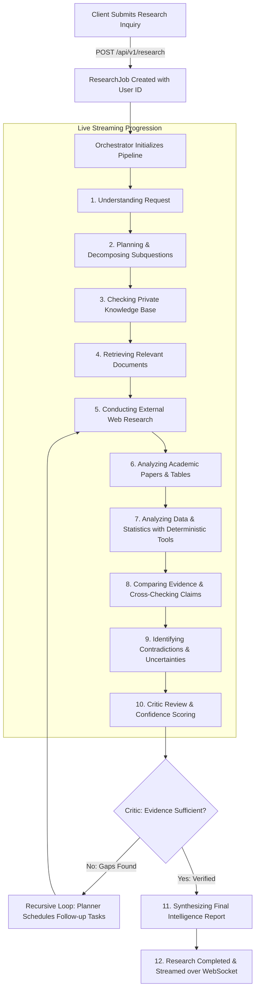

---

## 3. User Context & Quota-Locked Model Routing Flow

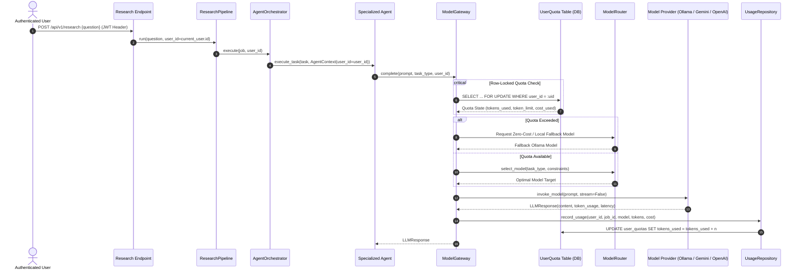

---

## 4. Phase 9: Automated Knowledge Ingestion Pipeline Flow

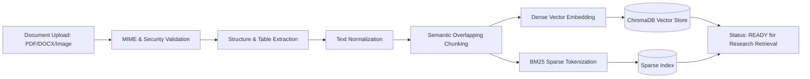

---

## 5. Explainability & Provenance Verification Flow

When a user asks: *"Why do you believe this finding?"*, the platform traverses the explicit provenance tree:

```
  Synthesized Report Finding
               │
               ▼
  Extracted Atomic Claim & Verification Confidence
               │
               ▼
  Exact Supporting Quote & Page/Coordinate Coordinates
               │
               ▼
  Source Document (PDF Table / Academic Preprint / Scraped Web URL)
               │
               ▼
  Raw Ingested Multimodal Chunk & Ingestion Timestamp
```

---

## 6. Phase 15: Deep Research Multi-Round Hypothesis Loop Flow

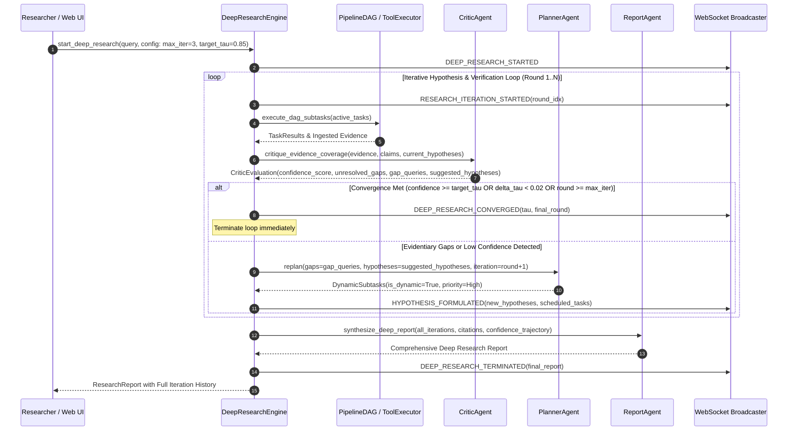

---

## 7. Phase 16: Research Memory Recall & Auto-Consolidation Flow

```mermaid
sequenceDiagram
    autonumber
    actor User as Researcher
    participant Pipe as ResearchPipeline
    participant MemMgr as ResearchMemoryManager
    participant MemRepo as MemoryRepository
    participant Planner as PlannerAgent
    participant Agents as Specialized Agents / Tools
    participant Rep as ReportAgent
    participant WS as WebSocket Broadcaster

    User->>Pipe: run(question, user_id)
    
    rect rgb(20, 30, 45)
        Note over Pipe, MemRepo: 1. Cross-Session Memory Recall
        Pipe->>MemMgr: recall_memories(user_id, query=question, limit=5)
        MemMgr->>MemRepo: search_by_text(user_id, query, limit=5)
        MemRepo-->>MemMgr: List[DBResearchMemory]
        MemMgr->>MemRepo: increment_access(memory_ids)
        MemMgr-->>Pipe: MemoryRecallResult(memories, summary)
        Pipe->>WS: MEMORY_RECALLED(count, titles)
        Pipe->>Planner: plan(question, context, historical_memories=recalled_summary)
    end

    Note over Planner, Agents: 2. Autonomous DAG Execution
    Planner-->>Pipe: ResearchPlan (incorporating prior knowledge)
    Pipe->>Agents: Execute DAG subtasks
    opt In-Flight Agent Memory Tool Calls
        Agents->>MemMgr: RecallMemoryTool / StoreMemoryTool
        MemMgr-->>Agents: Memory contents / Confirmation
    end
    Agents-->>Pipe: Verified Evidence & Findings

    rect rgb(20, 45, 30)
        Note over Pipe, MemRepo: 3. Post-Report Auto-Consolidation
        Pipe->>Rep: generate_report(evidence, query)
        Rep-->>Pipe: Synthesized ResearchReport
        Pipe->>MemMgr: store_memories_from_report(user_id, job_id, report)
        MemMgr->>MemRepo: batch_create(distilled_findings, methodologies, hypotheses)
        MemRepo-->>MemMgr: List[DBResearchMemory] persisted
        Pipe->>WS: MEMORY_STORED(count, keys)
    end

    Pipe-->>User: Final Research Job Complete (Memory Retained for Future Jobs)
```

---

## 7. Knowledge Graph Extraction & GraphRAG Flow (Phase 17)

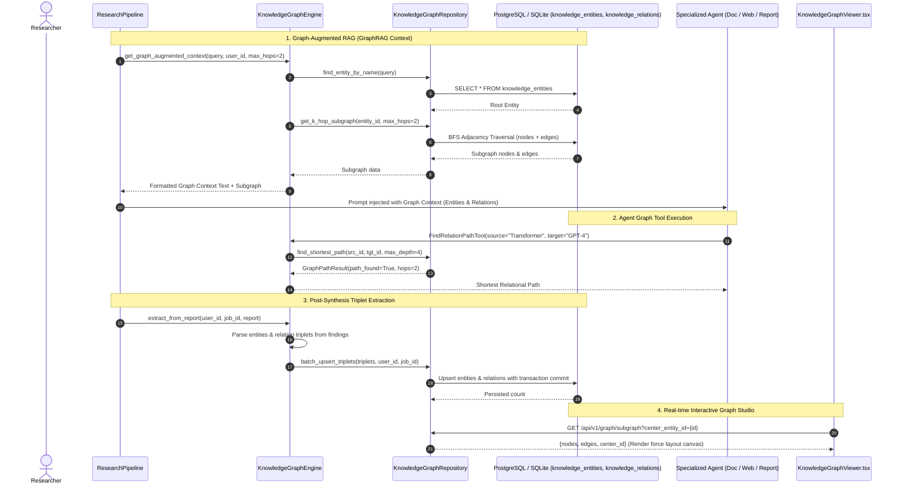

---

## 8. Multi-Tenant Workspace & Project Hierarchy Flow (Phase 18)

```mermaid
sequenceDiagram
    autonumber
    actor User as Researcher
    participant UI as WorkspaceSelector & App.tsx
    participant Ctx as WorkspaceContext
    participant API as FastAPI (/api/v1/workspaces, /api/v1/projects)
    participant DB as PostgreSQL / SQLite (workspaces, projects, members)
    participant Pipe as ResearchPipeline & Ingestion

    Note over User, DB: 1. Workspace & Project Auto-Hydration
    User->>UI: Logs in to platform
    UI->>Ctx: Hydrate active workspace from localStorage or API
    Ctx->>API: GET /api/v1/workspaces
    API->>DB: Query user workspaces & membership
    alt No workspace exists
        API->>DB: Provision default "Username's Workspace" & "General Research" project
    end
    DB-->>API: Workspaces list
    API-->>Ctx: Set currentWorkspace & currentProject
    Ctx-->>UI: Populate WorkspaceSelector dropdown

    Note over User, DB: 2. Scoped Research Job Submission
    User->>UI: Submit inquiry with active project selected
    UI->>API: POST /api/v1/research {question, workspace_id, project_id}
    API->>DB: Validate user membership in workspace
    API->>Pipe: Initialize job tagged with workspace_id & project_id
    Pipe->>DB: Persist job, sources, evidence scoped to project
    DB-->>UI: Return scoped job stream

    Note over User, DB: 3. Scoped Document & Knowledge Isolation
    User->>UI: Upload multimodal PDF/audio/dataset
    UI->>API: POST /api/v1/documents {file, workspace_id, project_id}
    API->>Pipe: Chunk, extract, index chunks with project metadata
    API->>DB: Persist Document with workspace_id & project_id foreign keys

---

## 9. Team Collaboration & Peer Review Flow (Phase 19)

```mermaid
sequenceDiagram
    autonumber
    actor Alice as Workspace Owner (Alice)
    actor Bob as Peer Reviewer (Bob)
    participant UI as React UI (WorkspaceMembersModal / ReportDrawer)
    participant API as FastAPI (/api/v1/collaboration)
    participant DB as PostgreSQL / SQLite (invites, annotations, activities)

    Note over Alice, DB: 1. Workspace Team Invitation Flow
    Alice->>UI: Opens Team & Access Modal -> Enters Bob's email & role
    UI->>API: POST /api/v1/workspaces/{ws_id}/invites {email: "bob@company.com", role: "reviewer"}
    API->>DB: Generate crypto token, insert into workspace_invites
    API->>DB: Log activity "member_invited" in workspace_activities
    API-->>UI: Return invite link / token (/invites/{token})

    Note over Bob, DB: 2. Token Redemption & Member Join
    Bob->>UI: Clicks invite link
    UI->>API: POST /api/v1/invites/{token}/accept
    API->>DB: Verify token validity and expiration (+7 days)
    API->>DB: Upsert Bob into workspace_members (role: reviewer)
    API->>DB: Set invite.is_accepted = true
    API->>DB: Log activity "member_joined" in workspace_activities
    API-->>UI: Bob joined workspace successfully

    Note over Bob, DB: 3. Inline Report Annotations & Collaborative Review
    Bob->>UI: Opens ResearchDetail.tsx -> Clicks "Review Notes" drawer
    Bob->>UI: Highlights section & writes comment note
    UI->>API: POST /api/v1/reports/{report_id}/annotations {comment_text, selected_text, section_index}
    API->>DB: Insert into report_annotations (status: open)
    API-->>UI: Live annotation added to drawer

    Note over Alice, DB: 4. Comment Resolution
    Alice->>UI: Views review drawer on report
    Alice->>UI: Clicks "Resolve" on Bob's comment
    UI->>API: PATCH /api/v1/annotations/{id}/resolve
    API->>DB: Update status = "resolved", resolved_by = Alice, resolved_at = NOW()
    API-->>UI: Drawer updates comment state with resolution badge
```

---

## 10. Intelligent Model Ecosystem Optimization Flow (Phase 20)

```mermaid
sequenceDiagram
    autonumber
    actor User as Researcher
    participant UI as NewResearch.tsx (Profile Selector)
    participant API as FastAPI (/api/v1/models/optimize)
    participant Opt as ModelEcosystemOptimizer
    participant Reg as ModelRegistry
    participant GW as ModelGateway

    User->>UI: Selects Routing Profile (e.g., "Deep Quality" or "Cost Efficient")
    UI->>API: POST /api/v1/models/optimize {profile, task: "long_form_research"}
    API->>Reg: Query candidate models for task capabilities
    Reg-->>API: Candidate ModelDefinitions
    API->>Opt: optimize(candidates, profile, task)
    Opt->>Opt: 1. Calculate Quality, Speed, Cost, Locality utility scores
    Opt->>Opt: 2. Compute non-dominated Pareto frontier
    Opt->>Opt: 3. Apply profile weights & rank candidates
    Opt-->>API: OptimizationResult (selected model, ranking, Pareto status, rationale)
    API-->>UI: Return live preview simulation data
    UI-->>User: Renders live routing target badge and Pareto analysis

    User->>UI: Submits research inquiry
    UI->>GW: Execute pipeline with routing_profile
    GW->>Opt: Route agent requests using active profile weights
```

---

## 11. Model Evaluation & Benchmark Leaderboard Flow (Phase 21)

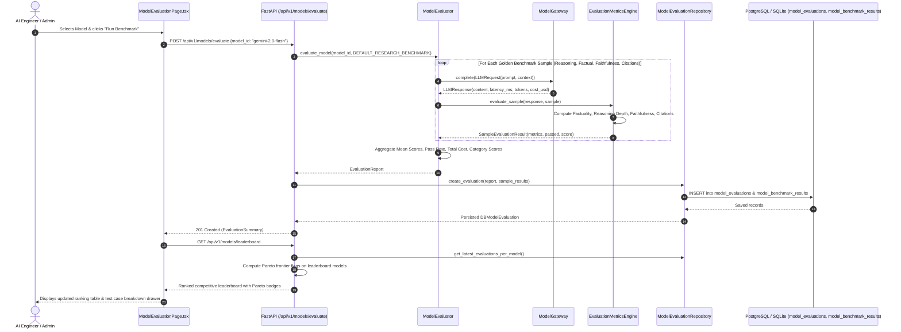

---

## 12. Agent Execution Evaluation & Observability Flow (Phase 22)

```mermaid
sequenceDiagram
    autonumber
    actor Dev as AI Engineer / System
    participant UI as AgentEvaluationPage.tsx
    participant API as FastAPI (/api/v1/agents)
    participant Evaluator as AgentEvaluator
    participant Repo as AgentEvaluationRepository
    participant DB as PostgreSQL / SQLite (agent_evaluations, agent_step_metrics)

    Dev->>UI: Selects Agent / Run & clicks "Evaluate Agent"
    UI->>API: POST /api/v1/agents/evaluate {agent_name, plan_tasks, step_telemetry, evidence_items, report_text}
    API->>Evaluator: evaluate_job_execution(job_id, agent_name, plan_tasks, objective, telemetry, evidence, report)
    
    rect rgb(20, 30, 45)
        Note over Evaluator: 1. Multi-Dimensional Metric Computation
        Evaluator->>Evaluator: evaluate_plan_precision(plan_tasks, objective)
        Evaluator->>Evaluator: evaluate_tool_accuracy(step_telemetry)
        Evaluator->>Evaluator: evaluate_evidence_coverage(evidence_items, claims)
        Evaluator->>Evaluator: evaluate_hallucination_rate(report_text, evidence_items)
        Evaluator->>Evaluator: Compute overall_score & synthesis_fidelity
    end

    Evaluator-->>API: AgentEvaluationScorecard
    API->>Repo: create_evaluation(scorecard, step_telemetry, evaluated_by)
    Repo->>DB: INSERT into agent_evaluations & agent_step_metrics
    DB-->>Repo: Saved evaluation record
    Repo-->>API: Persisted DBAgentEvaluation
    API-->>UI: 201 Created (Scorecard Details)

    UI->>API: GET /api/v1/agents/metrics/summary
    API->>Repo: get_agent_metrics_summary()
    Repo-->>API: Summary aggregates (mean score, avg hallucination rate, tokens, cost)
    API-->>UI: Live KPI cards update (System Hallucination Rate, Plan Precision, Tool Accuracy)
    UI-->>Dev: Displays Scorecard, Historical Trends, and Step Telemetry Inspector Drawer
```

---

## 13. Enterprise Security, KMS Envelope Vault & Cryptographic Audit Trail Flow (Phase 23)

```mermaid
sequenceDiagram
    autonumber
    actor SecAdmin as Security Officer / Admin
    participant UI as EnterpriseSecurityPage.tsx
    participant API as FastAPI (/api/v1/security)
    participant KMS as KMSEnvelopeEncryption
    participant Chainer as AuditHashChainer
    participant Repo as SecurityRepository
    participant DB as PostgreSQL / SQLite (security_audit_logs, encrypted_secrets)

    rect rgb(20, 30, 45)
        Note over SecAdmin, DB: 1. Two-Tier KMS Envelope Encryption (Store Secret)
        SecAdmin->>UI: Inputs API Key / Secret Plaintext
        UI->>API: POST /api/v1/security/secrets {name, provider, plaintext_value}
        API->>Repo: create_encrypted_secret(...)
        Repo->>KMS: encrypt_secret(plaintext_value)
        KMS->>KMS: Generate ephemeral 256-bit DEK
        KMS->>KMS: AES-256-GCM Encrypt plaintext with DEK
        KMS->>KMS: AES-256-GCM Encrypt DEK with KEK (derived from master key)
        KMS-->>Repo: EncryptedPayload + EncryptedDEK + KeyVersion
        Repo->>DB: INSERT into encrypted_secrets (masked_preview, ciphertexts)
        Repo->>Chainer: compute_record_hash(prev_hash, timestamp, "secret_stored", ...)
        Chainer-->>Repo: SHA-256 CurrentHash
        Repo->>DB: INSERT into security_audit_logs (previous_hash, current_hash)
        Repo-->>API: Persisted Secret Metadata (Masked Preview only)
        API-->>UI: 201 Created (Vaulted Successfully)
    end

    rect rgb(20, 45, 30)
        Note over SecAdmin, DB: 2. Tamper-Evident Merkle Hash Chain Verification
        SecAdmin->>UI: Clicks "Verify Cryptographic Chain"
        UI->>API: GET /api/v1/security/audit-logs/verify
        API->>Repo: verify_audit_log_integrity(limit=500)
        Repo->>DB: SELECT security_audit_logs ORDER BY created_at ASC
        DB-->>Repo: Ordered Audit Records
        Repo->>Chainer: verify_chain_integrity(records)
        loop For Each Audit Record Link
            Chainer->>Chainer: Assert record[i].previous_hash == record[i-1].current_hash
            Chainer->>Chainer: Recompute SHA-256(prev | ts | event | actor | details)
            Chainer->>Chainer: Assert recomputed_hash == record[i].current_hash
        end
        Chainer-->>Repo: (is_valid=True, error=None)
        Repo-->>API: {verified: True, integrity_status: "VALID_TAMPER_EVIDENT", total_records: N}
        API-->>UI: Displays Verified Green Badge & Genesis Anchor
    end
```

---

## 14. Distributed Worker Task Queue & Blob Storage Flow (Phase 24)

```mermaid
sequenceDiagram
    autonumber
    actor User as Researcher / System
    participant UI as ProductionInfrastructurePage.tsx
    participant API as FastAPI (/api/v1/system)
    participant Queue as AsyncTaskQueue (Priority Heap)
    participant Worker as WorkerNode (Distributed Agent Pool)
    participant Storage as ObjectStorageClient (S3 / MinIO / Local)
    participant Repo as InfrastructureRepository
    participant DB as PostgreSQL / SQLite (worker_nodes, storage_objects)

    rect rgb(20, 30, 45)
        Note over User, DB: 1. Priority Task Enqueueing & Worker Dispatch
        User->>UI: Enqueues Heavy Research Task (Priority: CRITICAL)
        UI->>API: POST /api/v1/system/queue/tasks {task_name, payload, priority: "CRITICAL"}
        API->>Queue: enqueue(task_name, payload, priority=Priority.CRITICAL)
        Queue->>Queue: Push to Priority Min-Heap (CRITICAL -> HIGH -> DEFAULT -> LOW)
        Queue-->>API: QueuedTask (task_id, status="queued")
        API-->>UI: 201 Created (task_id)

        Worker->>Queue: dequeue()
        Queue-->>Worker: Dispatches QueuedTask
        Worker->>Repo: update_worker_heartbeat(node_id, status="busy", current_task_id=task_id)
        Repo->>DB: UPDATE worker_nodes SET status='busy', active_task_count=active_task_count+1
    end

    rect rgb(20, 45, 30)
        Note over Worker, Storage: 2. Multimodal Artifact Persistence (Object Storage Vault)
        Worker->>Worker: Executes Task & Generates Large Report / PDF / Dataset Artifact
        Worker->>Storage: put_object(bucket="research-artifacts", key="reports/job_99.pdf", data)
        Storage->>Storage: Compute MD5 & SHA-256 Checksums
        Storage->>Storage: Write to S3 / MinIO / Local FS
        Storage-->>Worker: StorageObjectMetadata (etag, size_bytes, backend_type)
        Worker->>Repo: record_storage_object(object_id, bucket, key, content_type, size, etag)
        Repo->>DB: INSERT into storage_objects
        Worker->>Queue: mark_completed(task_id, result_summary)
        Worker->>Repo: update_worker_heartbeat(node_id, status="ready", current_task_id=None)
    end

    rect rgb(45, 30, 20)
        Note over User, Storage: 3. Secure Presigned Retrieval
        User->>UI: Requests Download Link for Artifact
        UI->>API: POST /api/v1/system/storage/presigned-url {bucket, key, method: "GET"}
        API->>Storage: generate_presigned_url(bucket, key, method="GET", expires_in=3600)
        Storage-->>API: Presigned Signed URL with Expiry
        API-->>UI: {url: "https://minio.local/research-artifacts/reports/job_99.pdf?..."}
        UI-->>User: Initiates direct secure stream download
    end
```

---

## 15. Developer API Gateway & Key Authentication Flow (Phase 25)

```mermaid
sequenceDiagram
    autonumber
    actor Dev as Third-Party Developer / Client App
    participant GW as FastAPI Public Gateway (/api/v1/developer/*)
    participant RateLimiter as ApiKeyRepository (Sliding Window)
    participant Auth as ApiKeyAuthenticator
    participant DB as PostgreSQL / SQLite (api_keys)
    participant Pipe as ResearchPipeline & WorkerPool

    rect rgb(20, 30, 45)
        Note over Dev, DB: 1. API Key Provisioning (Developer Studio UI)
        Dev->>GW: POST /api/v1/developer/keys {name: "Backend Bot", tier: "pro", scopes: ["research:write"]}
        GW->>GW: Generate Secret `amrp_live_<48_hex>` & Extract Prefix `amrp_live_...`
        GW->>GW: Compute Cryptographic SHA-256 Digest
        GW->>DB: INSERT into api_keys (key_prefix, key_hash, scopes, rate_limit_rpm=300)
        DB-->>GW: DBApiKey Record
        GW-->>Dev: 201 Created {secret_key: "amrp_live_...", key_prefix: "...", scopes: [...]} (One-time reveal)
    end

    rect rgb(20, 45, 30)
        Note over Dev, Pipe: 2. Programmatic Research Invocation & Rate Limit Verification
        Dev->>GW: POST /api/v1/developer/research (Header: X-API-Key: amrp_live_...)
        GW->>Auth: authenticate_api_key(raw_key, required_scope="research:write")
        Auth->>Auth: Extract Prefix -> SHA-256(raw_key)
        Auth->>DB: SELECT * FROM api_keys WHERE key_prefix = ... AND key_hash = ... AND is_active = True
        DB-->>Auth: DBApiKey Record
        Auth->>Auth: Verify required_scope in scopes
        Auth->>RateLimiter: check_rate_limit(key_id, limit_rpm=300)
        RateLimiter->>RateLimiter: Sliding 60-second request window check
        RateLimiter-->>Auth: (Allowed=True, Remaining=299, Reset=58s)
        Auth-->>GW: Authenticated Key Context (user_id, workspace_id, tier)

        GW->>Pipe: Enqueue autonomous research job
        Pipe-->>GW: JobQueued (job_id, status="pending")
        GW-->>Dev: 200 OK {job_id, status: "pending", poll_url: "/api/v1/developer/research/:id"}
    end

    rect rgb(45, 30, 20)
        Note over Dev, GW: 3. Programmatic Report Retrieval
        Dev->>GW: GET /api/v1/developer/research/{job_id} (Header: X-API-Key)
        GW->>Auth: authenticate_api_key(raw_key, required_scope="research:read")
        Auth-->>GW: Key Authenticated
        GW->>DB: Query research_jobs and reports
        DB-->>GW: DBReport Record
        GW-->>Dev: 200 OK {job_id, status: "completed", report: {title, findings, citations}}
    end
```

---

## 16. Research Automation, Scheduled Sweeps & Novelty Alerting Flow (Phase 26)

```mermaid
sequenceDiagram
    autonumber
    actor User as Researcher / Lead
    participant UI as ResearchAutomationPage.tsx
    participant API as FastAPI (/api/v1/automation)
    participant Engine as ResearchAutomationEngine
    participant Repo as AutomationRepository
    participant DB as PostgreSQL / SQLite (scheduled_research, research_sweep_results, automation_alerts)
    participant Webhook as Third-Party Webhook Receiver

    rect rgb(20, 30, 45)
        Note over User, DB: 1. Schedule Creation & Next Run Calculation
        User->>UI: Configures Scheduled Sweep (Cron / Interval, Sources, Novelty Threshold)
        UI->>API: POST /api/v1/automation/schedules {title, query, cron_expression, novelty_threshold: 0.35, alert_channels: ["in_app", "webhook"]}
        API->>Engine: compute_next_run(cron_expression, interval_seconds)
        Engine-->>API: next_run_at timestamp
        API->>Repo: create_schedule(user_id, title, query, cron, interval, novelty_threshold, next_run_at, ...)
        Repo->>DB: INSERT into scheduled_research
        DB-->>Repo: DBScheduledResearch
        Repo-->>API: Persisted Schedule Record
        API-->>UI: 201 Created (Schedule Active)
    end

    rect rgb(20, 45, 30)
        Note over Engine, DB: 2. Autonomous Sweep Execution & Semantic Claim Diffing
        Note over Engine: Scheduled Trigger Fired / On-Demand Manual Trigger
        API->>Engine: execute_scheduled_sweep(schedule_id)
        Engine->>Repo: get_schedule(schedule_id)
        Repo-->>Engine: DBScheduledResearch
        Engine->>Engine: Run autonomous research pipeline (retrieve papers, web findings, citations)
        Engine->>Repo: list_sweep_results(schedule_id, limit=5)
        Repo-->>Engine: Historical Prior Sweeps
        Engine->>Engine: detect_novelty(current_claims, prior_claims)
        Note over Engine: Computes novel_claims, contradictory_claims, and novelty_score in [0.0, 1.0]
        Engine->>Repo: record_sweep_result(schedule_id, findings_summary, novel_claims, contradictory_claims, novelty_score, ...)
        Repo->>DB: INSERT into research_sweep_results & UPDATE scheduled_research.last_run_at
        DB-->>Repo: DBResearchSweepResult
    end

    rect rgb(45, 30, 20)
        Note over Engine, Webhook: 3. Novelty Threshold Alerting & Webhook Dispatch
        alt novelty_score >= novelty_threshold OR contradictory_claims detected
            Engine->>Repo: create_alert(schedule_id, sweep_id, user_id, alert_type="novel_finding", title, summary, novelty_score, channel="in_app")
            Repo->>DB: INSERT into automation_alerts
            alt "webhook" in alert_channels AND webhook_url is configured
                Engine->>Webhook: POST webhook_url {event: "automation.alert", schedule_title, novel_claims, novelty_score}
                Webhook-->>Engine: 200 OK
            end
        end
        Engine-->>API: Sweep Execution Summary
        API-->>UI: Live Alert Count & Sweep Timeline Updated
    end
```

---

## 17. Adversarial Multi-Agent Debate & Dialectical Consensus Synthesis Flow (Phase 27)

```mermaid
sequenceDiagram
    autonumber
    actor Researcher as Lead Researcher
    participant UI as DebateArenaPage.tsx
    participant API as FastAPI (/api/v1/debates)
    participant Engine as DebateEngine
    participant Proposer as ProposerAgent (Affirmative Thesis)
    participant Opposer as OpposerAgent (Adversarial Counter)
    participant Arbiter as ConsensusArbiter (Judge & Synthesizer)
    participant Repo as DebateRepository
    participant DB as PostgreSQL / SQLite (agent_debates, debate_rounds, debate_consensus)

    rect rgb(20, 30, 45)
        Note over Researcher, DB: 1. Launch Multi-Agent Debate Arena
        Researcher->>UI: Configures Debate Topic, Initial Thesis, Counter-Thesis, Max Rounds (3)
        UI->>API: POST /api/v1/debates {topic, initial_thesis, counter_thesis, max_rounds: 3, proposer_model, opposer_model, arbiter_model}
        API->>Repo: create_debate(user_id, topic, initial_thesis, counter_thesis, max_rounds, ...)
        Repo->>DB: INSERT into agent_debates (proposer_elo=1500, opposer_elo=1500, status='active')
        DB-->>Repo: DBAgentDebate Record
        Repo-->>API: Persisted Debate Metadata
        API-->>UI: 201 Created (Debate Active, Round 0/3)
    end

    rect rgb(20, 45, 30)
        Note over Engine, DB: 2. Dialectical Round Execution & Dynamic Elo Scoring
        Researcher->>UI: Clicks "Execute Round" or "Run Full Debate"
        UI->>API: POST /api/v1/debates/{id}/rounds {run_to_completion: false}
        API->>Engine: execute_round(debate_id, context)
        Engine->>Repo: get_debate(debate_id, include_rounds=True)
        Repo-->>Engine: DBAgentDebate + previous rounds

        Note over Engine, Proposer: Proposer Turn: Evidence-Grounded Thesis Defense
        Engine->>Proposer: execute(topic, thesis, round_number, opposer_prior_argument, history)
        Proposer-->>Engine: ProposerTurn {argument_text, key_claims, citations, persuasiveness_self_score}

        Note over Engine, Opposer: Opposer Turn: Adversarial Counterargument & Edge Cases
        Engine->>Opposer: execute(topic, thesis, counter_thesis, round_number, proposer_argument, claims, history)
        Opposer-->>Engine: OpposerTurn {argument_text, counter_claims, citations, flaws_identified}

        Note over Engine, Arbiter: Arbiter Turn: Round Scoring & Critique
        Engine->>Arbiter: evaluate_round(topic, round_number, proposer_turn, opposer_turn)
        Arbiter-->>Engine: RoundEvaluation {proposer_score: 0.88, opposer_score: 0.82, round_winner: "proposer", critique}

        Note over Engine: Compute Elo Shift: ΔR = K * (S_A - E_A)
        Engine->>Engine: compute_elo_shift(proposer_elo, opposer_elo, p_score, o_score, k_factor=32)
        Engine->>Repo: add_debate_round(debate_id, round_num, p_arg, o_arg, p_score, o_score, critique, winner, elo_delta, ...)
        Repo->>DB: INSERT into debate_rounds
        Engine->>Repo: update_debate_status(debate_id, current_round, new_p_elo, new_o_elo)
        Repo->>DB: UPDATE agent_debates SET current_round=1, proposer_elo=1516, opposer_elo=1484
    end

    rect rgb(45, 30, 20)
        Note over Engine, DB: 3. Dialectical Consensus Synthesis (Round 3 Reached)
        alt current_round >= max_rounds
            Engine->>Arbiter: synthesize_consensus(topic, initial_thesis, complete_rounds_history)
            Arbiter-->>Engine: ConsensusPayload {consensus_statement, accepted_claims, refuted_claims, concessions, remaining_uncertainties, overall_confidence: 0.90, winner_overall}
            Engine->>Repo: record_consensus(debate_id, consensus_statement, accepted_claims, refuted_claims, concessions, remaining_uncertainties, overall_confidence, winner_overall, final_elos)
            Repo->>DB: INSERT into debate_consensus
            Repo->>DB: UPDATE agent_debates SET status='concluded'
        end
        Engine-->>API: Round & Consensus Execution Summary
        API-->>UI: Live Split-Screen Arena Transcripts, Elo Badges & Consensus Vault Updated
    end
```

---

## 18. Systematic Literature Review & PRISMA Meta-Analysis Flow (Phase 28)

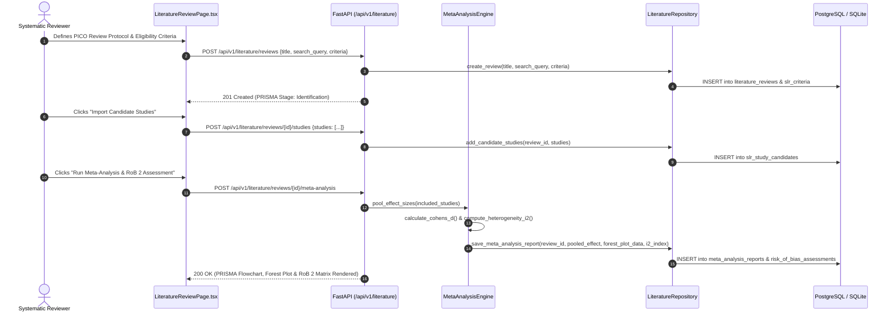

---

## 19. In-Silico Experimentation & Reproducibility Flow (Phase 29)

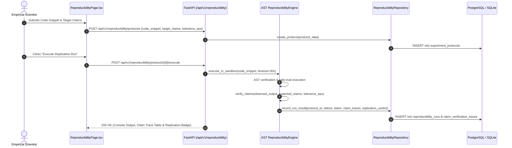

---

## 20. Multimodal Presentation & Podcast Generation Flow (Phase 30)

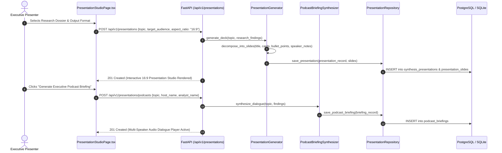

---

## 21. Autonomous Peer Review & Academic Publishing Flow (Phase 31)

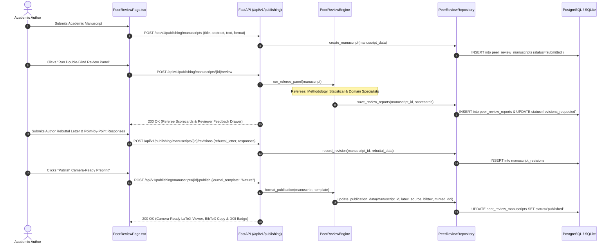

---

## 22. Collaborative Research Canvas & 2D Ideation Flow (Phase 32)

```mermaid
sequenceDiagram
    autonumber
    actor Researcher as Visual Researcher
    participant UI as ResearchCanvasPage.tsx
    participant API as FastAPI (/api/v1/canvas)
    participant Engine as CanvasIdeationEngine
    participant Repo as CanvasRepository
    participant DB as PostgreSQL / SQLite

    Researcher->>UI: Opens Infinite 2D Research Canvas
    UI->>API: POST /api/v1/canvas/boards {title: "Quantum Battery Ideation"}
    API->>Repo: create_board(board_data)
    Repo->>DB: INSERT into canvas_boards
    
    Researcher->>UI: Clicks "Auto-Generate DAG from Research Dossier"
    UI->>API: POST /api/v1/canvas/boards/{id}/generate {research_job_id}
    API->>Engine: convert_findings_to_nodes(research_dossier)
    Engine->>Repo: batch_create_nodes_and_edges(board_id, nodes, edges)
    Repo->>DB: INSERT into canvas_nodes & canvas_edges
    API-->>UI: 200 OK (2D Node-Link Visual Graph Rendered)

    Researcher->>UI: Selects Node & Clicks "AI Brainstorm Expansion"
    UI->>API: POST /api/v1/canvas/boards/{id}/brainstorm {node_id, prompt}
    API->>Engine: expand_ideation(node, prompt)
    Engine->>Repo: add_brainstorm_nodes(board_id, new_nodes, new_edges)
    Repo->>DB: INSERT into canvas_nodes & canvas_edges
    API-->>UI: 200 OK (Brainstormed Sub-Nodes Animated on Canvas)
```

---

## 23. Synthetic Instruction Dataset Generation & Active Learning Flow (Phase 33)

```mermaid
sequenceDiagram
    autonumber
    actor Engineer as AI Alignment Engineer
    participant UI as DatasetSynthesisPage.tsx
    participant API as FastAPI (/api/v1/datasets)
    participant Engine as InstructionDatasetSynthesizer
    participant Repo as DatasetSynthesisRepository
    participant DB as PostgreSQL / SQLite

    Engineer->>UI: Configures Dataset Generation (Format: DPO Preference Pairs)
    UI->>API: POST /api/v1/datasets/synthesize {name, format: "dpo_preference", domain, findings}
    API->>Engine: synthesize_from_research_findings(findings, format)
    Engine->>Engine: evolve_instruction(strategy="in_depth_expansion")
    Engine->>Engine: calculate_quality_metrics()
    Engine->>Repo: create_dataset_with_samples(dataset_meta, instruction_samples)
    Repo->>DB: INSERT into synthetic_datasets & instruction_samples
    API-->>UI: 201 Created (Sample Inspector & Active Learning Studio Rendered)

    Engineer->>UI: Curates Sample (Verdict: "Accepted", Edits Chosen Response)
    UI->>API: PATCH /api/v1/datasets/{id}/samples/{sample_id} {verdict: "accepted", chosen_response: "..."}
    API->>Repo: update_sample_curation(sample_id, verdict, edited_response)
    Repo->>DB: UPDATE instruction_samples SET curation_verdict='accepted'
    API-->>UI: 200 OK (Curation Badge Updated)

    Engineer->>UI: Clicks "Export Fine-Tuning JSONL"
    UI->>API: POST /api/v1/datasets/{id}/export {format: "jsonl"}
    API->>Repo: record_export(dataset_id, format)
    Repo->>DB: INSERT into alignment_exports
    API-->>UI: 200 OK (Instant JSONL Download & Clipboard Copy)
```

---

## 24. Autonomous Patent Landscape Analysis & Prior Art Search Flow (Phase 34)

```mermaid
sequenceDiagram
    autonumber
    actor IPAnalyst as Patent Attorney / Researcher
    participant UI as PatentLandscapePage.tsx
    participant API as FastAPI (/api/v1/patents)
    participant Engine as PatentPriorArtEngine
    participant Repo as PatentRepository
    participant DB as PostgreSQL / SQLite

    IPAnalyst->>UI: Creates Patent Landscape Corpus (Domain: Solid-State Electrolytes)
    UI->>API: POST /api/v1/patents/corpora {title, domain, cpc_classification: "H01M 10/0562", jurisdiction: "GLOBAL"}
    API->>Engine: synthesize_baseline_corpus(domain, cpc)
    Engine->>Repo: create_corpus_with_patents(corpus_meta, patent_assets)
    Repo->>DB: INSERT into patent_corpora, patent_documents & patent_claims
    API-->>UI: 201 Created (Indexed Patents & CPC Distribution Rendered)

    IPAnalyst->>UI: Enters Target Invention Claim for 102/103 Clearance
    UI->>API: POST /api/v1/patents/corpora/{id}/evaluate-claim {target_claim: "..."}
    API->>Engine: decompose_claim_limitations(target_claim)
    Engine->>Engine: evaluate_prior_art_anticipation(claim_limitations, corpus_patents)
    Engine->>Repo: record_prior_art_evaluation(corpus_id, eval_trace)
    Repo->>DB: INSERT into prior_art_evaluations
    API-->>UI: 200 OK (102/103 Claim Chart & Design-Around Mitigations Rendered)

    IPAnalyst->>UI: Clicks "Generate Freedom-To-Operate (FTO) Clearance Report"
    UI->>API: POST /api/v1/patents/corpora/{id}/fto-report
    API->>Engine: generate_fto_assessment(corpus_id)
    Engine->>Repo: save_fto_report(corpus_id, fto_dossier)
    API-->>UI: 200 OK (FTO Clearance Gauge 88% & White-Space Innovation Map)
```

---

## 25. Autonomous Scientific Grant Proposal Synthesizer Flow (Phase 35)

```mermaid
sequenceDiagram
    autonumber
    actor PI as Principal Investigator
    participant UI as GrantProposalStudioPage.tsx
    participant API as FastAPI (/api/v1/grants)
    participant Engine as GrantProposalSynthesizer
    participant Calc as InstitutionalBudgetCalculator
    participant Repo as GrantProposalRepository
    participant DB as PostgreSQL / SQLite

    PI->>UI: Defines Grant Opportunity (NIH R01, $2.5M, 5 Years)
    UI->>API: POST /api/v1/grants/proposals {title, funding_agency: "NIH", mechanism: "R01", duration_years: 5}
    API->>Engine: synthesize_proposal_narratives(title, agency, mechanism)
    API->>Calc: calculate_multiyear_budget(base_salary, duration, fna_rate: 52%)
    API->>Repo: create_proposal_with_aims_and_budget(proposal_data)
    Repo->>DB: INSERT into grant_proposals, grant_specific_aims, grant_budget_items
    API-->>UI: 201 Created (Narratives & MTDC Budget Breakdown Rendered)

    PI->>UI: Clicks "Run Mock Study Section Peer Review"
    UI->>API: POST /api/v1/grants/proposals/{id}/mock-review
    API->>Engine: conduct_mock_study_section_review(proposal_data)
    Engine->>Repo: record_review_scorecard(proposal_id, review_data)
    Repo->>DB: INSERT into grant_review_scorecards
    API-->>UI: 200 OK (1.0-9.0 Criterion Scores, Percentile & Fundability Badge)
```

---

## 26. Autonomous Clinical Trial Protocol & Drug Repurposing Flow (Phase 36)

```mermaid
sequenceDiagram
    autonumber
    actor Clinician as Medical Oncologist / PI
    participant UI as ClinicalTrialsPage.tsx
    participant API as FastAPI (/api/v1/clinical)
    participant Engine as ClinicalTrialEngine
    participant Repo as ClinicalRepository
    participant DB as PostgreSQL / SQLite

    Clinician->>UI: Submits Clinical Indication & Investigational Agent
    UI->>API: POST /api/v1/clinical/protocols/generate {disease_indication, investigational_agent, target_gene, phase_type}
    API->>Engine: synthesize_protocol(disease_indication, investigational_agent, target_gene, phase_type)
    Engine->>Engine: generate_pico_cohort_criteria()
    Engine->>Engine: screen_repurposing_candidates(target_gene)
    Engine->>Engine: generate_regulatory_package(agency: "FDA")
    API->>Repo: create_protocol(protocol_data)
    Repo->>DB: INSERT into clinical_protocols, clinical_cohort_criteria, clinical_drug_candidates, clinical_regulatory_packages
    API-->>UI: 201 Created (Full Clinical Dossier Rendered)

    Clinician->>UI: Inspects PICO Eligibility & LOINC Biomarker Assays
    Clinician->>UI: Evaluates Drug Repositioning Adjuvants (Kd Affinity, Bioavailability %, Tox Score)
    Clinician->>UI: Exports FDA IND eCTD Module 2 Dossier with 21 CFR 312 Validation Checklist
```

---

## 27. Autonomous Laboratory Automation & Robotic Protocol Generator Flow (Phase 37)

```mermaid
sequenceDiagram
    autonumber
    actor Bioengineer as Automation / Wet-Lab Scientist
    participant UI as LabAutomationPage.tsx
    participant API as FastAPI (/api/v1/lab)
    participant Compiler as RoboticProtocolCompiler
    participant Repo as LabAutomationRepository
    participant DB as PostgreSQL / SQLite (robotic_protocols, deck_slots, transfer_steps, execution_traces)

    Bioengineer->>UI: Defines Protocol (CRISPR LNP Synthesis, Opentrons OT-2, 12-Slot Deck)
    UI->>API: POST /api/v1/lab/protocols/compile {protocol_name, robot_platform, assay_type, deck_slots, transfer_steps}
    API->>Compiler: compile_protocol(protocol_name, robot_platform, assay_type, deck_slots, transfer_steps)
    Compiler->>Compiler: simulate_deck_execution() (volume tracking, tip consumption, gantry collision)
    Compiler->>Compiler: generate_opentrons_python_code() (Protocol API v2)
    Compiler->>Compiler: generate_pylabrobot_code() (Universal backend)
    Compiler->>Compiler: generate_autoprotocol_json() (Autoprotocol v1.0)
    API->>Repo: create_protocol(compiled_protocol)
    Repo->>DB: INSERT into robotic_protocols, robotic_deck_slots, robotic_transfer_steps, robotic_execution_traces
    API-->>UI: 201 Created (Interactive Deck Grid, Pipetting Steps & Telemetry Rendered)

    Bioengineer->>UI: Selects Deck Slot 2 (Inspects 96-Well Plate Geometry & Reagents)
    Bioengineer->>UI: Clicks "Physics & Collision Telemetry" (Replays microfluidic liquid class execution log)
    Bioengineer->>UI: Clicks "Executable Code" -> Downloads "crispr_lnp_opentrons.py" for immediate OT-2 execution
```


