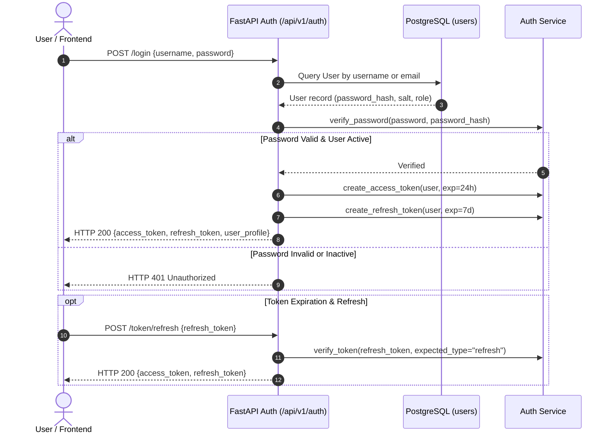
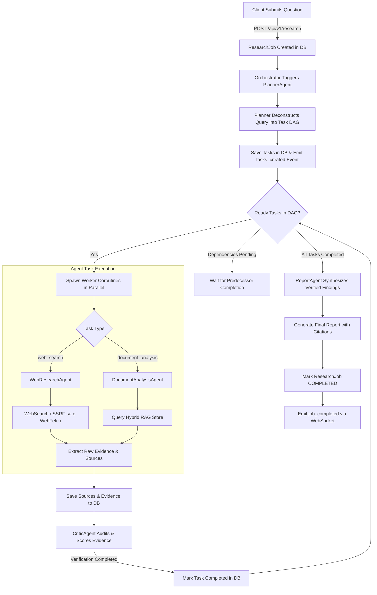
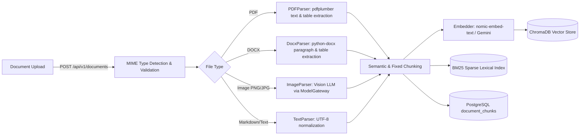
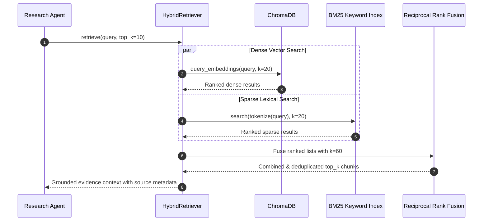
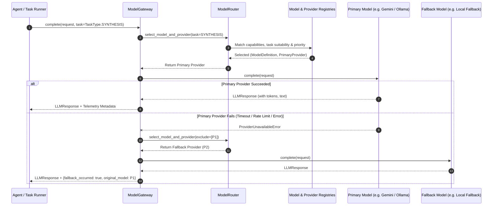
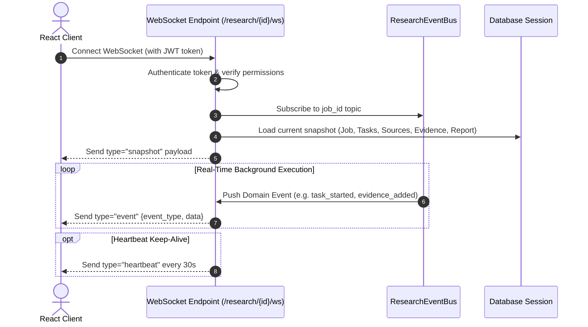

# System & User Workflows: flow.md

This document specifies the end-to-end operational, agentic, data ingestion, model routing, and real-time streaming workflows of the **Agentic Multimodal Research Platform**.

---

## 1. Authentication & Session Flow

---

## 2. Research Job Lifecycle & Agentic Execution Flow

---

## 3. Multimodal Document Ingestion Flow

---

## 4. Hybrid RAG & Knowledge Retrieval Flow

---

## 5. Intelligent Model Routing & Fallback Failover Flow (Phase 8A / 8B)

---

## 6. Live WebSocket Streaming Flow

---

## 7. Error Handling & Recovery Pathways

1. **Model Invocation Failure**:
   - `ModelGateway` attempts up to `max_fallback_attempts` (default: 1) against alternative eligible providers before propagating errors.
2. **Tool Failure (SSRF / Network Timeout)**:
   - `WebFetchTool` rejects unsafe targets immediately without network invocation.
   - Transient network fetch timeouts return empty result sets with error logs rather than crashing worker coroutines.
3. **Task Failure in DAG**:
   - If a non-critical task fails, dependent tasks are flagged as `failed` while independent branches continue uninterrupted.
   - The job error state is captured in `ResearchJob.error_message`.
